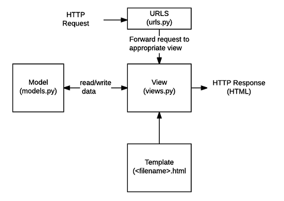
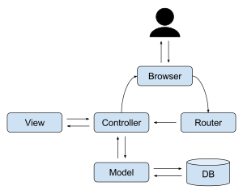

## django

Django makes it easier to build better web apps more quickly and with less code. Django is a high-level Python web framework that encourages rapid development and clean, pragmatic design. 

웹앱을 더 쉽게 빠르게 코드는 적게. 빠르게 원하는 역할을 해줄 수 있다. 사전 작업들을 줄여준다.

but, framework 이기 때문에 자유도는 낮다 = 제한된 역할만을 해준다. 정해진 것만을 써야함.

물론 다 똑같은 결과물을 나오지는 않지만 과정, 수행 작업 등에서는 거의 차이가 나지 않는다.

### django project 

django app 들의 총합

파일-폴더 상에서 기능별로 앱들이 생긴다.

master app 들이 app 들을 관리하는 역할을 한다. 

mdn reference 일종의 소개 문서가 존재한다.

MVC 정리 자료

https://velog.io/@seongwon97/MVC-%ED%8C%A8%ED%84%B4%EC%9D%B4%EB%9E%80

https://ko.wikipedia.org/wiki/%EB%AA%A8%EB%8D%B8-%EB%B7%B0-%EC%BB%A8%ED%8A%B8%EB%A1%A4%EB%9F%AC

https://cocoon1787.tistory.com/733

## 디자인 패턴

- 계속 지나가 길이 만들어진다. 이후 여러 사람들의 의견이 모아져 최적의 길이 탄생   
    -> 현재 가장 우수한 solution 이라고 할 수 있다.

- 이런 식으로 해결하는 것이 좋다. 라는 의미이다. 이것들을 문서화, 정리한 것이 디자인 패턴이다.





model -> DB와 통신


### MVC(model - view - controllor) 디자인 패턴

#### Model

백그라운드에서 동작하는 비즈니스 로직(데이터) 처리

데이터를 가진 객체이다. 

내부의 상태에 대한 정보를 가질 수도 있고, 모델을 표현하는 이름 속성으로 가질수도 있다.

모델의 상태에 변화가 있을 때 controllor 와 view 에 이를 통보함

model 의 규칙

  - 사용자가 편집하길 원하는 모든 데이터를 가지고 있어야 함
  - view 나 controllor 에 대해서 어떠한 정보다 알지 말아야 한다.
  - 변경이 일어나면, 변경 통지에 대한 처리 방법을 구현해야 함


#### View 

정보를 화면으로 보여주는 역할.

데이터를 보여주는 방식, 레이아웃과 화면을 처리합니다.
    > 사용자가 볼 결과물을 생성하기 위해 Model 로부터 정보를 얻어옵니다.

HTML/CSS/Javascript 를 보여준다. -> 편집이 가능하다. UI에 해당한다.

View 의 규칙

 - Model 이 가지고 있는 정보를 따로 저장해서는 안된다.
 - Model 이나 controllor 와 같이 다른 구성 요소를 몰라야 한다.
 - 변경이 일어나면, 변경 통지에 대한 처리 방법을 구현해야 함

#### Controllor 

사용자의 입력 처리와 흐름 제어 담당. 화면과 Model과 View를 연결시켜주는 역할, 중간에서 중개하는 역할을 한다.

사용자가 접근한 `URL`에 따라 사용자의 요청사항을 파악한 후에 그 요청에 맞는 데이터를 Model을 의뢰하고, 데이터를 View에 반영해서 사용자에게 나타낸다.
-> Model 과 View 에 명령을 전달.

Model에 명령(함수)을 보냄으로써 View의 상태를 변경할 수 있음 

Controllor가 관련된 Model에 명령을 보냄으로써 View의 표시 방법을 바꿀 수 있음 
  - Html 파일 편집을 통해서 View Ui 변경이 가능하다는 것을 말함.

Controllor의 규칙

 - Model 이나 View에 대해서 알고 있어야 함
 - Model 이나 View의 변경을 모니터링해야 함




>Django 에서는 mtv 로 mvc 를 변경
>view -> template 하지만 내용적으로는 바뀐 것 x, 역할도 같음.


### 실행하기

요청//응답을 하는 web service를 만들 수 있다.

서버를 키면 request -> response 작업을 실행할 수 있다.

software 는 24시간 켜져 있어야 한다. 

서버가 죽으면 요청을 받을 수 없기 때문에 -> 응답을 받을 수 없습니다.

> on : python manage.py runserver 
> 
> off : ctrl + c

pycache : 실행 속도를 빠르게 하기 위함. 성는과 관련이 있다. 지워도 무방한 자료들

기본값, 고정값 : `http://127.0.0.1:8000/`

render 함수는 값을 확인하고 읽어주는 역할을 한다

view 에는 2개의 형식을 가져온다.

- function view

- class view

이곳으로 url 파일을 가져오면 url 로는 사용할 수 없다.

### Django 에서 request / reponse 실행해보기

1. url 에서 먼저 링크를 설정해준다.

```
path('lunch/', lunch.site.urls),
```
    url lunce/ 로 요청이 들어오면, ~~~~ 일을 한다. 함수가 들어와야 한다.


2. view 에서 함수를 설정


```
def lunch(`request`): -> 반드시 request 값으로 채워줘야함 django 의 기본값이기 때문임
    lunch_menu = random.choice(['중식', '양식', '일식', '한식'])
    
    context = {
        'message' : '오늘의 점심은????',
        'lunch_menu': lunch_menu,
    }
    return render(request, 'lunch.html', context)

print 로 확인 가능 url 접속을 해서 새로고침을 하면 터미널 창에서 볼 수 있다 
```


3. templates 의 폴더를 만들고 templates에 html 파일을 형성

    alt + b 는 이 html 를 가져오는 것이다. 이 html 파일에서 작동가능.

    이 때 적어놓은 주석들도 그대로 출력된다.
    <br></br>


4. html 파일에서 view 에서 설정한 값에 따라서 설정하기

```
<!DOCTYPE html>
<html lang="en">
<head>
    <meta charset="UTF-8">
    <meta name="viewport" content="width=device-width, initial-scale=1.0">
    <title>Document</title>
</head>
    <h1> 두구두구 </h1>
<body>
    <p>{{message}}</p> -> 결과값을 적어줘야 한다. 함수명이 아니다!! 중요

{{lunch_menu}}
</body>
</html>
```

마지막으로 주소뒤에 url 값을 입력하고 작동을 확인하면 된다.

그리고 ',' 를 적어주는 것 매우 중요 없으면 작동을 안한다.


###  Django template Langage

server 에서는 url -> render 함수(이 때 render 함수가 해석을 한다.)로 작업을 실시 -> html 에서 가져오고 -> view

> {{}} -> 출력 {%} -> 주석 dtl 로 해석


### Vscode 에서 파이썬 키는 법

서버가 돌고 있으면 옆에서 + 버튼 또는 터미널 하나를 더킴

ipython 에서 코드를 칠 수 있다.

ctrl d enter 누르면 끌 수 있다.