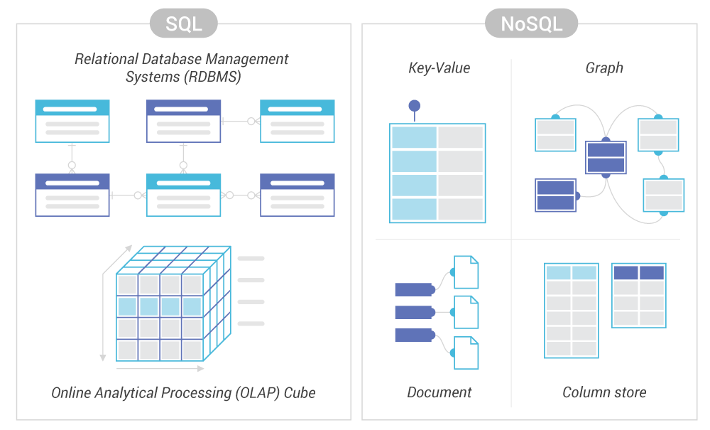

클라이언트 : 브라우저(랜더링을 해준다.)

curl : data transfer tool
python 에도 내장되어 있다.
터미널은 응답이 텍스트 형태로 나온다.


## Http Request Method(Verb) 요청 

1. Get (95%)

browser 주소창에 입력하고 enter = get 방식이다.

```
Request URL: https://finance.naver.com/sise/
Request Method:GET
Status Code: 200 OK 
Remote Address: 117.52.137.138:443
Referrer Policy: unsafe-url
```

### Crawling 하기

- 네이버 주식 페이지를 가져온다.
    `res = requests.get('https://finance.naver.com/sise/')`

여기서 request는 browser에 해당하고 get은 browser 에서의 enter(입력, 실행) 정도로 생각해주면 된다.    


- 네이버 주식의 Kospi,KOSDAQ 부분을 가져온다.
    `KOSPI_tag = soup.select_one('#KOSPI_now')`
    `KOSDAQ_tag = soup.select_one('#KOSDAQ_now')`


- BeautifulSoup을 통해 parsing 을 해준다.

    `soup = BeautifulSoup(res.text, 'html.parser')`

parsing(파싱)

부분 분석을 의미한다. browser 는 parsing 이 끝나서 화면이 나오는 것이다.

파이썬에서는 이 과정이 없기 때문에  ` BeautifulSoup()` 을 활용한다.
 
이렇게 한 값들은 type(res.text) - str 이다.

- res 를 dic 형태로 바꿔준다.
    
    `data = res.json()  # res 를 dic 형태로 바꿔준다.`

예시 : lotto 번호 가져오기

```
import requests 해줘야 한다.

res = requests.get('https://www.dhlottery.co.kr/common.do?method=getLottoNumber&drwNo=1086')

data = res.json() -> dic 형태로 변환

# data 에서 로또 당첨 번호에 해당하는 drwtNo 6개를 가져온다.
numbers =  [data[f'drwtNo{i}'] for i in range(1, 7)]

# data 에서 보너스 번호를 가져온다.
bonus_no = data['bnusNo']
```

lotto 번호 Crawling 하기

```
1번 방식 : drwtNo을 하나씩 가져온다.

no1 = soup.select_one('drwtNo1') 
no2 = soup.select_one('drwtNo2') 
.
.
.
no6 = soup.select_one('drwtNo6') 
numbers = []

2번 방식 : for 문 활용하기

for i in range(1,7):
    num = int(soup.select_one(f'#drwtNo{i}').text) 
    -> fstring 사용 1~6번까지 가져온다.

    numbers.append(num) -> 빈 리스트에 값을 추가해준다.
print(numbers)

bonus_no = int(soup.select_one('#bnusNo').text)
```

<Response [200]> ->> 위에 나오는 status code 임

특정값을 도출하고 싶을 때 id 를 사용한다.

`. 은 class`
`# 은 id`

-----------------------------------------------------------------------

### DB(DataBase)

- 데이터베이스는 쉽게 말해서 데이터의 집합, 묶음이다.


### DBMS(DataBase Management System)

#### RDBS

거의 90% 정도 사용하고 있다.

여러개의 제품군을 같이 사용 - 제품군끼리 공통점은 분명히 존재, 조금씩 차이가 있다.

  - MySQL
  - Postgre SQL
  - SQLite3 -> 규모가 작음
  - oracle -> 규모가 큼
  - Maria DB

기본적으로 명령(Query, 질의문)을 하려면 SQL(구조화된 질의문)이 필요하다.

RDBS == SQL

R -- relational => 표(table) 로 구성. = row, column 으로 구성되어 있다.

표에 무엇을 저장할 것인지를 생각해야 한다.

column 을 미리 저장 하는 것 schema 이러한 스키마에 따라 테이블에 저장된다.

유연성이 떨어져 데이터 스키마를 사전에 계획해야 하므로 추후 수정이 어렵다.

관계를 맺고 있어서 조인문이 많은 복잡한 쿼리가 만들어질 수 있다.

대체로 수직적 확장만 가능하다.

#### NoSQL

SQL을 쓰지 않는 DB 를 사용한다.

table 형식이 아니다. 보통은 문서(Documents -> RDBMS 에서의 row, record 라고 보면 된다.)의 형식.

SchemaLess - 스키마가 없다 = 유연하게 저장할 수 있다. -> 읽어오는 속도가 빠르지만 정리 정돈이 힘들다.


정확한 데이터의 구조를 알 수 없거나 변경, 확장될 가능성이 있는 경우
-> 무결성에 문제가 발생할 수 있다.

읽기는 자주 해도 데이터 변경은 자주 없는 경우

막대한 양의 데이터를 다뤄야 해서 데이터베이스를 수평으로 확장해야 하는 경우


### NoSQL vs RDBS




-----------------------------------------------------------------------

### Django 활용한 Models 만들기

1. startapp 을 통해서 app 파일을 만든다.

`$ django-admin startproject project명 .`

위의 방식은 파일명과 같은 app 파일을 만들 때 사용한다.

파일/project/project파일 이런식으로 3중 구조가 발생한다.

하지만 `project명 .` 을 사용하면

project/project파일 이런 식으로 project 를 만들 수 있다.

2. 만들어진 project 폴더 내에 settings 를 설정하고 models.py 에 들어가고 설정을 해준다.

```
# Create your models here.

# 예시 id(integer) name(Char 10) address(Text) major(Char 100) age(integer) cgpa(float) 설정
# column 을 정의하는 곳이다.
# 테이블명, 컬럼명 = 데이터 타입   
            
            # 상속을 받는다. 기존 Django 에 설정된 model 을 받아서 사용한다.          
class Student(models.Model):
    name = models.CharField(max_length=10)
    address = models.TextField()
    major = models.CharField(max_length=100)
    age = models.IntegerField()
    cgpa =  models.FloatField()

class 를 계속 설정하거나 model 수정은 이곳에서만 한다.
```

**if**

- 새로운 값을 추가 시 default 값을 설정해줘야한다.

    새로운 값 추가하면 기존 값들에는 빈값이 생기기 때문에 문제가 발생할 수 있기 때문이다.

++ 0001 , 0002 쌓이는 것은 버전이다. DB 내부에서 versioning을 하는 것 

++ id 값은 설정해주지 않아도 Django 에서 자동으로 설정해준다.

++ text 와 char 차이

현재는 text 길이의 차이 정도로 생각해보자.

3. DB 를 만들어준다.

Database 만드는 함수

   - `python manage.py makemigrations <app명> `

        0001 init => 작성한 명령어를 DB에 적용할 수 있게 변환시켜주는 것

   - `python manage.py migrate <app명>`

        => 변환하여 DB에 반영, 생성

#### python 과 SQL 은 완전히 다르다 

원래는 python 과 SQL 은 다르기 때문에 다룰 수 없지만 Django 에 ORM(Object Relational Mapper) 를 활용하여 코드를 변환해 줄 수 있다.

객체와 관계를 맵핑해준다 -> 파이썬과 DB를 연결해준다.

Python code Django Command -> ORM-> SQL(특수 목적 언어)


db 파일에 django_migration 에 버전이 생성된다.
