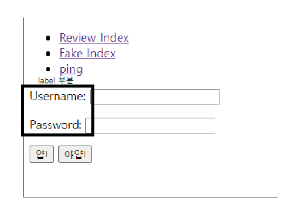
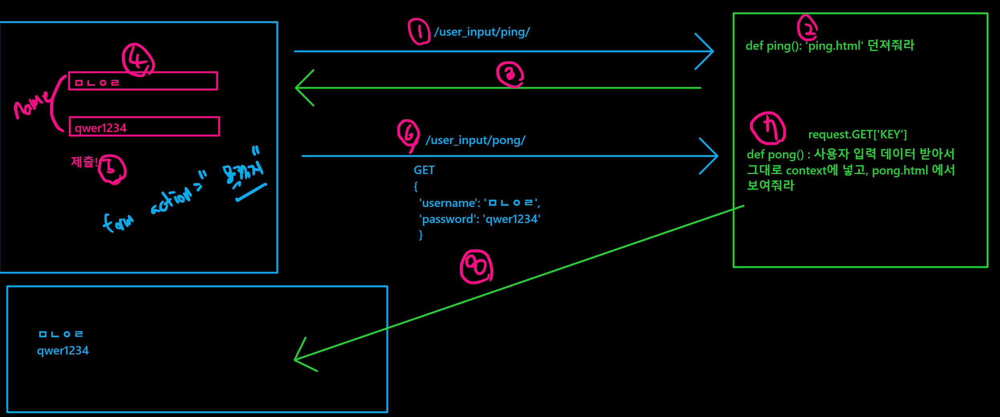

### form


#### 기본 html 설정 가능


```

```


```
  -> base 에서 받아오겠다.



입력하고자 하는 내용들


```

#### templates 추가 설정(base.html 설정)

- django 는 기본적으로 settings/installed_apps 내부의 templates 폴더를 찾는다.

- 그렇기 때문에 우리는 추가적으로 다른 폴더도 찾아달라고 설정해야 한다.


##### 1. Dirs :[__] 내부에 BASE_DIR/'templates 를 따로 입력해줘야한다.

```
TEMPLATES = [
    {
        'BACKEND': 'django.template.backends.django.DjangoTemplates',
        'DIRS': `[BASE_DIR/'templates']`, <------ 여기에 설정 
        'APP_DIRS': True,
        'OPTIONS': {
            'context_processors': [
                'django.template.context_processors.debug',
                'django.template.context_processors.request',
                'django.contrib.auth.context_processors.auth',
                'django.contrib.messages.context_processors.messages',

```

##### 2. app 내의 templates 폴더를 다시 설정해줘야 한다. templates의 함정

`/01_form/fake/templates/fake `

-  templates를 찾을 때 installed app 의 모든 templates 폴더들을 순차적으로 찾는다. 그렇기 때문에 정확히 설정해줘야 한다.

- 프로젝트 -> app -> templates 폴더 생성

- templates 폴더 내에 다시 app 이름으로 된 폴더를 생성


##### 3. views 에 입력된 html 주소값을 바꿔줘야 한다.

```
def hello(request):
    
    return render(request, **'User_input/hello.html'**, 
                         ## 이와 같이 경로를 추가 설정해줘야 한다.
    
    {'message': message,})
```


#### 이러한 base templates 를 사용하는 이유

위와 같은 사이트 설정을 해줄 수 있어서 base 를 쓰면 효율성이 증가. 메인 페이지로 복귀 쉽게

```
    <nav>
        <ul>
            <li>
                <a href="/review/">Review Index</a> ->> base 링크로 돌아가는 링크 설정
            </li>
        </ul>
    </nav>
```


### form 실행하기


#### Url 에서 직접 input 하기


`path('hello/<str:name>/', views.hello) `

-> path url 에서 직접 input 값을 받을 수 있다.

```
def hello(request, name): 
-> 이렇게 받아줘야 한다. 직접 받는 것이기 때문에 2개의 값이 생성되기 때문이다.

    message = f'반갑습니다 {name}님!' 
    # 여기서 이 변수 값은 위에서 사용한 것 그대로 사용해줘야 한다. 
    # return 시 꼭 dic 형태로 받아주기
    return render(request, 'User_input/hello.html', {
        'message': message,
    })
```


```
# base.html 을 사용해서 받아 온다.는 뜻




<h1>{{ message }}</h1> # 위에서 f'string 해준 값이 반환된다


```


### 이제 form 을 활용한 input 하기 (중요 부분)

- `<form>` 태그
  
    사용자가 입력한 정보를 서버로 전송할 때 사용하는 태그이다. 어디로 보낼 지는 action 속성을 통해 작성한다.

#### 1. input 을 위한 ping 을 설정한다.

```
def ping(request):
    return render(request, 'User_input/ping.html')  ->> base.html 을 활용한다


<form action="/User_input/pong/"> --> action = "" 는 ping 에서 입력한 값이 어디로 도착할지를 설정해주는 것이다.
  <p>
    <label for="username">Username: </label>  
    ->> label 는 <input> tag 의 text 영역에 이름을 붙여주는 태그이다. 이름표라고 보면된다.

    <input type="text" id="username" name="username">  
    ## label 의 for 값과 input 의 id 값은 일치해야 한다.
    ## name 은 정보를 넘길 때 붙이는 이름표라고 할 수 있다. 한 문서 안에 여러 개의 태그가 있을 경우 구분하기 위해서 사용된다.
  </p>
```




- input type?
    <input> 은 사용자로부터 정보를 입력받을 수 있는 태그이다.
    이 정보의 type 을 결정해주는 것이라고 보면 된다.

```
  <p>
    <input type="submit" value="얍!"> ## submit -> 데이버(입력정보)를 서버로 전송한다.
    <button>야얍!</button>
  </p>
  
</form>
```

#### 2. input 한 값을 받는 pong 을 설정해보자

pong의 view에서 ping으로부터 받은 자료를 request.GET을 활용해서 반환한다.
```
def pong(request):
    username = request.GET['username']  ## request 받은 모든 값을 의미한다. 
                                        ## id, name 값을 활용해서 받은 값 중 필터링해서 가져오는 것
    password = request.GET['password']
    return render(request, 'User_input/pong.html', {
        'a': username,
        'b': password,
    })
```


```

<h1>Data from PING</h1>

# 위에서 2개의 값을 받았기 때문에 2개 값을 반환해준다.

<p>
  {{ a }}  pong 에서 설정한 username의 값
</p> 

<p>
  {{ b }} pong 에서 설정한 password의 값
</p>



```


이 과정을 그림으로 정리해주심

