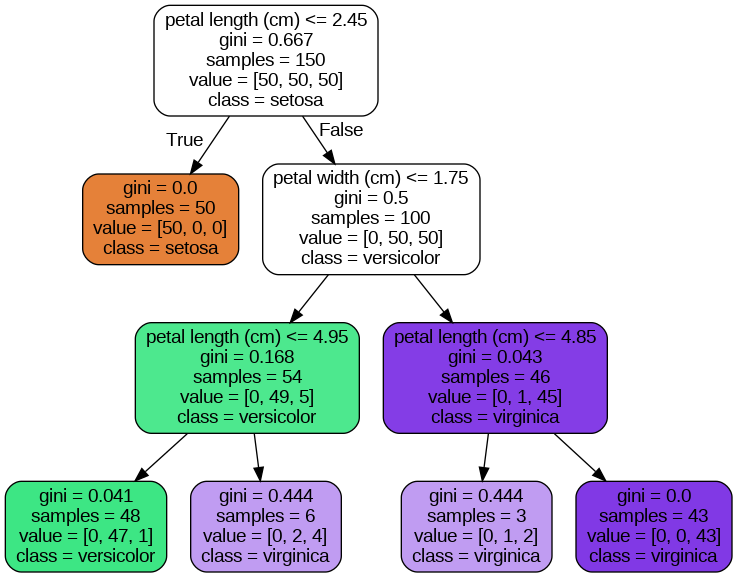

# Decision Tree(의사결정 나무)란 무엇인가?

- 의사결정 규칙을 `나무 구조`로 나타내어 전체 자료를 몇 개의 작은 집단으로 나누어서 분석하는 기법이다.

- SVM 처럼 결정트리(decision tree)는 `분류 및 회귀가 가능`한 머신러닝 알고리즘이다.

- 매우 복잡한 데이터셋도 학습할 수 있는 강력한 알고리즘으로 최근에 많이 사용하는 랜덤 포레스트의 기본 구성 요소이다.

## Decision Tree 예측하기

- 용어 정리
- Root Node(루트 노드) : 깊이가 0인 꼭대기 노드

- Leaf Node(리프 노드) : 자식 노드가 없는 마지막 노드

- Gini Impurity(지니 불순도) : 한 노드의 모든 샘플이 같은 클래스에 속해있으면, 해당 노드는 순수(gini=0)하다고 한다.

- 첫번째로 `root node(꼭대기)에서 시작`한다.

- petal width가 0.8과 같거나 작은지 검사한다.(조건에 따라 좌우 분기) - 불순도에 따라서 분기한다.

- 만약 False라면 오른쪽으로 이동해 root node에서 했던 조건 검사를 실시하여 `반복하여 분기`한다.

- 마지막에 `leaf node(끝)에 도달`했을 때, 추가적인 조건 검사 없이 가장 많은 클래스의 비중을 차지하고 있는 곳으로 `클래스를 예측`하게 된다.

- 결정 트리의 장점 : 스케일이나 평균을 원점에 맞추는 것과 같은 `데이터 전처리가 거의 필요하지 않다.`

- 변수가 카테고리한 것이 많다면(연속적이지 않은), 결정트리가 작동을 잘한다.

- 사이킷런은 이진 트리(자식 노드의 수가 2개 이하)만 만드는 CART 알고리즘을 사용한다.

- 결정 트리는 위와 같이 매우 직관적이고 이해하기 쉽고, 해석력이 아주 좋다. (이러한 모델을 '화이트 박스'라고 부른다'-> 안의 박스 자체가 투명하다는 의미)

- 반대로 다음 시간에 할 랜덤 포레스트와 신경망은 '블랙 박스'인데, 성능은 뛰어나지만 해석력이 떨어집니다.

- 그래서 상황(데이터 종류, 모델 적용할 비즈니스 모델, 환경 등등)을 고려해서 모델선택을 하여야 한다.

### CART 알고리즘 아이디어

- 훈련 세트 중 하나의 특성과 거기에 대한 임계값을 정한다. ex) "Petal width < 2.6"

- 특성과 임계값을 고를 때는 가장 순수한(pure) 서브셋으로 나눌 수 있는 짝을 찾는다.

- 비용함수를 통해서 불순도, 샘플수로 분류한다고 보면 된다. -> 학습의 불순도를 줄이기 위함이다.

- 훈련 세트를 순수하게 잘 나눴다면 위 방식을 반복적으로 지정한 max_depth만큼 서브셋으로 나눈다.

- CART 알고리즘은 root node에서부터 최적의 분기를 찾으면서 최대한 불순도를 낮추려고 하는 `greedy algorithm(탐욕적 알고리즘)`이다. 각 단계에서 가장 최선의 선택을 하는 기법이다.

- 다르게 말하면, 미래를 생각하지 않고 각 단계에서 가장 최선의 선택을 하는 기법이다. 이렇게 각 단계에서 `최선의 선택`을 한 것이 전체적으로도 최선이길 바라는 알고리즘, 하지만 종종 충분히 훌륭한 모델을 찾곤 한다.

### 계산 복잡도

- decision tree를 학습시키기 위해서는 `root node ~ leaf node(위에서부터 아래의 방향으로)까지 탐색을` 해야 한다.

- 일반적으로 결정 트리는 평행하게 가지 분기를 하기 때문에, 모든 결정트리를 탐색하기 위해서는 약 log(m)/log(2) 만큼의 노드를 거쳐야한다.

- `각 노드의 한 개의 특성값만 확인`하기 때문에, `예측에 필요한 전체 복잡도는 특성 수와 무관하게 log(m)/log(2)이다.` -> 특성이 얼마나 많은지는 무관

- 곧, 훈련 세트가 매우 클 경우에도 예측 속도가 아주 빠르다는 것을 알 수 있다.

- 그러나.. 훈련 알고리즘의 경우에는 각 노드에서 모든 훈련 샘플의 모든(max feature 이하) 특성을 비교한다.

- 그래서 훈련 복잡도는 n X m X log(m)이 된다.

- 그리고 훈련 세트가 (수천개 이하)만큼 작은 경우에는 DecisionTreeClassifier(~~~, presort = True)를 하게 되면 미리 데이터를 정렬하여 훈련 속도를 높일 수 있다.

### 지니 불순도 또는 엔트로피

- Decision Tree Classifier의 criterion : 기본값 `"gini"`이고, Decision Tree Regressor의 criterion : 기본값 `"mse"` 를 사용한다.

- 만약에 criterion 매겨변수를 열역학 개념에서 많이 사용하는 "entropy"로 지정하여 `엔트로피 불순도`를 사용할 수 있다. -> 머신러닝의 불순도 측정 방법으로 많이 사용된다.

- 만약, 한 노드가 한 클래스의 샘플만 가지고 있다면 엔트로피 역시 "0" 이 된다.

- "그렇다면 지니 불순도와 엔트로피 중 어떤 것을 사용해야 하나?" 답은 실제로 차이가 별로 없다이다.

- 지니 불순도의 경우가 약간 계산이 빠르다는 이유로 default값으로 많이 사용된다.

- 하지만 지니 불순도의 경우에는 빈도가 높은 클래스를 한쪽 가지로 고립시키는 경향이 있고, 엔트로피의 경우에는 조금 더 평형을 유지 하는 트리를 만드는 경향을 보인다.
