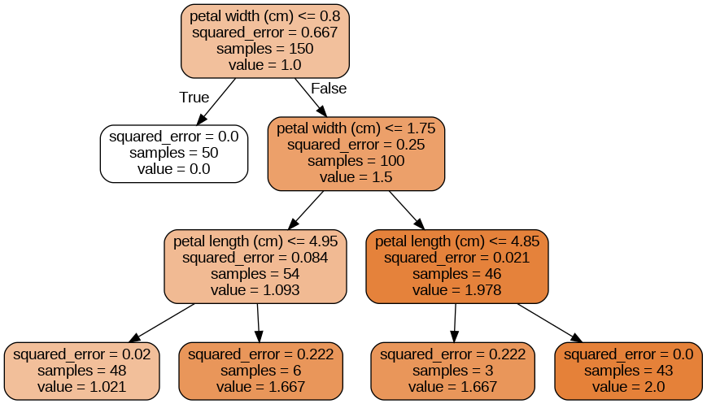

###  규제 매개변수

- 결정 트리의 경우 훈련 데이터에 대한 가정을 보통 두지 않는다. (<=>선형 모델의 경우에는 데이터가 선형일거라 가정)

- 하지만 훈련 데이터에 대한 일반적인 가정을 두지 않는다면, 모델 자체가 훈련 데이터와 아주 가깝게 만들려고 해서 `과접합이 발생할 수 있다.` -> 과적합, 너무 훈련데이터에 맞춰서 예측이 진행된다.

- 결정 트리 모델의 경우에는 일반적인 선형 모델과 같이 파라미터 모델이 아니다.

- 결정 트리 모델은 훈련되기 전에 파라미터의 수를 지정할 수 없는 `비파라미터 모델`(nonparametric model)이다.

- 비파라미터 모델은 훈련 데이터에 맞춰지기 때문에 모델 구조가 고정되지 않고 자유롭다.

- 파라미터 모델은 미리 파라미터를 정할 수 있기 때문에 제한적이지만 과대적합의 위험을 조절할 수 있다.

- 결정 트리는 보통 최대 깊이(max_depth)로 모델의 과적합을 규제할 수 있다.

- max_depth가 낮아지면 과대적합의 위험이 감소될 수 있다.
결정 트리의 규제 매개변수 종류

- max_depth : 트리 `최대 깊이` - 규제의 정도

  - max_depth 감소(깊어지는 것을 방지하기 위함이다.) => 모델 규제 증가 => 과적합 감소

- min_samples_split : 분할되기 위해 노드가 가져야 하는 `최소 샘플 수`

  - min_samples_split 증가(분기를 어느정도까지 분화시킬 것인가를 결정한다.) => 모델 규제 증가 => 과적합 감소

- min_samples_leaf : leaf node가 가지고 있어야할 최소 샘플 수

  - min_samples_leaf 증가 => 모델 규제 증가 => 과적합 감소

- min_weight_fraction_leaf : min_samples_leaf와 비슷하지만, `가중치`가 부여된 전체 샘플 수에서의 비율

  - min_weight_fraction_leaf 증가 => 모델 규제 증가 => 과적합 감소

- max_leaf_nodes : leaf node의 총 최대 개수

  - max_leaf_nodes 감소 => 모델 규제 증가 => 과적합 감소

- max_features : 최상의 분할을 찾을 때 고려할 기능의 수

  - max_features 감소 => 모델 규제 증가 => 과적합 감소

### Decision Tree를 활용한 회귀

- decision tree(결정 트리)를 활용하여 회귀문제 또한 해결할 수 있다.

- 앞에서 classification 했을 때와 거의 비슷한 형태의 그림을 가지게 된다.

- 차이점이라고는 클래스를 예측하는 것이 아니라, 특정 연속적인 `value값을 예측`한다는 것이다.

- classification에서 CART알고리즘은 훈련 세트의 불순도를 줄이는 방향으로 학습하지만, 회귀에서는 형태는 비슷하게 불순도 대신 `MSE`를 기본값으로 사용한다.

### Decision Tree의 불안정성

- Decision Tree(결정 트리)는 이해 및 해석이 용이하면서 예측속도가 아주 빠르고 성능도 좋다.

- 하지만 결정트리는 계단 모양의 Decision Boundary(결정 경계)를 만들기 때문에 `훈련 세트의 회전에 아주 민감`하다.

- 복잡해지는 문제를 일반화하기 위해서 `PCA`(Principal Component Analysis)방법을 사용할 수 있다. -> 데이터 회전을 통한 특성 축소를 의미한다고 보면 된다. / 다중공선성 문제를 어느정도 해결할 수 있다.

- 하지만 위의 방법을 사용할 시 새로운 변수에 대한 해석력이 낮아질 수 있다.