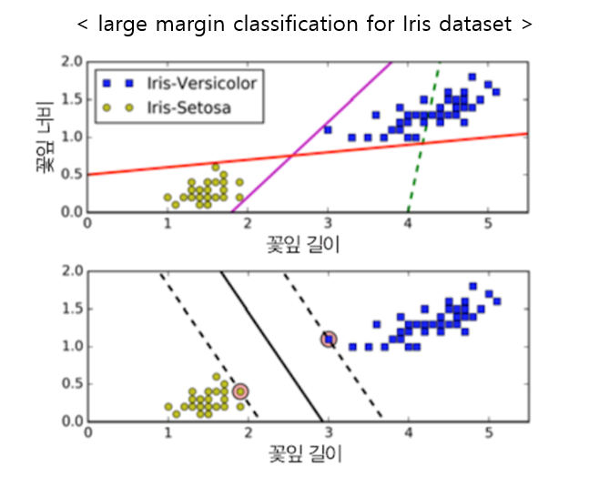

### 핸즈온 머신러닝 svm 개요

- 서포트 벡터 머신은 매우 강력하고 선형이나 비선형 분류, 회귀 이상치 탐색에도 사용할 수 있는 다목적 머신러닝 모델이다.

- 머신러닝에서 인기 있는 모델에 속하고, 머신러닝 관심있는 사람이라면 반드시 알아야 하는 모델이다.

- 특히 SVM(선형) 은 복잡한 분류 문제에 잘 들어 맞으며, 작거나 중간 크기의 데이터 셋에 적합하다.

- SVM 은 특성 스케일에 매우 민감하다.(사이킷런의 StandardScaler 사용을 권장한다.)




- 위 그림의 iris 데이터셋을 보면 SVM을 더 잘 이해하기 쉬울 것이다.

- 첫 번째 그림의 실선은 두 개의 클래스를 잘 분류하지 못하고 있다.

- 첫 번째 그림의 다른 두 모델 분류기는 정확히 분류는 하고 있으나, 모델 분류기의 선이 훈련 데이터와 너무 가까워서, 만약 새로운 new 데이터가 온다면 정확히 분류하지 못할 수도 있다.

- 두 번째 그림은 SVM 분류기의 결정 경계이다.

- 이 직선은 두 개의 클래스를 나누고 있을 뿐만 아니라, 클래스를 나누는 결정경계가 훈련샘플로부터 최대한 멀리 떨어져 있다.

- 그래서 `SVM 분류기는 클래스 사이의 가장 폭이 넓은 구간을 찾는 것으로 이해`할 수 있다. 그리고 이를 `large margin classification`(라지 마진 분류)라고 부른다.

- 방금 말한 SVM의 목적 때문에, 마진 구간 바깥쪽의 데이터는 결정 경계에 전혀 영향을 주지 않고, 오로지 마진 구간 근처에 위치한 샘플에만 결정경계는 영향을 받게 된다. 그리고 이렇게 영향을 주는 샘플들을 `Support Vector(서포트 벡터)`라고 부른다.

- SVM 개요에서 말한 것처럼 `SVM은 특성 스케일에 민감`하므로, 보통 사이킷런의 `StandardScaler을 사용하면 결정경계의 명확성을 높일 수 있다`.

- SVM 분류기는 기존 로지스틱 회귀처럼 클래스에 대한 확률, 즉 `predict_proba() 메서드를 제공하지 않지만`, SVC모델안에 probability=True 매개변수를 주게되면 predict_proba()메서드 사용 가능

- 위 방법말고, SVC(kernel='linear',C=1)과 같이 SVC 모델을 사용 가능 (훈련세트가 커지면 속도 느려져 권장 X)

- 위 방법말고, SGDClassifier(loss='hinge',alpha=1/(m*C)) <m = 샘플수>를 사용 할 수 있다. 이는 LinearSVC만큼 빠르게 수렴하지는 않지만 데이터셋이 아주 커서 메모리에 적재 불가능하거나, 온라인 학습으로 분류 문제를 다룰 때는 유용하다.

### 비선형 SVM 분류

- 비선형 SVM이 많은 경우에서 잘 작동하지만, 데이터셋 자체가 선형으로 잘 분류할 수 없는 경우도 많다.

- 간단히 이러한 데이터셋에서는 다항 특성(polynomial)인 아래와 같은 특성을 추가하면 된다.

- 사이킷런의 PolynomialFeature를 사용하면 데이터에 다항특성을 적용할 수 있다.

- 다음은 실제 비선형적 특성을 가지는 사이킷런의 moons(make_moons, sklearn dataset에 있다.)데이터 예제를 통해 비선형 SVM 분류를 해보겠다.

```py
from sklearn.datasets import make_moons
from sklearn.pipeline import Pipeline
from sklearn.preprocessing import PolynomialFeatures
from sklearn.svm import LinearSVC

# 샘플 수 1000개, noise값 0.1, random_state=2021, 비선형적인 dataset이다.
x,y = make_moons(n_samples=1000, noise=0.1, random_state=2021)

# 변수변환 : polynomial 3차 다항식 사용, scaler : StandardScaler 사용, 모델 : LinearSVM(C=10,loss='hinge) 사용 
polynomial_std_svm = Pipeline([
                               ("polynomial", PolynomialFeatures(degree=3)),
                               ("std", StandardScaler()),
                               ("svm", LinearSVC(C=10, loss='hinge'))
])

# 모델 학습
polynomial_std_svm.fit(x, y)

# 첫번째 변수값:2.0, 두번째 변수값:1.0 인 새로운 데이터 예측
new_moon = [[2.0, 1.0]]
polynomial_std_svm.predict(new_moon)
```