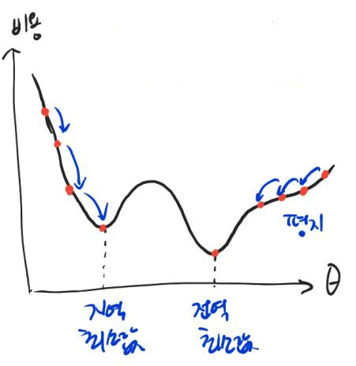
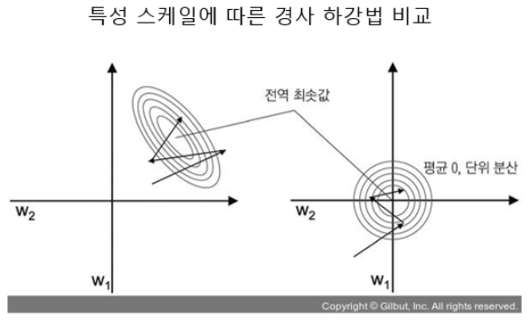
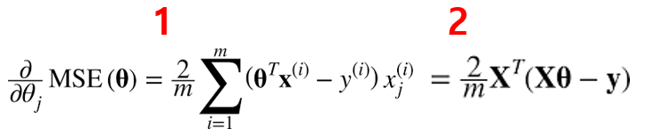
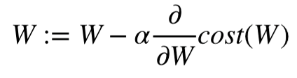

## 경사하강법

- 여러 종류의 문제에서 최적의 방법을 찾을 수 있는 일반적인 최적화 알고리즘

- 기본 메커니즘은 지정한 비용 함수를 최소화하기 위해 `파라미터를 반복적으로 수정`하는 것, 하이퍼 파라미터의 수정 -> 최적 파라미터 값을 찾는다.

- 무작위로 벡터 `θ를 초기화`한다.

- 파라미터 벡터 θ에 대해 비용 함수(Loss Function)의 현재 그래디언트(현재 가중치, 기울기)를 계산한다.

- 최적의 기울기를 찾는다. -> 미분값을 그었을 때 -> 방향을 찾고 계속 기울기를 하강시킨다.

- 그래디언트가 감소하는 방향으로 진행하면서, 최종적으로 계산된 그 `래디언트가 0이 되면 최솟값에 도달`하도록 해야 한다.

- 위 그림처럼 경사 하강법에서 최적화 시키는 방향으로 가게 하는 중요한 하이퍼파라미터 step(learning rate)를 결정해야 한다. -> 학습률을 조정

- 실제 모든 비용함수는 위와 같이 quadratic(이차원)하게 표현되지 않고 울긋불긋하게 솟았다가 내려앉았다가 한다.

- 학습률이 너무 작은 경우에는 local minumum(`지역 최소값`)에 빠지게 된다. -> 과적합

- 학습률이 너무 큰 경우에는 `수렴이 되지 않게 된다`. 계속 발산해서 튕겨나간다.

- 학습률을 잘 조정해야지, global minumum(최적의 값)으로 잘 수렴할 수 있다.



이 그림과 같은 결과가 나타날 수 있기 떄문이다.

- 다행히도 선형 회귀의 MSE 비용 함수는 convex function(볼록 함수)이기 때문에, local minum이 없고, global minimum만 존재한다.

- 충분한 시간과 적절한 학습률만 주어진다면, global minimum에 최대한 근접할 수 있다.
-> 시간만 많으면 학습을 계속 진행시켜 찾을 수 있다.



- 위 그림처럼 오른쪽의 경사 하강법은 곧장 global minimum으로 내려갈 수 있다.

- 왼쪽의 그림에서 완만한 경사를 만나게 되면 global minimum으로 내려갈 수는 있지만 더 오래 걸린다.

- 경사 하강법 전에는 반드시 `모든 특성을 같은 스케일을 사용`하여서 데이터 변환을 하여야 한다.

- scikit learn(사이킷런) 라이브러리에서 각 특성에서 평균을 빼고 표준편차로 나누어 평균을 0 분산을 1로만드는 `StandardScaler(표준화 작업)`을 사용하곤 한다.



- 경사 하강법에서 각 모델의 θj에 대한 비용 함수의 partial derivative(편미분) 값을 1번 처럼 계산해야 한다. w1, w2, w3 .. 하나씩 구하는 것

- partial derivative를 각각 계산하는 대신 2번처럼 한번에 계산도 가능하다.

- 위 공식은 매 경사 하강 스텝에서 전체 훈련 세트에 대해 계산한다.

- 그래서 이 공식을 Batch Gradient Descent(배치 경사 하강법)이라고 한다.

- 전체 데이터를 다 사용하기 때문에 큰 훈련 세트에서는 아주 느리다.

- 장점으로는, `특성 수에 민감하지 않기 때문에` 정규방정식보다 경사 하강법을 사용하는 것이 훨씬 빠르다.



- 위와 같이 그래디언트 벡터가 계산되면 학습률(alpha)에 그래디언트 벡터를 곱하고 이전 `weight`에 빼면 된다. (최적화 과정이다.)

## 확률적 경사하강법

- 앞서, 배치 경사 하강법에서 언급한대로 매 스텝에서 `전체 훈련 세트를 사용해서 그래디언트를 계산해야 하는 큰 문제`가 있다.

- 이러한 문제를 극복하기 위해, 확률적 경사 하강법은 `매 스텝마다 한 개의 샘플을 무작위로 선택 및 그 샘플에 대한 그래디언트를 계산`한다.

- 매 반복에서 적은 양의 데이터로 그래디언트를 계산하고 업데이트 하기 때문에 최적화가 더 빠르다.

- 그리고 전체 데이터에서 샘플을 추출해서 최적화 시키기 때문에 매우 큰 훈련 데이터 역시 처리할 수 있다.

- 하지만 무작위 추출(일부 데이터만 사용하기 때문에)이기 때문에, 전체 데이터를 사용하는 것 보다 안정적이지는 못하다.

- 비용 함수의 global minumum에 도달하기 까지 요동치며 평균적으로 감소한다. 요동치면서 최적의 해에 가까워지기는 하겠지만, `최소값에 도달하지 않을 수도 있다.`

- 하지만 비용 함수가 MSE처럼 convex(볼록 함수)하지 않고 불균형하다면 배치 경사 하강법보다 global minimum에 도달할 가능성이 높다.

- 무작위성으로 인한 global minimum에 도달하지 않을 수 있다는 단점을 극복하기 위해서, 학습률을 점진적으로 감소시키는 해결책이 있다.(시작: 학습률 크게 => 진행단계: 학슬률 작게)

- 위 해결책을 위한 매 반복 학습률 결정 함수를 `learning schedule(학습 스케쥴)`이라고 부른다. 학습률을 계속 바꿔가면서 실행한다. 라는 의미이다.

## 미니 배치 경사하강법

- 가중치를 계산하는 것이 아니라, Mini Batch라 부르는 임의의 작은 샘플 세트에 대해 그래디언트를 계산하는 것이다.

- 확률적 경사 하강법에 비해 행렬 연산에 최적화된 GPU를 사용해서 성능을 더 올릴 수 있다.

- 미니 배치가 큰 경우, 파라미터 공간에서 SGD(확률적 경사 하강법)보다 덜 불규칙하게 움직인다.

- 곧, SGD(확률적 경사하강법)보다 최소값에 도달할 수 있는 가능성이 더 높지만, `Local Minimum(국소값)에 빠질 위험은 존재`한다.

- 배치 전체 훈련 세트를 사용하는 경우에 최소값 도달이 가능하지만 매 스탭에서 많은 시간과 비용이 든다.

- 확률적, 미니 배치 경사하강법은 학습 스케쥴을 사용한다면 최소값에 도달은 할 수 있다.

- 사이킷런의 SGDRegressor와 SGDClassifier에서 `partial_fit 메서드`를 사용하여 모델 파라미터를 초기화하지 않고 미니배치 학습을 위해 반복적으로 호출할 수 있다.

- partial_fit 메서드는 fit 메서드와 동일하게 미니배치의 샘플을 하나씩 적용하므로 엄밀히 말하면 미니배치 경사 하강법 알고리즘은 아니다. - 핸즈온 머신러닝 -

## 규제가 있는 선형 모델

- 과대적합을 감소시키는 것이 아주 중요하고, 그 과대적합을 줄일 수 있는 방법을 강구해야 한다.

- 그 방법 중 loss에 새로운 term을 추가하여서 모델 weight에 대한 규제를 가하는 것이다.

### Lasso Regression (라쏘 회귀)

- Lasso(라쏘)회귀는 선형 회귀의 규제된 버전이다.

- 비용 함수에 L1 term(가중치에 절대값을 적용한 형태)을 사용하여서 weight에 규제를 한다. 가중치에 절댓값을 활용

- MSE 에서만 W 규제 -> MSE + W 둘다 규제

```py
from sklearn.linear_model import Lasso
lasso_reg = Lasso(alpha=0.1)
lasso_reg.fit(x,y)
lasso_reg.predict([[1.5]])
```

### Ridge Regression (릿지 회귀)

- Ridge(릿지)회귀는 선형 회귀의 규제된 버전이다.

- 비용 함수에 L2 term(가중치에 제곱을 한 형태)을 사용하여 weight에 규제를 한다.

```py
# 안드레 루이 숄레스키가 발견한 행렬 분해(matrix factorization) 사용
# 숄레스키 분해의 장점은 성능이다. 원래 ridge의 solver default값은 'auto'이며 희소 행렬이나 특이 행렬이 아니면 'cholesky'가 된다.
from sklearn.linear_model import Ridge
ridge_reg = Ridge(alpha=0.1,solver='cholesky')
ridge_reg.fit(x,y)
ridge_reg.predict([[1.5]])
>array([[0.29217567]])
```
