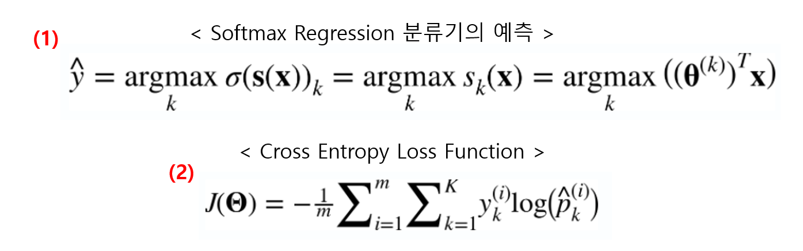

# softmax 회귀

- 로지스틱 회귀를 다항 분류가능하게 만드는 함수이다.

- 로지스틱 회귀 모델은 이진 분류뿐만 아니라, 여러 클래스를 분류할 수도 있다.

- 이를 지원하는 것이 Softmax Regression(소프트맥스 회귀) 또는 다항 로지스틱 회귀라고 한다.

- 모든 클래스를 더하면 1이 된다. 그 확률 중 가장 큰 값으로 분류한다.

- (1)에서 처럼 softmax를 통해서 나온 각 클래스별 추정 확률 값이 가장 높은 클래스를 실제 클래스라고 예측한다.

- 모델의 훈련 방법은 로지스틱 회귀의 훈련 방식과 비슷하게 (2)과 같이 나타나게 되고, 이를 크로스 엔트로피라고 부른다.

- `크로스엔트로피`는 추정된 클래스의 확률이 `목표 클래스에 얼마나 잘 들어맞는지 판단하는 용도`로 종종 사용된다.