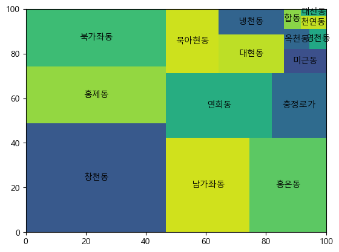

## 서대문구에서 치킨집이 가장 많은 동 찾기를 통한 DATA 분석

### Pandas and Numpy

#### Pandas

- 데이터 처리와 분석을 위한 라이브러리

- 행과 열로 이루어진 데이터 객체를 만들어 다룰 수 있음

- 대용량의 데이터들을 처리하는데 매우 편리

#### Pandas의 자료 구조

- Series: 1차원
- DataFrame: 2차원
- Panel: 3차원

- Pandas 로딩하기
- 
```
import pandas as pd
import numpy as np # np와 함께 사용
```

####  Pandas DataFrame

- 주로 사용하게될 자료형태

- 2차원 자료구조

  - 행레이블/열레이블, 데이터로 구성됨

  - 딕셔너리(dictionary)에서 데이터프레임 생성
  
- csv 파일에서 데이터를 가져와서 DataFrame 을 형성함

```
# data 폴더에 저장된 일반음식점.csv 를 로드함.
data = pd.read_csv('./data/서울특별시_일반음식점.csv', 
                  encoding = 'cp949',
                  low_memory = False)
```

- 특정 변수의 추출, 부분 추출이 가능하다.

```
# 특정변수 추출
print(data['번호']) 

# 특정 column 만을 따로 추출
data_fin = data_fin[['소재지전체주소','위생업태명']]
```

- 중복 제거, 유효성 검사.

```
# 위생업태명 column에서 중복을 제거해준다.
set(data.위생업태명.values)
```

- 특정 column 에서 특정 문자열이 존재하는지도 확인할 수 있다.

```
# <column 명>.contains(확인하려는 문자열): column 안에 문자열이 포함되어 있는지의 여부를 확인

data.위생업태명.str.contains('통닭|치킨', na = False)
# 위생업태명에 통닭 또는 치킨이 포함되어 있는지를 확인한다.
```

- 조건 인덱싱을 사용할 수 있다.
  
  - 조건식을 작성하여 특정 원소를 찾아낼 수 도 있다.

```
# 조건 인덱싱을 사용 : `위생업태명` 중 `통닭/치킨`이 포함된 `업태명`을 반환

data.위생업태명[data.위생업태명.str.contains('통닭|치킨', na = False)]

# 조건식을 사용 : 영업상태명이 영업/정상이면서 위생업태명이 '통닭(치킨)' 또는 '호프/통닭' 인 자료 찾기
data_fin = data[(data.영업상태명 == '영업/정상') & (data.위생업태명.isin(['통닭(치킨)', '호프/통닭']))]
```

#### Pandas에서의 통계처리 중 많이 사용하는 것들

|Method|	Description|
|--|--|
|count|	Number of non-NA values(숫자 세기)|
|min, max	|Compute minimum and maximum values(최소값, 최대값)|
|sum	|Sum of values(합계)|
|mean	|Mean of values(평균)|
|median	|median (50% quantile) of values(중간값)|
|var	|Sample variance of values(분산)|
|std	|Sample standard deviation of values(표준편차)|
|diff|	Compute first arithmetic difference (한 객체 내에서 열과 열 / 행과 행의 차이를 출력)|

#### slice 함수 및 iloc


- loc 인덱싱

    - <DataFrame명>.loc[행, 컬럼] :  원하는 행만 추출 하고 싶을 땐 리스트 사용

```
data.loc[['영업상태명', '상세영업상태명']]
```

- slice 함수

    - <DataFrame명>.<column명>.자료type.slice(start = 시작 index, stop = 끝 index + 1)

```
# 전체 주소의 자료에서 11번 째 ~ 17번 째 글자만 추출

addr = data_seo.소재지전체주소.str.slice(start = 11, stop = 17)
```

#### 트리맵 작도 패키지

- squarify.plot(데이터, label =  표시할 라벨 data)

```
# 트리맵 작도 패키지 import 해서 사용한다.
import squarify 


squarify.plot(ck_cnt, label = ck_cnt.index)
```


