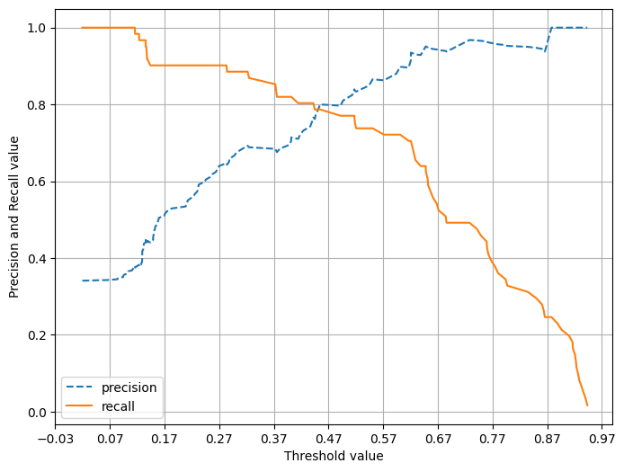

# 머신러닝_04_0_0 분류모델평가지표 **정밀도 / 재현율 트레이드 오프(Trade-off)** 부분부터 정리

## **정밀도 / 재현율 트레이드 오프(Trade-off)**

* 업무에 따라 정밀도/재현율 중요도가 다름

* 보통은 재현율이 중요하다.
   ex) 질병, 환자 Data, 금융사기판별 Data

* 정밀도 : ex) 스팸메일의 판단

* 분류하려는 업무 특성상 정밀도 또는 재현율이 특별히 강조돼야 할 경우, 분류의 결정 `임계값(Threshold)`을 조정해서 정밀도 또는 재현율의 수치를 높일 수 있음

* 그러나 정밀도와 재현율은 `상호 보완적`인 평가 지표이기 때문에 어느 한쪽을 강제로 높이면 다른 하나의 수치는 떨어지는데 이를 정밀도/재현율의 `트레이드 오프` (교차가 되는 지점)라고 한다.

* 사이킷런에서는 분류 결정 임계값을 조절해서 정밀도와 재현율의 성능 수치를 상호 보완적으로 조정 가능

## **분류 결정 임계값** (2진 `분류`를 기준)

* 임계값 : 하나의 변수 x가 어느 값이 되었을 때 특이한 상태나 `급격한 변화`가 일어나 `임계 상태(경계와 비슷한 개념, 변화가 나타나기 시작하는 지점)`에 있을 때의 x값이라고 한다.

* `Positive 예측값`을 결정하는 확률의 기준

* 임계값을 낮출수록 True 값이 많아진다.

* 확률 0.5 를 기준으로 0.5 이상미면 1이라고 판단하기로 결정함
  
  * 0.23, 0.8, 0.48, 0.6 확률로 나왔을 때 -> 0, 1, 0, 1 로 판단
  
  * 재현율이 중요한 데이터여서 임계값을 0.4 로 정하기로 했다.
  
  * 0.23, 0.8, 0.48, 0.6 확률로 나왔을 때 -> 0, 1, 1, 1 로 판단 `True(1)값이 많아진다.`

### `predict_proba()` 메소드

* 예측 결정값이 아닌 결정 확률값을 반환하는 매서드

* 타이타닉 생존자 데이터를 학습한 `LogisticRegression(회귀분석)` 객체에서 `predict_proba()` 메서드를 수행한 뒤 반환 값 확인하고, predict() 메서드와 결과 비교 -> 앞 예제의 코드 이어서 작성

```py

# predict(테스트 피처 데이터 세트) : 예측 결과 클래스 '값' 반환
# predict_proba(테스트 피처 데이터 세트) : 예측 '확률'을 반환(각 클래스에 속할 확률을 반환, 이진 분류의 경우 (0일 확률, 1일 확률)을 반환, 다중 분류의 경우 클래스마다 확률을 반환)
lr_clf.predict(X_test) # 로지스틱 회귀분석을 진행

# 예측 확률의 임계값에 따른 결정값을 반환하게된다.
print(lr_clf.predict_proba(X_test))
```

* 밑의 결과가 도출된다.

```md
[[0.44935227 0.55064773]
 [0.86335512 0.13664488]
 [0.86429645 0.13570355]
 [0.84968519 0.15031481]
 [0.82343411 0.17656589]
 [0.84231224 0.15768776]
 [0.8709549  0.1290451 ]
 [0.27228603 0.72771397]
 [0.78185129 0.21814871]
 [0.33185993 0.66814007]
 [0.86178764 0.13821236]
 [0.87058099 0.12941901]
 [0.86425952 0.13574048]
 [0.87065945 0.12934055]
 [0.56033546 0.43966454]
...
 [0.91079839 0.08920161]
 [0.84970739 0.15029261]
 [0.54874088 0.45125912]
 [0.48192067 0.51807933]]
```

```py
# 예측 확률 array 와 예측 결과값 array 를 concatenate 하여 예측 확률과 결과값을 한눈에 확인
# 메서드를 통해 각 클래스에 속할 확률을 반환 -> 여기서는 pred_proba 변수에 예측된 확률
pred_proba = lr_clf.predict_proba(X_test) # 로지스틱 회귀분석을 진행
pred_proba_result = np.concatenate([pred_proba, pred.reshape(-1, 1)], axis=1)

print('두개의 class 중에서 더 큰 확률을 클래스 값으로 예측')
print(pred_proba_result[:10])
```

* 결과

```md
두개의 class 중에서 더 큰 확률을 클래스 값으로 예측
[[0.44935227 0.55064773 1.        ]
 [0.86335512 0.13664488 0.        ]
 [0.86429645 0.13570355 0.        ]
 [0.84968519 0.15031481 0.        ]
 [0.82343411 0.17656589 0.        ]
 [0.84231224 0.15768776 0.        ]
 [0.8709549  0.1290451  0.        ]
 [0.27228603 0.72771397 1.        ]
 [0.78185129 0.21814871 0.        ]
 [0.33185993 0.66814007 1.        ]]
```

### Binarizer 클래스 활용

* 연속형 수치형 데이터를 이진화하는 데 사용되는 도구 -> 이진 `분류`

* 사이킷런의 `Binarizer 클래스 이용`해서 분류 결정 임계값을 조절하여 정밀도와 재현율의 성능 수치를 상호 보완적으로 조정 가능하다.

#### Binarizer 클래스 이용 예측값 변환 예제

* `threshold 변수`를 특정 값으로 설정하고 Binarizer 클래스의 fit_transform() 메서드를 이용한다.

* 넘파이 `ndarray` 입력 값을 지정된 threshold보다 같거나 **작으면 0 값으로**, 크면 1값으로 변환해서 반환, 해당한 임계값은 포함하지 않는다.

```py
# Binarizer 클래스를 활용
from sklearn.preprocessing import Binarizer

X = [[ 0.5, -1,  2],
     [ 2,  0,  0],
     [ 0,  1.1, 1.2]]

c_threshold = 0.5

#Binarizer의 threshold 설정값. 분류 결정 임계값 = 0.5로 설정.  
bina = Binarizer(threshold = c_threshold).fit(X)
bina.transform(X)
```

* 도출되는 값

```md
array([[0., 0., 1.],
       [1., 0., 0.],
       [0., 1., 1.]])
```

### **분류 결정 임계값 0.5 기반에서 Binarizer를 이용하여 예측값 변환**

```py
# 현재 임계값 = 0.5
c_threshold = 0.5

# predict_proba( ) 반환값([0확률 1확률])의 두번째 컬럼(1일확률) 
pred_proba[:10] # 0일확률,1일확률
pred_proba_1 = pred_proba[:,1] # 1차원 array로 반환
# pred_proba_1[:10] 1일확률
pred_proba_1 = pred_proba_1.reshape(-1, 1) # 2차원으로 변경해준다. 배열의 형태를 (-1, 1)로 변환

# Binarizer 사용 임계값, fit 적용(pred_proba_1)시켜준다.
bina = Binarizer(threshold = c_threshold).fit(pred_proba_1) 
custom_predict = bina.transform(pred_proba_1)

print("분류 임계값 : c_threshold = 0.5")
get_clf_eval(y_test, custom_predict)

# 앞에서 predict()로 구한 결과와 동일 : 정확도: 0.866, 정밀도: 0.825, 재현율: 0.770
# predict()는 threshold 값 설정하지 않고 구했음 (디폴트 : 0.5, 0.5 초과 시 1로 판단)
```

* 결과

```md
분류 임계값 : c_threshold = 0.5
오차행렬
[[108  10]
 [ 14  47]]
정확도: 0.866, 정밀도: 0.825, 재현율: 0.770
```

#### **분류 결정 임계값을 0.4로 변경**

```py
# 임계값을 0.5 -> 0.4 로 변경
c_threshold = 0.4

# predict_proba( ) 반환값([0확률 1확률])의 두번째 컬럼 
# 즉 Positive 클래스 컬럼 하나만 추출하여 Binarizer를 적용
pred_proba_1 = pred_proba[:,1].reshape(-1,1)

binarizer = Binarizer(threshold = c_threshold).fit(pred_proba_1)
custom_predict = binarizer.transform(pred_proba_1)

print("분류 임계값 : c_threshold = 0.4")
get_clf_eval(y_test, custom_predict)
# 정확도: 0.866, 정밀도: 0.825, 재현율: 0.770 - 임계값 0.5 일 때
# 정확도: 0.821, 정밀도: 0.704, 재현율: 0.820 - 임계값 0.4 일 때
```

* 결과

```md
분류 임계값 : c_threshold = 0.4
오차행렬
[[97 21]
 [11 50]]
정확도: 0.821, 정밀도: 0.704, 재현율: 0.820
```

* 여기서 분류 결정 임곗값이 낮아질수록 Positive로 예측할 확률이 높아진다. -> 재현율의 증가

* 그렇다면 임계값을 더욱 늘려서 진행해본다면 어떤 결과를 도출할 수 있을까?

```py
# 테스트를 수행할 모든 임곗값을 리스트 객체로 저장. 
thresholds = [0.35, 0.4, 0.45, 0.50, 0.55, 0.60]

# 정답, 1일 때의 예측, # 임계값
def get_eval_by_threshold(y_test, pred_proba_c1, thresholds):
    # thresholds list객체내의 값을 차례로 iteration하면서 Evaluation 수행.
    for custom_threshold in thresholds:
        # 객체를 생성해줌
        binarizer = Binarizer(threshold=custom_threshold).fit(pred_proba_c1) 
        # 임계값에 따라서 결정값이 나올 것이다.
        custom_predict = binarizer.transform(pred_proba_c1)
        print('\n임곗값:',custom_threshold)
        # 결정값에 대한 평가를 진행하겠다.
        get_clf_eval(y_test , custom_predict)

get_eval_by_threshold(y_test ,pred_proba[:,1].reshape(-1,1), thresholds )
# 데이터에 따라서 다른 결정을 할 것이다.
# 재현율에 조금 더 치중
```

* 결과

```md
임곗값: 0.35
오차행렬
[[94 24]
 [ 9 52]]
정확도: 0.816, 정밀도: 0.684, 재현율: 0.852

임곗값: 0.4
오차행렬
[[97 21]
 [11 50]]
정확도: 0.821, 정밀도: 0.704, 재현율: 0.820

임곗값: 0.45
오차행렬
...
오차행렬
[[113   5]
 [ 17  44]]
정확도: 0.877, 정밀도: 0.898, 재현율: 0.721
```

### 임곗값에 따른 정밀도-재현율 값 추출

* precision_recall_curve()를 사용해서 시각화하기

#### **precision_recall_curve( 실제값, 레이블 값이 `1`일 때의 예측 확률값)**

* 정밀도, 재현율, 임계값을 ndarray로 반환

* 임계값 : 일반적으로 0.11 ~ 0.95 범위

* 정밀도와 재현율의 임계값에 따른 값 변화를 곡선 형태의 그래프로 시각화하는데 이용

#### 예제

* 반환되는 임계값이 너무 작은 값 단위로 많이 구성되어 있다.

* 반환된 임계값의 데이터 143건인데, 임계값을 15단계로 해서 샘플로 10건만 추출하고 좀 더 큰 값의 임계값과 그때의 정밀도와 재현율 확인해본다.

```py

from sklearn.metrics import precision_recall_curve

# 레이블 값이 1일때의 예측 확률을 추출, 차원 변환도 같이 일어난다. 
pred_proba_class1 = lr_clf.predict_proba(X_test)[:, 1] 

# 실제값 데이터 셋과 레이블 값이 1일 때의 예측 확률을 precision_recall_curve 인자로 입력 
precisions, recalls, thresholds = precision_recall_curve(y_test, pred_proba_class1)

# 임계값 반환
print('임계값 shape: ', thresholds.shape)

# 정밀도 반환
print('정밀도 shape: ', precisions.shape)

# 재현율 반환
print('재현율 shape: ', recalls.shape)
```

* 결과 반환 형태

```md
임계값 shape:  (165,)
정밀도 shape:  (166,)
재현율 shape:  (166,)
```

#### 결과 확인하기

```py
# 임계값을 15단계로 한다.
idx = np.arange(0, thresholds.shape[0], 15) # 15 간격으로 데이터를 생성
print('sample index:', idx)

sample index: [  0  15  30  45  60  75  90 105 120 135 150]

# 설정한 idx 값들을 넣고 결과 확인하기.
print('임계값 sample: ', np.round(thresholds[idx], 3))
print('정밀도 sample: ', np.round(precisions[idx], 3))
print('재현율 sample: ', np.round(recalls[idx], 3))
```

* 결과값들

```md
임계값 sample:  [0.02  0.113 0.129 0.144 0.16  0.243 0.325 0.447 0.621 0.728 0.866]
정밀도 sample:  [0.341 0.372 0.401 0.44  0.505 0.598 0.688 0.774 0.915 0.968 0.938]
재현율 sample:  [1.    1.    0.967 0.902 0.902 0.902 0.869 0.787 0.705 0.492 0.246]
```

```py
# 반환된 임계값 배열 행이 143건으로 임계값을 15단계로 해서 샘플로 10건만 추출
thr_index = np.arange(0, thresholds.shape[0], 15)
print('샘플 추출을 위한 임계값 배열의 index 10개:', thr_index)
print('샘플용 10개의 임곗값: ', np.round(thresholds[thr_index], 2))

# 15 step 단위로 추출된 임계값에 따른 정밀도와 재현율 값 
print('샘플 임계값별 정밀도: ', np.round(precisions[thr_index], 3))
print('샘플 임계값별 재현율: ', np.round(recalls[thr_index], 3))
```

* 결과값들

```md
샘플 추출을 위한 임계값 배열의 index 10개: [  0  15  30  45  60  75  90 105 120 135 150]
샘플용 10개의 임곗값:  [0.02 0.11 0.13 0.14 0.16 0.24 0.32 0.45 0.62 0.73 0.87]
샘플 임계값별 정밀도:  [0.341 0.372 0.401 0.44  0.505 0.598 0.688 0.774 0.915 0.968 0.938]
샘플 임계값별 재현율:  [1.    1.    0.967 0.902 0.902 0.902 0.869 0.787 0.705 0.492 0.246]
```

* 결과값 df 형태로 변환하기

```py
col_dict={'임곗값': np.round(thresholds[thr_index], 2),
          '정밀도': np.round(precisions[thr_index], 3),
          '재현율': np.round(recalls[thr_index], 3)}
df = pd.DataFrame(col_dict)
```

### 임곗값의 변경에 따른 정밀도-재현율 변화 곡선 확인하기

```py
import matplotlib.pyplot as plt
import matplotlib.ticker as ticker
%matplotlib inline

# y_test : 실제 값  pred_proba_c1: 예측 확률 값
# 그래프 만들기를 함수로 설정
def precision_recall_curve_plot(y_test , pred_proba_c1): 
    # threshold ndarray와 이 threshold에 따른 정밀도, 재현율 ndarray 추출. 
    precisions, recalls, thresholds = precision_recall_curve( y_test, pred_proba_c1)
    
    # X축을 threshold값으로, Y축은 정밀도, 재현율 값으로 각각 Plot 수행. 
    # 정밀도는 점선으로 표시
    plt.figure(figsize=(8,6))
    threshold_boundary = thresholds.shape[0] # (165,)에서 165 추출

    # thresholds : 165이고, precisions과 recalls는 166개로 x, y축 값의 개수가 맞지 않으므로 1개 더 적게 가지고 오도록 설정
    # precisions, recalls로 그래프 그리면 오류 
    # y 값을 [0:threshold_boundary] ([0:165])로 165개 추출해서 x축 개수와 맞춤, 맨 마지막에 있는 데이터를 제외해준다.
    plt.plot(thresholds, precisions[0:threshold_boundary], linestyle='--', label='precision') 
    plt.plot(thresholds, recalls[0:threshold_boundary],label='recall')
    
    # threshold 값 X 축의 Scale을 0.1 단위로 변경
    # xlim() : X축 범위를 지정하거나 반환
    start, end = plt.xlim() # X축 범위 반환
    plt.xticks(np.round(np.arange(start, end, 0.1),2)) # 0.1 간격으로 x 값을 표현
    
    # x축, y축 label과 legend, 그리고 grid 설정 범례, 제목을 설정
    plt.xlabel('Threshold value'); plt.ylabel('Precision and Recall value')
    plt.legend(); plt.grid()
    plt.show()

# y_test : 실제 값
# lr_clf.predict_proba(X_test)[:, 1] : 레이블 값이 1일때(두번째)의 예측 확률 값
precision_recall_curve_plot( y_test, lr_clf.predict_proba(X_test)[:, 1] )

# x 값을 다 주기 위해서 x 값을 자동으로 늘리거나 줄이는 작업을 실시함.
```



### 그래프 결과

* 임계값이 낮을 수록 많은 수의 양성 예측으로 인해 재현율이 값이 극도로 높아지고 정밀도 값이 극도로 낮아짐

* 0.45 에서 서로 교차한다.

* 재현율 중시 - 교차되는 지점에서 왼쪽 + 차이가 적게 나는 지점에서 임계값을 설정

* 정밀도 중시 - 교차되는 지점에서 오른쪽 + 차이가 크게 나는 지점 전에서 임계값을 설정

* 임계값을 계속 증가시킬수록 재현율 값이 낮아지고 정밀도 값은 높아지는 반대 양상 보인다.

### 정밀도와 재현율 조합

* `Positive 예측의 임계값에 따라 정밀도와 재현율 수치가 변경`

* 임계값은 업무 환경에 맞게 정밀도와 재현율의 수치를 상호 보완할 수 있는 수준에서 적용되어야 함

* 단순히 하나의 성능 지표 수치를 높이기 위한 수단으로 사용되어서는 안된다.

* 정밀도 또는 재현율 중 하나에 상대적인 중요도를 부여해 각 예측 상황에 맞는 분류 알고리즘을 튜닝할 수는 있지만, 정밀도와 재현율 성능 수치를 어느 한쪽만 참조하면 극단적인 수치 조작 가능하다.

#### 정밀도를 100%로 만드는 법

* 확실한 기준이 되는 경우만 Positive로 예측하고 나머지는 모두 Negative로 예측
* 전체 환자 1000명 중 확실한 Positive 징후만 가진 환자는 단 1명이라고 하면, 한 명만 Positive로 예측하고 나머지는 모두 Negative로 예측할 경우
* 정밀도 = TP / (FP + TP)에서 FP는 0, TP는 1이되므로 정밀도는 1/(0+1)으로 100%가 됨

#### 재현율을 100%로 만드는 법

* 모든 환자 1000명을 Positive로 예측하면 됨
* 실제 양성인 사람이 30명 정도라도 TN이 수치에 포함되지 않고 FN은 아예 0이므로
* 재현율 = TP / (FN + TP)에서 재현율은 30/(0+30)으로 100%가 됨

#### 결국 분류의 종합적인 성능 평가에 사용하기 위해서는 정밀도와 재현율의 수치를 적절하게 조합하는 것이 필요하다고 할 수 있다

### F1 Score

* 정밀도와 재현율의 조화평균(tip. 조화평균은 평균변화율등을 구할때 사용(평균속력등)) -> 분류 문제에서 많이 사용

* 정밀도와 재현율이 어느 한쪽으로 치우치지 않는 수치를 나타낼때 상대적으로 높은 값을 가짐

* 평가 지표 중 하나이다.

```py
# 사이킷런의 F1 스코어 API : f1_score()
# 결정값을 가지고 정밀도, 재현율 계산 후에 f1_score 를 계산한다.
from sklearn.metrics import f1_score 
f1 = f1_score(y_test, pred)
print('F1 스코어: {0:.4f}'.format(f1))
```

#### 타이타닉 생존자 예측에서 F1 스코어 구하기

* 함수 정의하기

```py
def get_clf_eval(y_test , pred):
    confusion = confusion_matrix( y_test, pred)
    accuracy = accuracy_score(y_test , pred)
    precision = precision_score(y_test , pred)
    recall = recall_score(y_test , pred)
    
    # F1 스코어를 위의 함수에 추가
    f1 = f1_score(y_test, pred)
    print('오차 행렬')
    print(confusion)
    # f1 score print 추가
    print('정확도: {0:.4f}, 정밀도: {1:.4f}, 재현율: {2:.4f}, F1:{3:.4f}'
          .format(accuracy, precision, recall, f1))
    print()
```

* 정의한 함수 실제 대입하기

```py
# 임계값 0.35 ~ 0.6별(0.05 마다)로 정확도, 정밀도, 재현율, F1 스코어 확인
thresholds = [0.35, 0.4 , 0.45 , 0.50 , 0.55 , 0.60]
pred_proba = lr_clf.predict_proba(X_test)

# 임계값에 따른 predict 값들을 만들어내는 함수
# 임계값 평가 함수에 변화함수를 대입해주었다.
get_eval_by_threshold(y_test, pred_proba[:,1].reshape(-1,1), thresholds) # 사용자 정의함수
```

* 결과값

```md
임곗값: 0.35
오차 행렬
[[94 24]
 [ 9 52]]
정확도: 0.8156, 정밀도: 0.6842, 재현율: 0.8525, F1:0.7591


임곗값: 0.4
오차 행렬
[[97 21]
 [11 50]]
정확도: 0.8212, 정밀도: 0.7042, 재현율: 0.8197, F1:0.7576

...
[[113   5]
 [ 17  44]]
정확도: 0.8771, 정밀도: 0.8980, 재현율: 0.7213, F1:0.8000
```

#### F1 score 는 임계값이 0.6일 떄 가장 좋은 값

* 재현율은 크게 감소

* 그렇기 때문에 임계값이 0.6 을 선택하지 않는 것이 좋다.
