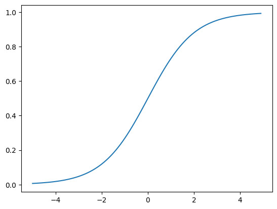
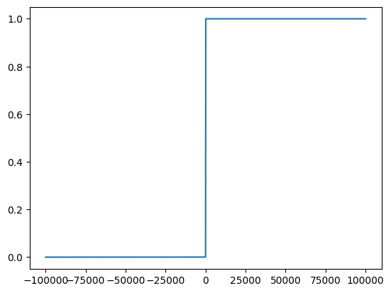

# 04_1_로지스틱회귀(분류) 부분 복습

## 다중 분류 문제 - 로지스틱회귀

- 회귀 기법을 분류 문제에 적용한 것 중 하나가 로지스틱 회귀이다.

### sklearn 을 이용한 iris 데이터 분류

- 붓꽃 데이터 세트를 사용해서 붓꼿의 품종을 `분류(classification)`

### iris dataset?

- sklearn.dataset에 들어있는 data 이다.

- load.iris() 매서드를 통해 로드해서 사용할 수 있다.

- 머신러닝 각 분야에서 알고리즘을 측정하기 위한 기본 자료로서 다양하게 활용되고 있다.

- 4가지 feature(특성)을 가진 3가지 붓꽃 품종의 50개의 샘플을 포함하고 있다.

- Setosa, Versicolor, Virginica 3 가지 품종으로 구성되어 있다.

### 붓꽃의 4가지 속성(Feature)

- 꽃받침 길이 : Sepal Length

- 꽃받침 너비 : Sepal Width

- 꽃잎의 길이 : Petal Length

- 꽃잎의 너비 : Petal Width

## iris 데이터 준비 -> 분류 실시

```py
from sklearn.datasets import load_iris # dataset
from sklearn.linear_model import LogisticRegression # 로지스틱회귀 분류
from sklearn.model_selection import train_test_split
from sklearn.metrics import accuracy_score
import pandas as pd
import numpy as np

# 붓꽃 데이터 세트 로딩
iris = load_iris()

# iris.data : Iris 데이터 세트에서 
# 피처(feature)만으로 된 데이터를 numpy로 가지고 있음
iris_data = iris.data
print(iris_data[:10])
```

- iris data의 구성 - 4가지 특성이 순서대로 나타난다.

```md
[[5.1 3.5 1.4 0.2]
 [4.9 3.  1.4 0.2]
 [4.7 3.2 1.3 0.2]
 [4.6 3.1 1.5 0.2]
 [5.  3.6 1.4 0.2]
 [5.4 3.9 1.7 0.4]
 [4.6 3.4 1.4 0.3]
 [5.  3.4 1.5 0.2]
 [4.4 2.9 1.4 0.2]
 [4.9 3.1 1.5 0.1]]
```

- 전처리 및 df 구성하기

```py
# label 을 target으로 설정
iris_label = iris.target

# iris 종류 - label 로 표현되어 있음
print(iris_label)

# iris 종류 - 품종명
print(iris.target_names)

# iris 데이터를 구성하고 있는 피쳐
print(iris.feature_names)

# DataFrame 으로 변환하는 작업실시
# 4가지 피쳐를 열로 한다.
iris_df = pd.DataFrame(data = iris_data, columns = iris.feature_names)

# label 을 추가 -> target 이 label 로
iris_df['label'] = iris.target
```

### 본격적인 머신러닝 진행

```py
from sklearn.model_selection import train_test_split

# 학습/훈련 데이터로 분류 (0.3, 0.7) 
X_train, X_test, y_train, y_test = train_test_split(iris_data, iris_label, test_size=0.3, random_state=11)
```

### k-최근접 이웃 분류기를 이용한 `분류 확률` 예측하기

```py
from sklearn.neighbors import KNeighborsClassifier
kn = KNeighborsClassifier(n_neighbors = 3)

# k 최근접 이웃 분류를 실시한다.
kn.fit(X_train, y_train)

# 분류 결정값 확인
print(kn.classes_)

# 정확도(확률)로 출력하기
print(kn.score(X_train, y_train))
print(kn.score(X_test, y_test))
```

- 주변 이웃 클래스들의 `비율`을 확률로 출력

```md
0.9714285714285714
0.9555555555555556
```

- 테스트 데이터로 예측 진행하기

```py
# 테스트 데이터 앞 5개 데이터에 대한 분류 결과
kn.predict(X_test[:5])
> array([2, 2, 2, 1, 2])

# 테스트 데이터 중 첫 번째 데이터 확인하기
X_test[:1]
> array([[6.8, 3. , 5.5, 2.1]])

# 각 클래스별 확률값을 proaba 매서드를 통해 반환
pred_proba = kn.predict_proba(X_test[:5])
np.round(pred_proba, 3)
# 주변의 이웃들만 가지고 확률을 판단하기 때문에 나타날 수 있는 확률이 정해질 수 밖에 없다.
# 확률에 따라서 분류하고 이를 계산한 비율을 넘겨줄 뿐이다.
# predict_proba() 메서드는 클래스별 확률을 계산하여 분류 모델의 예측 결과를 더욱 정확하게 이해하는 데 도움을 준다.
```

- 분류, 예측의 확률값을 반환 1에 가까울수록 그 범주에 속한다는 의미이다.

```md
array([[0.   , 0.   , 1.   ],
       [0.   , 0.   , 1.   ],
       [0.   , 0.333, 0.667],
       [0.   , 0.667, 0.333],
       [0.   , 0.   , 1.   ]])
```

### 3개의 품종중 하나로 결정되는 이유는?

- 3개 각 품종으로 으로 분류될 확률을 먼저 계산하고 거기서 `가장 확률값이 높은 품종으로 분류`된다.

- 즉, 2로 분류되었다고 해서 100프로 2번 품종 이라는 의미는 아니고 `2번 품종일 확률이 가장 높다`는 의미를 갖는다

- sklearn은 각 분류 클래스의 예측 확률을 반환하는 함수인 predict_proba()함수를 제공함으로써 이를 확인할 수 있다.

- 이를 다시 확인해보자면,

```py
# 각 테스트 샘플에 대하여 최근접 이웃 결정값을 확인하면
# 3 번째 데이터에 대해서 predict_proba 을 진행한다.
pred_proba = kn.predict_proba(X_test[2:3])

# 확률을 3번째 자리에서 반올림한다.
np.round(pred_proba, 3)

# label 3 일 확률이 0.667 이다.
> array([[0.   , 0.333, 0.667]])

# 각 테스트 샘플에 대하여 최근접 이웃 결정값(neighbors 활용)을 확인하면
# 거리와 인덱스를 반환하고 훈련 데이터에서 이에 해당하는 값을 반환한다.
dist, idx = kn.kneighbors(X_test[2:3])

# 거리, idx 값
print(dist, idx)

# y_train 에서 해당하는 값들
print(y_train[idx])
```

```md
[[0.36055513 0.37416574 0.43588989]] 

- index 값들
[[48 24 64]]

- 해당하는 label 값 -> 거리로 변환해서 가장 가까운 label 값들을 반환한 것이다.
[[1 2 2]]
```

- 하지만 현재 3개의 최근접 이웃을 사용하기 때문에 가능한 확률은 0/3, 1/3, 2/3, 3/3 이기 때문에 확률이라고 이야기 하기에는 많이 부족하다.

### 로지스틱 회귀 분류를 진행

- 선형회귀와 동일하게 `선형회귀식을 통한 학습`을 진행한다.

- z = a X 꽃잎길이 + b X 꽃잎 넓이 + c X 꽃받침 길이 + d X 꽃받침 넓이 + e

- 다른 값으로 변환된다. `가중치와 절편의 값`으로 이루어져 있는 z 값으로 변환, 여기서 z는 어떤 값도 가능

- 단, 분류가 되려면 0 에서 1 (or 0 에서 100%) 사이 값이 되어야 함 -> 확률로 분류를 진행하기 때문이다.

- z가 아주 큰 음수일때는 0, z가 아주 큰 양수일때는 1로 바꾸는 방법은?

- 시그모이드함수를 사용하면 된다.
  
  - 1/(1+e**-z)
  
  - z 값이 커지면 커질수록 1에 가까워진다.
  
  - 선형 방정식의 출력 z의 음수를 사용해 자연상수 e를 거듭제곱하고 1을 더한 값의 역수를 취한다. 이 계산식을 이용하면 위와 같은 그래프를 그릴 수 있다.
  


#### 시그모이드 함수 계산 예시

```py
# -5에서 +4.9까지 0.1간격의 난수 생성
# z값이 -5에서 +5 사이라면
# z값은 주어진 데이터에 대해서 선형회귀 알고리즘이 찾아낸 식을 적용한 결과값이다.

z = np.arange(-5, 5, 0.1)
```

- 밑과 같이 결과 도출

```md

- 이런식으로 난수를 형성해준다.

array([-5.00000000e+00, -4.90000000e+00, -4.80000000e+00, -4.70000000e+00,
       -4.60000000e+00, -4.50000000e+00, -4.40000000e+00, -4.30000000e+00,
       -4.20000000e+00, -4.10000000e+00, -4.00000000e+00, -3.90000000e+00,
       -3.80000000e+00, -3.70000000e+00, -3.60000000e+00, -3.50000000e+00,
       -3.40000000e+00, -3.30000000e+00, -3.20000000e+00, -3.10000000e+00,
       -3.00000000e+00, -2.90000000e+00, -2.80000000e+00, -2.70000000e+00,
       -2.60000000e+00, -2.50000000e+00, -2.40000000e+00, -2.30000000e+00,
       -2.20000000e+00, -2.10000000e+00, -2.00000000e+00, -1.90000000e+00,
       -1.80000000e+00, -1.70000000e+00, -1.60000000e+00, -1.50000000e+00,
       -1.40000000e+00, -1.30000000e+00, -1.20000000e+00, -1.10000000e+00,
       -1.00000000e+00, -9.00000000e-01, -8.00000000e-01, -7.00000000e-01,
       -6.00000000e-01, -5.00000000e-01, -4.00000000e-01, -3.00000000e-01,
       .....

```

```py
# z에 대하여 시그모이드 연산을 진행한 phi를 생성 후 그래프로 확인
phi = 1/(1 + np.exp(-z))
```

```py

- phi 결과값

array([0.00669285, 0.00739154, 0.00816257, 0.0090133 , 0.0099518 ,
       0.01098694, 0.01212843, 0.01338692, 0.01477403, 0.0163025 ,
       0.01798621, 0.01984031, 0.02188127, 0.02412702, 0.02659699,
       0.02931223, 0.03229546, 0.03557119, 0.03916572, 0.04310725,
       0.04742587, 0.05215356, 0.05732418, 0.06297336, 0.06913842,
       0.07585818, 0.0831727 , 0.09112296, 0.09975049, 0.10909682,
       0.11920292, 0.13010847, 0.14185106, 0.15446527, 0.16798161,
       0.18242552, 0.19781611, 0.21416502, 0.23147522, 0.24973989,
       0.26894142, 0.2890505 , 0.31002552, 0.33181223, 0.35434369,
       0.37754067, 0.40131234, 0.42555748, 0.450166  , 0.47502081,
       0.5       , 0.52497919, 0.549834  , 0.57444252, 0.59868766,
       0.62245933, 0.64565631, 0.66818777, 0.68997448, 0.7109495 ,
       0.73105858, 0.75026011, 0.76852478, 0.78583498, 0.80218389,
       0.81757448, 0.83201839, 0.84553473, 0.85814894, 0.86989153,
       0.88079708, 0.89090318, 0.90024951, 0.90887704, 0.9168273 ,
       0.92414182, 0.93086158, 0.93702664, 0.94267582, 0.94784644,
       0.95257413, 0.95689275, 0.96083428, 0.96442881, 0.96770454,
       0.97068777, 0.97340301, 0.97587298, 0.97811873, 0.98015969,
       0.98201379, 0.9836975 , 0.98522597, 0.98661308, 0.98787157,
       0.98901306, 0.9900482 , 0.9909867 , 0.99183743, 0.99260846])
```

- `시그모이드 함수`의 결과를 그래프로 표현하기

```py
plt.plot(z, phi)
plt.show()
```



```py
# z값이 무한대로 커진다면?
# 하지만 파이썬에서 무한대 표현은 불가능하므로 +- 5보다 상당히 커진다고 가정한다.
# 값이 커질수록 계산값이 많아서 overflow 가 발생하게 된다.
z = np.arange(-100000, +100000, 0.1)

phi = 1/(1 + np.exp(-z))

# 곡석 -> 직선의 형태 비슷하게 변환, 확률이 0/1 만 남는다.
plt.plot(z, phi)
```



### 로지스틱 회귀로 이진 분류를 수행하기

#### 로지스틱 회귀 모델 생성 함수 파라미터 정리

```py
# 모델 파라미터 확인
lr_cfg.get_params()

{'C': 1.0,
 'class_weight': None,
 'dual': False,
 'fit_intercept': True,
 'intercept_scaling': 1,
 'l1_ratio': None,
 'max_iter': 100,
 'multi_class': 'auto',
 'n_jobs': None,
 'penalty': 'l2',
 'random_state': None,
 'solver': 'lbfgs',
 'tol': 0.0001,
 'verbose': 0,
 'warm_start': False}
```

- LogisticRegression(penalty, dual, tol, C, fit_intercept,  
                   intercept_scaling, class_weight, random_state,
                   solver, max_iter, multi_class, verbose, warm_start, n_jobs, l1_ratio)

- penalty : 규제에 사용 된 기준을 지정 (l1, l2, elasticnet, none) – default : l2

- dual : 이중 또는 초기 공식

- tol : 정밀도

- C : 규제 강도

- fit_intercept : 모형에 상수항 (절편)이 있는가 없는가를 결정하는 인수 (default : True)

- intercept_scaling : 정규화 효과 정도

- class_weight : 클래스의 가중치

- random_state : 난수 seed 설정

- solver : 최적화 문제에 사용하는 알고리즘

- max_iter : 계산에 사용할 작업 수

- multi_class : 다중 분류 시에 (ovr, multinomial, auto)로 설정

- verbose : 동작 과정에 대한 출력 메시지

- warm_start : 이전 모델을 초기화로 적합하게 사용할 것인지 여부

- n_jobs : 병렬 처리 할 때 사용되는 CPU 코어 수

- l1_ratio : L1 규제의 비율(Elastic-Net 믹싱 파라미터 경우에만 사용)

#### 로지스틱 회귀로 이진 분류를 수행

```py
# iris data 에서 2개의 품종만 추출
two_indexes = (y_train == 0) | (y_train == 1) 
X_train_two = X_train[two_indexes]
y_train_two = y_train[two_indexes]

set(y_train_two)

#이진 분류(0/1)
from sklearn.linear_model import LogisticRegression
lr_cfg = LogisticRegression()
lr_cfg.fit(X_train_two, y_train_two)


# 5개의 샘플에 대한 예측
print(lr_cfg.predict(X_train_two[:7]))
> [1 1 0 0 1 1 0]


# 5개의 샘플에 대한 예측 확률
print(np.round(lr_cfg.predict_proba(X_train_two[:5]), 4))
```

```md
- 5개의 샘플에 대한 예측 확률(선정된 2개의 iris 종에 속할 확률)
[[0.207  0.793 ]
 [0.0053 0.9947]
 [0.9829 0.0171]
 [0.9754 0.0246]
 [0.0151 0.9849]]
```

- 하지만 예측 결과가 100% 0번품종, 100% 1번품종으로 나오는 경우는 거의 없음

- 어떤 모델이든 분류에 대한 확률로 계산하고, 그 확률값이 가장 큰 클래스로 결정한다. 이진 분류이므로 0.5가 넘어가는 클래스로 결정하기로 함.

```py
# 클래스값을 크기순으로 정렬해서 사용
# 위 predict_proba()결과값은 앞 숫자가 0일 확률, 뒤 숫자가 0일 확률임
# 클래스값이 문자라면 알파벳순으로 정렬 후 확률을 제공 알파벳에 따른 index를 지정해준다.
print(lr_cfg.classes_)
> [0 1]

# 회귀계수와 절편 확인
print(lr_cfg.coef_, lr_cfg.intercept_)
> [[ 0.38875002 -0.89288122  2.17302605  0.91050282]] [-5.92772201]
```

- 회귀계수를 통해 `선형회귀식`을 도출

> z=(0.38875002*'꽃받침길이'+ -0.89288122*'꽃받침넓이'+ 2.17302605*'꽃잎길이' + 0.91050282*'꽃잎넓이' ) + -5.92772201

- 로지스틱회귀 알고리즘은 회귀식에 의해서 각각에 대하여 최종 회귀식을 적용시킨 `z 값을 반환`하는 메서드를 가지고 있다.

- 모델이 찾아낸 회귀식을 함수로 저장하고 았음

- LogisticRegression.decision_function(data)

- 회귀식으로 계산된 z 값을 반환한다.

```py
# 계산된 z값(5개의 샘플에대해)
desc = lr_cfg.decision_function(X_train_two[:5])

from scipy.special import expit

# 1일 확률값이 반환
expit(desc)
> array([0.79303723, 0.99466568, 0.01709948, 0.02462396, 0.9849279 ])
```

```md
결과 모음

[[0.207  0.793 ]
 [0.0053 0.9947]
 [0.9829 0.0171]
 [0.9754 0.0246]
 [0.0151 0.9849]]

[1 1 0 0 1 1 0]

array([ 1.34333127,  5.22824605, -4.05146   , -3.67910331,  4.17972306])
```

### 로지스틱 회귀로 다중 분류 수행하기

- 회귀알고리즘은 반복 알고리즘을 사용하는데 이는 반복적으로 계산하여 잔차가 적은 회귀식을 찾아내기 위함이다.

- `max_iter`는 반복 횟수(기본값은 100인데 100번 반복이 부족하다는 경고가 뜰 수 있음.) 충분한 반복을 위해 1000번으로 상향조정

- 하이퍼파라미터기때문에 분석가가 임의 조정한다

- `C`는 로지스틱 규제 파라미터: 값이 작을수록 규제가 커짐, 기본값은 1이다.

```py
# 규제를 좀 완화하기 위해 C=20, 충분한 반복 학습을 위해 max_iter=1000
lr_cfg = LogisticRegression(C = 20, max_iter =1000)
lr_cfg.fit(X_train, y_train)

print(lr_cfg.score(X_train, y_train))
# 0.9904761904761905
print(lr_cfg.score(X_test, y_test))
# 0.9777777777777777

# 훈련세트와 테스트세트에 대한 점수가 높고, 과대적합이나 과소적합으로 치우친것 같지 않음

# 5개 테스트 데이터로 예측
print(lr_cfg.predict(X_test[:5]))

# 예측 확률
pred_proba = lr_cfg.predict_proba(X_test[:5])
np.round(pred_proba, 3)
```

```md
array([[0.   , 0.004, 0.996],
       [0.   , 0.004, 0.996],
       [0.   , 0.477, 0.523],
       [0.   , 0.898, 0.102],
       [0.   , 0.015, 0.985]])
```

```py
# 각 열에 대한 클래스 명
print(lr_cfg.classes_)
> [0 1 2]

# 각 품종에 속할 확률을 df 로만들어 반환해준다.(위에서 진행한 5개의 테스트 데이터에 한해서)
pd.DataFrame(pred_proba, columns = lr_cfg.classes_)
```

```py
# 4 개의 특징을 사용하므로 회귀계수는 4(위에서 나온 붓꽃의 4가지 특성을 말하는 것임)
# 3개의 분류에 대한 확률을 각각 계산해야 하므로 3행의 방정식이 생김
# 즉 z 값을 3개를 계산
lr_coef = lr_cfg.coef_

# 품종 0의 z값을 계산할 방정식 회귀 계수
lr_coef[0]
# 품종 1의 z값을 계산할 방정식 회귀 계수
lr_coef[1]
# 품종 2의 z값을 계산할 방정식 회귀 계수
lr_coef[2]

> array([-0.82834209, -1.90758767,  5.10347775,  4.86319876])

# 테스트데이터 0번에 대한 z값
lr_cfg.decision_function(X_test[:1])
> array([[-10.89280558,   2.68498625,   8.20781933]])

# 테스트데이터에 4번까지에 대한 값들 도출하기
desc = lr_cfg.decision_function(X_test[:5])
```

- 3개의 z값을 0이나 1로 변환해야 한다.

- 시그모이드 함수는 2개의 값을 0~1로 변환하므로 사용 불가

- 다중 값을 0~1로 변환시키는 함수는 softmax 함수임

### softmax 를 진행하기

#### 위에서 계산한 coef 값으로 함수를 구성하는 것임

> 각 식은 각 품종에 속할 확률을 coef 를 활용하여 만든 회귀식을 통해서 구하는 것이라고 할 수 있다.

- s1= np.exp(-10.89)/sum([np.exp(-10.89),  np.exp(2.68),  np.exp(8.21)])

- s2= np.exp(2.68)/sum([np.exp(-10.89),  np.exp(2.68),  np.exp(8.21)])

- s3= np.exp(8.21)/sum([np.exp(-10.89),  np.exp(2.68),  np.exp(8.21)])

- s1에서 s3까지 모두 더하면 분자와 분모가 같아지므로 1이 되어야 한다. -> 모든 품종의 확률의 합은 1이 되어야 하기 때문임.

### 첫번째 샘플의 z값 : [-10.89   2.68   8.21]

- 가장 값이 큰 8.21의 확률 계산

```py
np.exp(8.21)/sum([np.exp(-10.89), np.exp(2.86), np.exp(8.21)])
np.exp(2.68)/sum([np.exp(-10.89), np.exp(2.86), np.exp(8.21)])
np.exp(-10.89)/sum([np.exp(-10.89), np.exp(2.86), np.exp(8.21)])


# 위의 복잡한 식을 통한 계산은 scipy의 softmax 함수를 이용하면 쉽게 계산 가능해진다.
# softmax 를 진행한다.
from scipy.special import softmax
pred_proba = softmax(desc, axis=1)
np.round(pred_proba, 3)
```

```md
- softmax 함수를 사용한 결과값
array([[0.   , 0.004, 0.996],
       [0.   , 0.004, 0.996],
       [0.   , 0.477, 0.523],
       [0.   , 0.898, 0.102],
       [0.   , 0.015, 0.985]])
```
