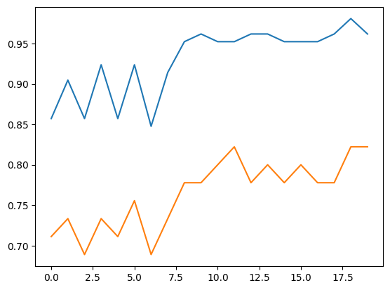

# 확률적 경사 하강법

- 확률적 : 무작위하게 또는 랜덤하게와 같은 표현
- 경사 : 기울기
- 하강법 : 내려가는 방법
- 랜덤하게 경사를 따라 내려가는 방법

- 산을 빨리 내려가려면? -> 가장 가파른 경사를 따라서 내려가면 빠르게 내려갈 수 있다.

- `경사하강법`

  - 가장 가파는 길을 찾아 내려오지만 조금씩 내려오는것이 중요

  - 조금씩 내려오는 과정이 경사하강법모델을 훈련하는 것

- **확률적** : 경사하강법으로 내려올 때 가장 가파른 길을 찾는 방법
  
  - 훈련세트이 전체 세트를 사용하지 않고, 딱 하나의 샘플을 훈련세트에서 랜덤하게 골라 가장 가파른 길을 찾는다.
  
  - 훈련세트에서 하나의 샘플을 고르는 것이 **확률적경사하강법**
  
  - 훈련세트에서 하나의 샘플을 골라 경사를 조금 내려가고 그 다음 훈련세트에서 랜덤하게 또 다른 샘플을 하나 선택하여 경사를 조금 내려감

  - 즉 훈련세트를 다 사용했지만 최저점에 도달하지 못했다면 모든 훈련세트를 다시 복구시키고, 처음부터 다시 시작 이를 만족할만한 지점에 도달할때까지 계속 반복 -> 이런 한번의 반복을 **에포크**라고 함 즉, 수십 수백번의 에포크를 수행

## 다른 형태의 경사하강법

- 훈련세트에서 `여러개의 샘플을 사용`해 경사를 찾는 **미니배치경사하강법**

- 극단적으로 한 번에 선택한 경사로를 따라 내려가기 위해 `모든 데이터`를 사용해 경사를 찾는 **배치경사하강법**

  - 단, 전체 데이터를 사용하면 그만큼 자원을 많이 사용하게 되고, 어떤 경우는 데이터가 너무 많아 전체 데이터를 읽을 수 없을수 있기 떄문에 거의 사용되지 않는다.

### 손실함수

#### 어디를 내려가야 하는가?

- **학습중** 머신러닝 알고리즘이 얼마나 오차가 큰 지를 측정하는 값

- 반복적인 학습을 진행하는 회귀는 `한번의 반복`(한 스텝의 대표 직선을 찾는 것)이 끝나면 손실함수를 통해 오차를 확인하고 더 진행할 것인지의 여부와 기울기 방향(얼마만큼 수정해야 하는가)을 결정한다

- 값이 클수록 오차가 크다는 의미 값이 작을수록 성능이 좋은 알고리즘이다

- but, 어디가 최솟값인지는 알지 못하기 때문에 가능한 많이 찾아보고 만족할만한 수준이면 산을 다 내려왔다(최소의 오차를 찾았다)고 인정해야 함

- 작은 값을 찾기위해 조금씩 이동하려면 확률적 경사하강법을 써야 함
- 다뤄야 하는 많은 문제의 손실함수는 이미 정해져 있음 이는 해당 러닝 알고리즘으로 풀어야할 `문제의 종류에 맞는 손실함수가 정해져 있다는 뜻`

#### tip. 손실함수 vs 비용함수

- 손실함수 : 샘플 하나에 대한 손실을 정의

- 비용함수 : 모든 샘플에 대한 손실함수의 합

- 보통 이 둘을 비슷한 의미로 사용함(엄격하게 구분하지 않음)

#### tip2. 학습이 다 끝난 모델의 성능평가는 평가지표로 진행한다

- 회귀 : RMSE, MSE, R2 등

- 분류 : 정확도, 정밀도, 재현율 등

#### 회귀에서의 손실: 예측 오차

- 손실함수 : MSE를 기준으로 알고리즘별로 약간의 변형을 해서 진행

#### 분류에서의 손실 : 정답을 못 맞히는 것

```md
|예측|정답(타켓)|
|--|--|
|1|1|
|0|1|
|0|0|
|1|0|
```

### 정확도는 어떻게 구하는가?

- 4개의 예측 중 2개를 맞췄으므로 0.5 로 구할 수 있다.

- 정확도를 손실함수로 사용한다면, 정확도에 역수를 구한 후 음수를 취해 -1.0이 가장 낮고 -0.0이 가장 높다고 한다면??? -> 의미전달은 명확하지만 직관적이지 못함.

- 또한, 정확도는 손실함수로 사용할 수 없는 단점이 있다.

- 표와 같이 4개의 샘플만 있다면 가능한 정확도는 0, 0.25, 0.5, 0.75, 1 다섯가지 뿐이다. 이렇게 정확도가 듬성듬성(연속적이지 않다면) 하다면 경사하강법을 이용할 수 없기 때문이다.

- 즉, 손실함수를 통해 경사의 방향을 결정하기 위해서는 확실히 `연속적`이어야 함(`미분 가능`해야 함)

- **그러므로, 손실함수를 통해 나타나는 손실값은 `연속값`이어야 함(정확도의 값은 이산값임)**

- 그렇다면 이산값인 정확도를 통해 손실함수를 표현하려면??

  > **연속값이 필요하므로 예측 결정값이 아닌 확률을 사용해보자**

### 분류문제의 연속적인 손실함수

- 로지스틱 회귀모델은 확률을 출력함

- 예측은 0또는 1이지만 확률은 0~1사이의 어떤 값도 될 수 있음. 즉, `연속적인 값`을 가진다.

### 확률을 이용 연속적인 손실값 계산

- 모든 타깃을 1일때의 값으로 변환 후 처리(2진 분류를 기준으로 변환, 현재 값이 0 과 1 밖에 없기 때문)

  - 예측 확률 X 정답(타깃) 1 -> 음수처리 -> 손실값

  - 예측이 `1`에 가까울수록 좋은 모델, 예측확률이 1에 가까울수록 타깃곱의 음수는 점점 작아짐

  - 위 샘플 4개의 예측 확률을 각각 0.9, 0.3,0.2,0.8 이라고 가정한다면???

- 첫번째 샘플 손실함수

  - 예측 0.9 X 정답(타깃) 1 -> 음수처리 -> -0.9(맞추지 못했을 경우 잃는 값이라고 생각하면 편함)
  - 예측 0.3 X 정답(타깃) 1 -> 음수처리 -> -0.3
  - 예측 0.2 지만 0을 정답으로 계산한 것이므로 계산되었을때 1이 정답이었다면(답이 0이지만 0이 아닐 확률 = 1일 확률이라는 뜻), 예측 0.8 X 정답(타깃) 1 -> 음수처리 -> -0.8
  - 예측 0.8 지만 정답은 0인데 1로 예측, 정답이 1이라면 0.2의 확률로 0으로 예측했을것이므로, 예측 0.2 X 정답(타깃) 1 -> 음수처리 -> -0.2
  - 손실값이 더 작으면 더 좋은 모델(정답을 맞추면 손실값이 작아짐)

```md
|예측|정답(타켓)|
|--|--|
|1|1|
|0|1|
|0|0|
|1|0|
```

- 타깃값이 0인경우 1로 통일하기 위해 1-예측확률로 연산 진행

```md
|예측값|예측확률|정답(타켓)|손실값|
|--|--|--|--|
|1|0.9|1|-0.9|
|0|0.3|1|-0.3|
|0|0.2 -> 0.8(1일 확률로 변경)|0|-0.8|
|1|0.8 -> 0.2|0|-0.2|
```

- 이와 같은 방법으로 연속적인 손실값을 얻는다.

  - 원래 정답은 1, 1, 0, 0
  
- 예측 확률에 로그 함수를 적용하면 더 효율적인 손실값을 얻을 수 있다.
  - 1일 떄를 기준으로 로그 확률을 구해준다.

  - 타깃이 1일때 : -log(예측확률)

  - 타깃이 0일때 : -log(1-예측확률(1이 아닐 확률))

- 예측 확률의 범위는 0~1사이인데 로그 함수는 이 사이에서 음수가 되므로 최종 손실값은 양수가 됨

- 손실값이 양수가 되면 이해하기가 더 쉽다

```py
import numpy as np
# 예측확률이 0.9로 정답을 맞춘 경우(손실이 낮다)
np.log(0.9)
> 0.10536051565782628

# 예측활률이 0.8로 정답을 못 맞출 경우(손실이 높은 경우): 정답이 0일 때
np.log(1-0.8)
> 1.6094379124341005
```

- 위에서 정의한 손실함수를 **이진크로스엔트로피 손실함수** 또는 **로지스틱손실함수**라고 부른다.

- 다중 분류도 거의 비슷하게 만들고 다중분류에서는 **크로스엔트로피손실함수**를 사용한다

- 손실함수는 이미 개발되어 있기 때문에 모델 사용시 지정만 해주면 됨

- 하지만 기억해야할 것

  - **이진분류 : 이진크로스엔트로피 손실함수**
  - **다중분류 : 크로스엔트로피 손실함수**

### SGDClassifier

- 확률적 경사 하강법을 사용한 `선형분류` 알고리즘

```py
import pandas as p
from sklearn.datasets import load_iris
from sklearn.linear_model import LogisticRegression
from sklearn.model_selection import train_test_split
from sklearn.metrics import accuracy_score
from sklearn.preprocessing import StandardScaler
from sklearn.linear_model import SGDClassifier

# 붓꽃 데이터 세트 로딩
# 타겟 데이터를 설정해준다.
iris = load_iris()
iris_data = iris.data
iris_label = iris.target

# 붓꽃 데이터 DataFrame으로 변환 
iris_df = pd.DataFrame(data=iris_data, columns = iris.feature_names)

# label 타겟으로 설정
iris_df['label']= iris.target

# 학습, 훈련 데이터 세트를 분류해준다.
X_train, X_test, y_train, y_test = train_test_split(iris_data, iris_label, test_size=0.3, random_state=11)

# 표준화 작업을 실시 -> 일반화해서 모델의 성능을 높히기 위함이다.
ss = StandardScaler()
ss.fit(X_train)
X_train_scl = ss.transform(X_train)
X_test_scl = ss.transform(X_test)

# loss = 손실함수 : 자체 평가를 할 때 손실함수를 무엇으로 할 것인가
# 손실함수 = log 로 설정한다.
sc_cfg = SGDClassifier(loss = 'log_loss', max_iter = 5, random_state = 42)

sc_cfg.fit(X_train_scl, y_train)

# 정확도, 손실도를 점수(확률)로 반환하기.
print(sc_cfg.score(X_train_scl, y_train))
> 0.780952380952381

print(sc_cfg.score(X_test_scl, y_test))
> 0.6444444444444445
```

### ConvergenceWarning: Maximum number of iteration 이란?

- 학습을 위한 반복 횟수가 충분하지 않다는 의미 -> max_iter를 늘려야 함

- 즉, 현재 모델이 과소적합이 되었다 -> 반복 횟수를 늘릴 여지가 존재한다.

### 모델에 이어서 훈련할 때는 partial_fit() 사용

- 호출할 때마다 + 1에포크 씩 이어서 훈련함, 훈련 횟수를 늘려 나간다.

```py
sc_cfg.partial_fit(X_train_scl, y_train)

print(sc_cfg.score(X_train_scl, y_train))
> 0.9238095238095239
print(sc_cfg.score(X_test_scl, y_test))
> 0.7777777777777778
```

- 에포크를 한번 더 실행하니 테스트 `정확도가 향상`되었기 때문에 에포크를 늘려봐도 괜찮을 것 같다는 결과를 도출

- 하지만 얼마나 훈련해야 할까?????? 에 대한 의문가 문제가 발생한다.

- tip. `SGDClassifier`는 기본 확률적 경사하강법을 사용함
  
  - 한번에 하나의 샘플을 이용

  - 미니배치나 배치는 지원하지 않음

### 에포크와 과대/과소적합

- 확률적 경사하강법을 사용한 모델은 `에포크횟수`(epochs)에 따라 과소적합이나 과대적합이 될 수 있음


- 과소적합이 발생하는 에포크 이상으로 충분히 학습하되 과대적합이 되기전에 종료하는 것이 모델의 성능을 결정한다고 할 수 있다.

- 조기종료 : 과대 적합이 시작되기 전에 학습을 멈추는 것

- `partial_fit() 이용 1번의 에포크마다 결과를 확인`

- 주의. partial_fit(classes=) 은 결정레이블을 `classes 파라미터로 전달`해야 함

```py
import numpy as np

# 손실함수는 log 로 설정한다.
sc_cfg = SGDClassifier(loss = 'log_loss', random_state = 42)
t_score =[]
v_score =[]

# 결정레이블
classes = np.unique(y_train)

# 20번 에포크 진행(한번 진행할때마다 훈련/테스트 점수 저장)
for _ in range(0, 20):
    sc_cfg.partial_fit(X_train_scl, y_train, classes = classes)
    t_score.append(sc_cfg.score(X_train_scl, y_train))
    v_score.append(sc_cfg.score(X_test_scl, y_test))
# 훈련점수와 테스트점수를 에포크별로 시각화

import matplotlib.pyplot as plt
plt.plot(t_score)
plt.plot(v_score)
```



- 차이의 구분이 쉽지는 않지만 10번 에포크일때 두 그래프의 간격이 가장 좁아보임

- 위의 결과를 기반으로 에포크수(학습 횟수, 사이클, max_iter)를 10으로 변경

- tol = None으로 지정해서 자동으로 멈추지 않고 10번까지 무조건 학습하도록 함

```py
sc_cfg = SGDClassifier(loss='log_loss', max_iter = 10, tol = None, random_state = 42)
sc_cfg.fit(X_train_scl, y_train)

# 손실도를 반환, 예측 정확도
print(sc_cfg.score(X_train_scl, y_train))
> 0.9619047619047619

print(sc_cfg.score(X_test_scl, y_test))
> 0.9111111111111111
```

- 학습점수와 테스트 점수가 전체적으로 향상됨

- tip.확률적 경사 하강법을 사용하는 회귀모델: `SGDRegressor`

### SGDClassifier의 기본 loss 함수 : hinge

- `hinge`는 서포트벡터머신 알고리즘을 위한 손실함수 임

```py
sc_cfg = SGDClassifier(loss='hinge', max_iter = 10, tol = None, random_state = 42)
sc_cfg.fit(X_train_scl, y_train)

# 손실도를 반환, 예측 정확도
print(sc_cfg.score(X_train_scl, y_train))
> 0.9238095238095239

print(sc_cfg.score(X_test_scl, y_test))
> 0.8888888888888888
```

- 결과는 비슷하지만 약간 낮게 나옴
