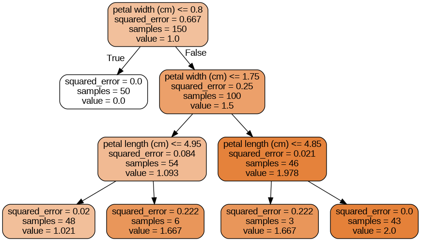
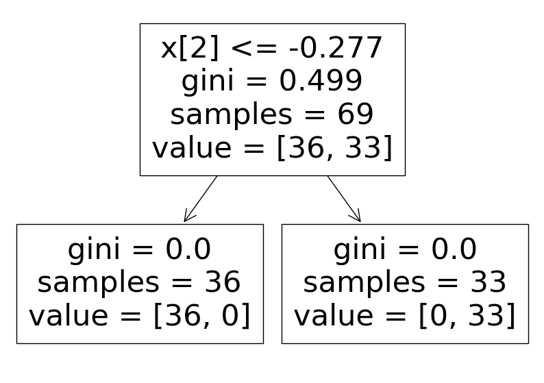
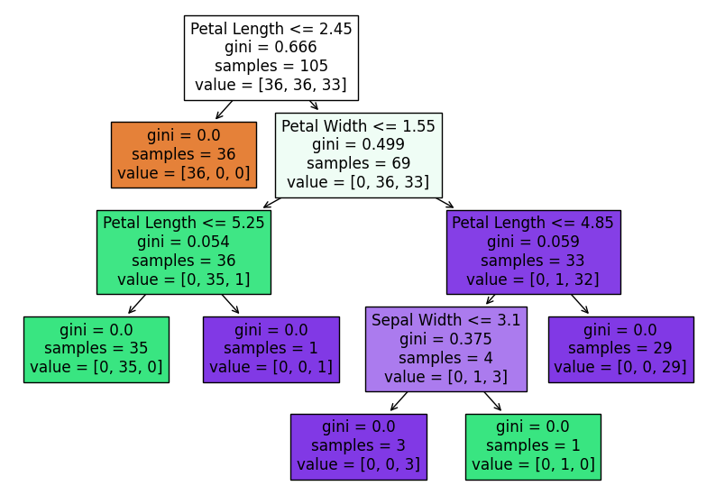
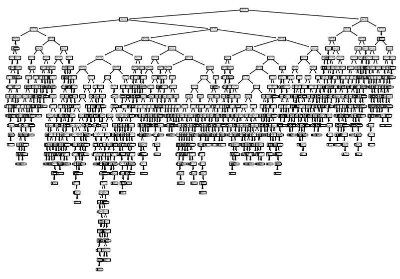
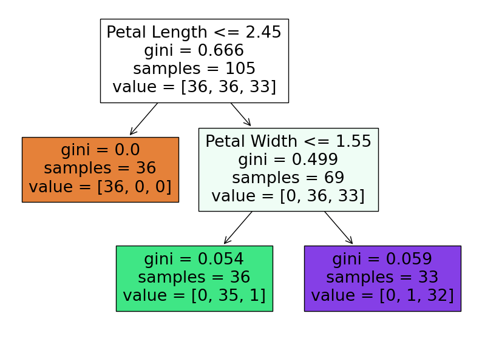
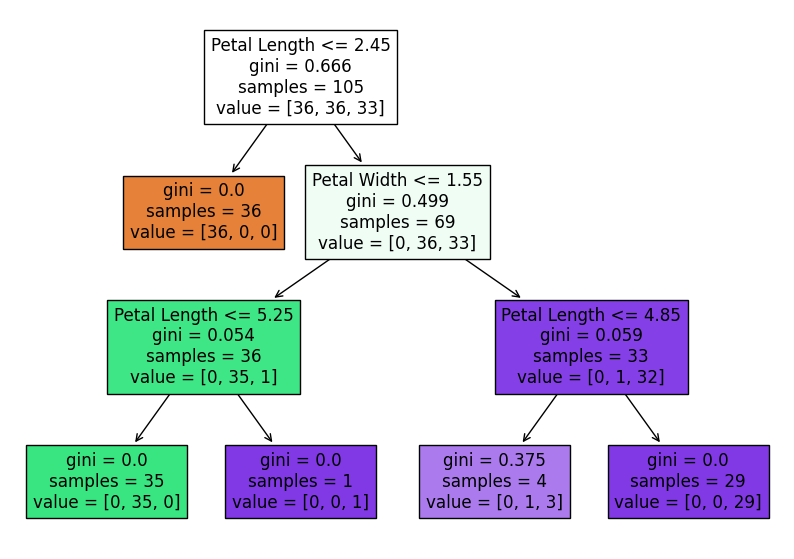
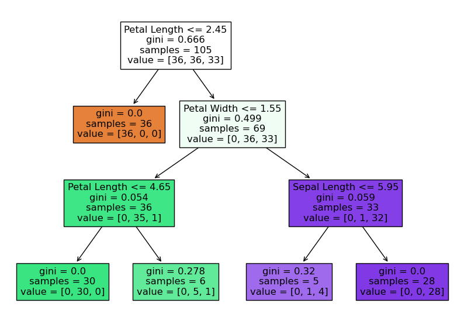
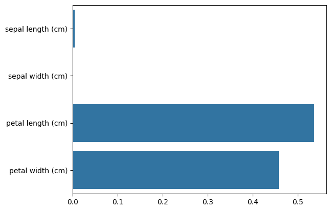

# 결정 트리 - iris data 분류하기

## 로지스틱 회귀를 이용한 분류

```py
from sklearn.datasets import load_iris
from sklearn.linear_model import LogisticRegression
from sklearn.model_selection import train_test_split
from sklearn.metrics import accuracy_score
import pandas as pd
from sklearn.preprocessing import StandardScaler

# 붓꽃 데이터 세트 로딩
iris = load_iris()
iris_label = iris.target
iris_data = iris.data

# 붓꽃 데이터 DataFrame으로 변환 
iris_df = pd.DataFrame(data=iris_data, columns = iris.feature_names)

# label 를 target 으로 설정한다.
iris_df['label']= iris.target

# counts : 원소수
# mean : 평균
# std : 표준편차
# min/max/사분위수
# 기본 통계량을 제공하는 함수(컴럼type이 object는 계산하지 않음)
# 데이터의 분포를 확인한다.
iris_df.describe() 
```

- 데이터들 간 크기 차이가 크지는 않지만 있기 때문에(일반화해서 분류 성능을 높이기 위해서) 표준화 필요성이 있다.

```py
# Data 분할해주기
X_train, X_test, y_train, y_test = train_test_split(iris_data, iris_label, test_size=0.3, random_state=11)

# 표준화 작업을 실시한다.
ss = StandardScaler()

# 훈련데이터에 표준화 작업한 것을 fit 시켜준다.
ss.fit(X_train)

# X_train 으로 데이터 형태를 변환시켜준다.(표준화 작업)
X_t_scl = ss.transform(X_train)
X_v_scl = ss.transform(X_test)

# train data 에 대해서 2개의 품종만 추출
two_indexes = (y_train == 0)|(y_train == 2)
X_t_two = X_t_scl[two_indexes]
y_t_two = y_train[two_indexes]

# test data에 대해서 2개의 품종만 추출
two_indexes = (y_test == 0)|(y_test == 2)
X_v_two = X_v_scl[two_indexes]
y_v_two = y_test[two_indexes]


# 표준화한 작업으로 로지스틱 분류를 진행시켜준다.
lr_cfg = LogisticRegression()
lr_cfg.fit(X_t_two, y_t_two)

# 정확도 평가를 실시 
print(lr_cfg.score(X_t_two, y_t_two))
> 1.0
print(lr_cfg.score(X_v_two, y_v_two))
> 1.0
```

### 설명하기 쉬운 모델과 어려운 모델이 존재

```py

# iris 데이터의 기울기(계수들 간 상관관계). 절편을 구해준다.
print(lr_cfg.coef_, lr_cfg.intercept_)

> [[ 0.79920015 -0.72157581  1.30467046  1.33148205]] [0.57203178]
```

### 이 모델의 선형 회귀식을 도출해보자

- (꽃받침길이 * 0.79920015 + 꽃받침넓이 * -0.72157581 +  꽃잎길이 * 1.30467046 + 꽃잎 넓이 * 1.33148205) + 0.57203178 로 식을 도출 할 수 있다.

- 정확도 1.0% 가 도출되지만 이를 설명하기기 어렵다

- 추측하면 꽃잎길이와 꽃잎 넓이가 크면 2번 품종일 가능성이 높고

- 꽃받침 넓이가 작을수록 0번 품종일 가능성이 높다
.
- 대부분의 머신러닝 모델은 설명하기가 어렵다. 정확히 어떤 데이터로 분류되어서 설명하기 어렵다. 확률을 추출하는 작업이기 때문이다.

## 결정트리 (Decision Tree)

- 학습을 통해 데이터에 있는 규칙을 자동으로 찾아내 트리 기반의 분류 규칙을 만드는 알고리즘 -> 회귀 방식이 아니다.

- ML 알고리즘 중 직관적으로 이해하기 쉬운 알고리즘으로 분류와 회귀 문제에서 널리 사용

- 특정기준(질문)에 따라서 데이터를 구분한다. 이는 여러 컬럼 중 최적의 기준을 찾으면서 진행된다.

- 가장 쉬운 규칙 표현 방법 : if/else 기반 (스무고개 게임과 유사)함 -> 이진 분류 기반으로 진행

### 의사결정나무의 타입

- 분류 나무
  
  - 범주형 목표 변수를 기준으로 마디를 나눔
  
  - 끝마디에 포함된 자료의 범주가 분류 결과 값이 됨

- 회귀 나무

  - 연속형 목표 변수를 기준으로 마디를 나눔
  
  - 끝마디에 포함된 자료의 평균값이 각 끝마디의 회귀 값이 됨  

### Tree(나무) 구조

- 전체적인 모양이 `나무를 뒤집어 놓은 것과 닮았다`고 해서 붙여진 이름

- 결정트리에서 질문이나 네모상자를 `노드(Node)` 라고 함

- 맨 위의 노드(첫 질문)를 Root Node

- 각 질문에 대한 마지막 노드를 Leaf Node : 결정된 클래스 값 

- Decision Node(규칙 노드) : 규칙 조건  

- 새로운 `규칙, 조건` 마다 Sub `Tree 생성`

- 조건을 계속 수행해서 불순도가 0일 때, 더 이상 분할하지 않도록 하는 알고리즘이다.



### 결정트리에서 중요한 이슈, 문제점

- 데이터 세트의 피처가 결합해 규칙 조건을 만들 때마다 규칙노드가 만들어짐  -> 가지가 계속 분화된다고 보면 된다.

- `규칙이 많아지면` 결정 방식이 복잡해지고 `과적합(overfitting)` 발생 이러한 이유로 일반화시키기가 어렵다는 문제가 발생하게 되고 depth(깊이) 를 늘릴 수 없다면 타협을 하게 된다.

- 즉, `depth가 길어질수록` 결정트리의 예측 성능이 저하될 가능성이 높아진다.

- 가능한 적은 결정노드로 높은 예측 정확도를 가지려면, 데이터를 분류할 때 최대한 많은 데이터 세트가 해당 분류에 속할 수 있도록 결정 노드의 규칙이 정해져야 함  

- **`어떻게 트리를 분할할 것인가`가 중요**한 문제이다. 즉 최대한 균일한 데이터 세트를 구성할 수 있도록 분할하는 것이 필요하다.

### 코드를 통해서 결정 나무를 구현

```py
from sklearn.tree import DecisionTreeClassifier

# 의사결정나무 분류 모델을 생성
dt_cfg = DecisionTreeClassifier(random_state = 42)
dt_cfg.fit(X_t_two, y_t_two)

print(dt_cfg.score(X_t_two, y_t_two)) 
print(dt_cfg.score(X_v_two, y_v_two))
```



- 트리의 depth(깊이)를 제한해서 출력할 수도 있다.

```py
# filled=True 색상을 채워줌, 색깔에 따라 구분도 가능하다.
# feature_names= [피처들] 조건 피처명을 표시해 줌

# 결정 나무를 그려준다.
plt.figure(figsize =(10,7))

plot_tree(dt_cfg, filled = True,
         feature_names = ['Sepal Length','Sepal Width','Petal Length', 'Petal Width'])
```


### 계속 나오는 불순도란??

- gini : 지니 불순도(critertion 매개변수의 기본값), `복잡도`라고 할 수 있다. 노드의 순수성을 측정하는데 사용한다.

- GINI 불순도는 `0부터 1`까지의 값을 가지며, `0`은 노드 내에 순수한 클래스(`하나의 클래스만 포함`)가 있는 경우를 의미하고, `1`은 노드에 `여러 클래스가 균등하게 분포`되어 있는 가장 불순한 상태를 의미한다.

- GINI 불순도는 각 클래스의 비율을 제곱하여 더한 다음, 1에서 그 값을 뺀 것으로 계산된다.

- critertion 매개변수 : 데이터를 `분할할 기준`을 정하는 것이다.

- 위에서 트리에서 루트노드가 Petal Length <= -0.713의 기준을 세운 이유???

- 지니불순도를 활용한 계산을 통해 불순도로 분류를 진행했기 때문이다.

  - 지니불순도 = 1- (음성클래스비율(하나의 범주에만 포함되어 있는 상태)의 제곱 + 양성클래스비율(여러 범주에 속해 있는 상태)의 제곱) -> 확률의 차이를 일반화하여 구한 값이라고 보면 된다.
  
  - 지니 불순도는 두개의 클래스가 있을 때 결정값의 개수가 반반이면 0.5

  - 어느 한쪽의 클래스만 있으면 0 이다.

  - 즉, 클래스별 개수가 혼잡할 수록 불순도가 높아짐

### `기상조건`에 따른 테니스 경기 참가여부 데이터를 이용한 조건 생성 예제(불/참으로 구분하는 것)

```py
# data 파일에 있는 tennis 자료를 가지고 진행하겠다.
tennis = pd.read_csv('./data/tennis.csv',encoding='cp949')

# 참가에 영향을 미치는 4개의 기상 data 를 활용해서 분류 조건 생성하기
# 불러온 데이터를 살펴본다.
tennis.head()

# 참가 여부라는 새로운 열을 생성 -> 여기에 분류값을 넣어줄 것이다.
tennis[tennis['참가여부'] == 'o']
```

### 과정

### 1. 전체 데이터의 클래스에 대한 지니불순도를 계산한다.

```py
pos = len(tennis[tennis['참가여부'] == 'o'])
neg = len(tennis[tennis['참가여부'] == 'x'])
tot = len(tennis['참가여부'])
print(pos,neg,tot)

## 전체 데이터(root 노드)의 지니 불순도 계산
root_gini = 1 - ((pos/tot)**2 + (neg/tot)**2)
```

### 2. 각 컬럼별 지니 불순도 계산

- 한개의 독립변수와 클래스를 이용해 지니불순도 계산(날씨, 날짜)

```py
# 날씨 노드의 지니 불순도 계산 - 날씨 컬럼의 범주별 참가여부를 이용해서 계산
# df.groupby([분류 기준 컬럼]) : 기준 컬럼에 따른 샘플을 분리
# groupby.그룹함수(): 그룹 요약 반환받을 수 있다.
# groupby[컬럼명].그룹함수 적용 : 그룹된 결과에 대한 컬럼별 요약이 가능.
# 날짜를 활용해서 count
tennis.groupby(['날씨', '참가여부'])['날짜'].count()
tennis.groupby(['날씨', '참가여부']).count()['날짜']
```

```
- 이런 식으로 결과가 도출된다.
날씨  참가여부
맑음  o       2
    x       3
비   o       3
    x       2
흐림  o       4
Name: 날짜, dtype: int64
```

- 날씨 기준의 불순도

```py
# 날씨 지니계수 중 맑음 범주(차지하는 비율만 계산을 해줘야 한다.)의 불순도를 확인
5/14 * (1 - ((2/5)**2 + (3/5)**2))

# 날씨 계수 중 비 범주의 불순도
5/14 * (1 - ((2/5)**2 + (3/5)**2))

# 날씨 계수 중 흐림 범주의 불순도
4/14 * (1 - (4/4)**2)

# 도출한 불순도들로 예측, 분류하는 식을 생성한다. 날씨의 불순도를 기준
weather_gini = 5/14 * (1 - ((2/5)**2 + (3/5)**2)) + 5/14 * (1 - ((2/5)**2 + (3/5)**2)) + 4/14 * (1 - (4/4)**2)
```

- 온도 기준의 불순도

```py

# 온도 노드의 지니 불순도 계산
# 위의 날씨에서 구한 표처럼 도출된다.
tennis.groupby(['온도','참가여부'])['날짜'].count()

# 온도 불순도 계산식
temp_gini = 4/14*(1-((2/4)**2 + (2/4)**2)) + 4/14*(1-((3/4)**2 + (2/4)**2)) + 6/14*(1-((4/6)**2+(2/6)**2))
```

- 습도 기준의 불순도

```py
# 습도 노드의 지니 불순도 계산
# 위의 날씨에서 구한 표처럼 도출된다.
tennis.groupby(['습도','참가여부'])['날짜'].count()

# 습도 불순도 계산식
hum_gini = 7/14*(1-((3/7)**2 + (4/7)**2)) + 7/14*(1-((6/7)**2 + (1/7)**2))
```

- 바람 기준의 불순도

```py
# 바람 노드의 지니 불순도 계산
# 위의 날씨에서 구한 표처럼 도출된다
tennis.groupby(['바람','참가여부'])['날짜'].count()

# 바람 불순도 계산식
wind_gini = 6/14*(1-((3/6)**2 + (3/6)**2)) + 8/14*(1-((6/8)**2 + (2/8)**2))
```

### 3. 정보이득이 큰 컬럼을 기준으로 분류

- 정보이득 : 불순도의 차이

```py
# 가장 정보이득이 크다(날씨를 기준으로 분류한다.)
print(root_gini - weather_gini) 
> 0.11632653061224485

print(root_gini - temp_gini)
> 0.07227891156462585

print(root_gini - hum_gini)
> 0.09183673469387743

print(root_gini - wind_gini)
> 0.030612244897959162
```

### 4. **위 내용을 모든 리프노드의 불순도가 0이 될때까지 2,3을 반복**

## iris 데이터를 이용한 `다중분류`

### 의사 결정 트리를 사용한다.

```py
# DecisionTree Classifier 생성
dt_cfg = DecisionTreeClassifier(random_state = 156)
dt_cfg.fit(X_train, y_train)

# 다중분류를 위한 매서드들 import
import matplotlib.pyplot as plt
from sklearn.tree import plot_tree


# filled=True 색상을 채워줌 - 구분을 위해서 색깔 설정해줌
# feature_names= [피처들] 조건 피처명을 표시해 줌
plt.figure(figsize = (10, 7))
plot_tree(dt_cfg, filled = True, feature_names=['Sepal Length', 'Sepal Width', 'Petal Length', 'Petal Width'])
plt.show()
```



### 와인 데이터를 활용해서 추가적인 분류 작업을 진행해보자

```py
# 외부 링크에 저장되어 있는 와인 데이터를 가져온다.
data = pd.read_csv("https://bit.ly/wine-date")

# 분류를 위한 특성을 설정해준다.
feature = data.drop('class', axis = 1)

# 모델링을 위한 샘플, 훈련 데이터를 분류해준다.
X_train_1, X_test_1, y_train_1, y_test_1 = train_test_split(feature, data['class'], test_size=0.3, random_state=11)

# 의사결정 모델을 생성하고 훈련, 샘플 데이터에 적용시켜준다.
dt_tmp = DecisionTreeClassifier(random_state = 42)
dt_tmp.fit(X_train_1, y_train_1)

# 와인 데이터를 활용한 분류 나무 모델을 보여준다.
plt.figure(figsize = (10, 7))
plot_tree(dt_tmp)
plt.show()
```



- 이처럼 tree 분류 모델은 모델의 불순도(분류 하는 기준)가 0이 될 때까지 반복적으로 조건을 찾기 때문에 위와 같이 너무 많은 규칙이 생길 수 있음

- 이러한 이유로 과대적합이 발생하기 쉽다.

- 때문에 하이퍼파라미터를 통해서 과대적합을 방지하는게 가장 큰 이슈임

- 과대적합 방지 여부에 따라 성능의 차이가 난다.

- 그러므로 위의 모델은 성능이 아주 좋지는 않다.

## 결정 트리 하이퍼 파라미터

- 규칙 트리는 규칙 생성 로직을 미리 제어하지 않으면, `완벽하게 클래스 값을 구별할 때까지 트리 노드를 계속해서 만들어가기 때문에` 매우 복잡한 규칙 트리가 만들어져 모델이 쉽게 과적합되는 문제 발생한다.

- 때문에 하이퍼 파라미터를 사용하여 복잡한 트리가 생성되지 않도록 제어(여러 개를 동시에 적용 가능)

### 결정 트리의 하이퍼 파라미터

- `max_depth` : 결정 트리의 최대 트리 깊이 제어

- `min_samples_split` : 자식 규칙 노드를 분할해서 만드는데 필요한 최소 샘플 데이터 개수

  - 예시: min_samples_split=4로 설정하는 경우

    - 최소 샘플 개수가 4개 필요한데 3개만 있는 경우에는 더 이상 자식 규칙 노드를 위한 분할을 하지 않음
    - 트리 깊이도 줄어서 더 간결한 결정 트리 생성

- `min_samples_leaf` : 리프 노드가 될 수 있는 최소 샘플 개수

  - 리프 노드가 될 수 있는 조건은 디폴트로 1의 값을 가진다.

  - 즉, 다른 클래스 값이 하나도 없이 단독 클래스로만 되어 있거나, 단 한 개의 데이터로 되어 있을 경우에도 리프 노드가 될 수 있다는 것

  - min_samples_leaf 값을 키우면 더 이상 분할하지 않기 때문에 리프 노드가 될 수 있는 조건이 완화됨

  - 즉, min_samples_leaf=4로 설정하면, 샘플이 4 이하이면 리프 노드가 되기 때문에 지니 계수가 크더라도 샘플이 4인 조건으로 규칙 변경되어 브랜치 노드가 줄어들고 결정 트리가 더 간결하게 되어 과적합을 방지할 수 있다.

#### 코드를 통해 확인해보자

- max_depth 제어

```py
# 결정 트리 모델을 생성하고 하이퍼 파라미터 튜닝을 매서드 내에서 진행할 수 있다.
# max_depth = 2으로 조정
dt_cfg = DecisionTreeClassifier(max_depth = 2, random_state = 156)
dt_cfg.fit(X_train, y_train)

# 특성에 따라서 색을 구분해준다.
plt.figure(figsize = (10, 7))
plot_tree(dt_cfg, filled = True, feature_names=['Sepal Length', 'Sepal Width', 'Petal Length', 'Petal Width'])
plt.show()
# Depth 를 제한하면 트리가 간결해짐 -> 규칙이 일반화되어졌다.
```



- min_samples_split 을 제어한다.

```py
# 결정 트리 하이퍼 파라미터 튜닝
# min_samples_split=5로 상향 
dt_cfg = DecisionTreeClassifier(min_samples_split = 5, random_state = 156)
dt_cfg.fit(X_train, y_train)

# 샘플이 5 이하이면 리프 노드가 되기 때문에
# 지니 계수가 크더라도 샘플이 5인 조건으로 규칙 변경되어
# 브랜치 노드가 줄어들고 결정 트리가 더 간결하게 됨
plt.figure(figsize = (10, 7))
plot_tree(dt_cfg, filled = True, feature_names=['Sepal Length', 'Sepal Width', 'Petal Length', 'Petal Width'])
plt.show()
```



- min_samples_leaf 를 제어한다.

```py
# leaf 노드가 최소 5개의 노드를 가지고 있어야 된다.
dt_cfg = DecisionTreeClassifier(min_samples_leaf = 5, random_state = 156)
dt_cfg.fit(X_train, y_train)

# 특성에 따라서 색을 구분해준다.
plt.figure(figsize = (10, 7))
plot_tree(dt_cfg, filled = True, feature_names=['Sepal Length', 'Sepal Width', 'Petal Length', 'Petal Width'])
plt.show()

# leaf 노드의 샘플 수를 제한 -> 상위노드에서는 분류 규칙을 생성할 때 분할되는 양쪽노드가 leaf가 된다고 하면 leaf 노드의 최종 샘플 수가 5를 넘도록 규칙을 생성해야 한다.

# 규칙이 일반화 되어진다. -> 학습데이터에 대해서는 정답이 아닌 분류가 늘어나지만, 다른 데이터에 대해서는 적용의 결과가 더 효율적일 수 있다.  
```



### feature_importances_ 속성 (피처 중요도)

- tree를 만드는 결정에 각 피처가 얼마나 중요한지 평가

- 주로 0과 1사이의 숫자로 표현한다.

- 결정 트리는 `균일도`에 기반해서 어떠한 속성(피처)을 규칙 조건(어떤 열을 기준으로 하는가)로 선택하느냐가 중요한 요건이다.

- 중요한 몇 개의 피처가 명확한 규칙 트리를 만드는데 크게 기여하며 모델을 좀 더 `간결하고 이상치에 강한 모델을 만들 수 있음`

#### **`feature_importances_`** 란?

- ndarray 형태로 값을 반환하고 피처 순서대로 값이 할당이 된다.

- [첫 번째 피처의 중요도, 두 번째 피처의 중요도, ....]

- 값이 높을 수록 해당 피처의 중요도가 높다는 의미이며, 특정 노드의 중요도 값이 클수록, 그 노드에서 불순도가 크게 감소한다고 보면 된다.

- 코드로 확인

```py
# 피처별 중요도 값 확인하고 막대 그래프로 표현
# 위 예제에서 fit()으로 학습된 DecisionTreeClassifier 객체 df_clf의 
# feature_importances_ 속성 사용

import seaborn as sns
import numpy as np
%matplotlib inline

print(iris.feature_names)
print(np.round(dt_cfg.feature_importances_,3))

> ['sepal length (cm)', 'sepal width (cm)', 'petal length (cm)', 'petal width (cm)']
> [0.005 0.    0.537 0.458]
```

```py
# feature importance를 column 별로 시각화 하기 
sns.barplot(x = dt_cfg.feature_importances_, y = iris.feature_names)

# 결과
# petal length의 피처 중요도가 가장 높음
```



### 결론

- iris 데이터의 품종은 (피처 중요도에 따라서) 꽃잎의 길이와 넓이로 분류할 수 있다.
