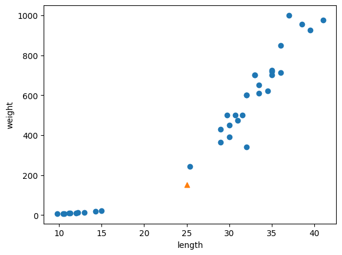
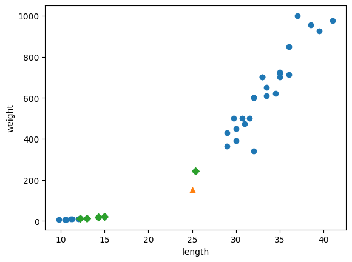
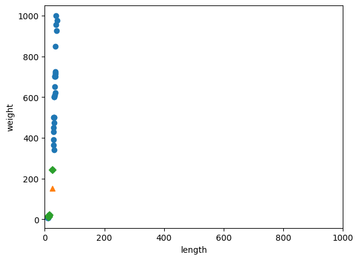
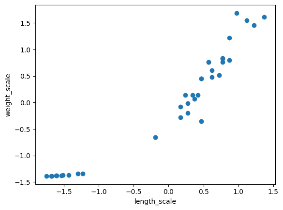
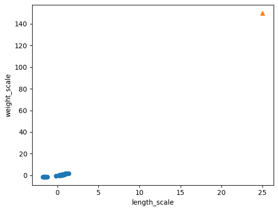
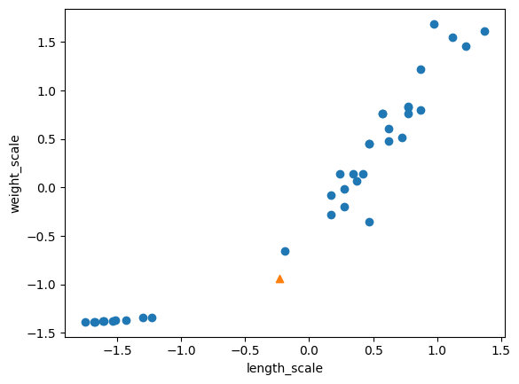
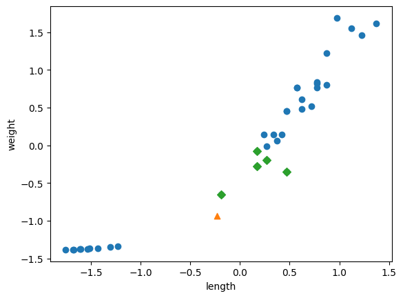

## 데이터 전처리 후 sklearn 사용하기


- 데이터를 준비(numpy를 활용, 2차원 배열로 만들기)

```py 
import numpy as np

fish_length = [25.4, 26.3, 26.5, 29.0, 29.0, 29.7, 29.7, 30.0, 30.0, 30.7, 31.0, 31.0, 
                31.5, 32.0, 32.0, 32.0, 33.0, 33.0, 33.5, 33.5, 34.0, 34.0, 34.5, 35.0, 
                35.0, 35.0, 35.0, 36.0, 36.0, 37.0, 38.5, 38.5, 39.5, 41.0, 41.0, 9.8, 
                10.5, 10.6, 11.0, 11.2, 11.3, 11.8, 11.8, 12.0, 12.2, 12.4, 13.0, 14.3, 15.0]
fish_weight = [242.0, 290.0, 340.0, 363.0, 430.0, 450.0, 500.0, 390.0, 450.0, 500.0, 475.0, 500.0, 
                500.0, 340.0, 600.0, 600.0, 700.0, 700.0, 610.0, 650.0, 575.0, 685.0, 620.0, 680.0, 
                700.0, 725.0, 720.0, 714.0, 850.0, 1000.0, 920.0, 955.0, 925.0, 975.0, 950.0, 6.7, 
                7.5, 7.0, 9.7, 9.8, 8.7, 10.0, 9.9, 9.8, 12.2, 13.4, 12.2, 19.7, 19.9]

# 주어진 1차원 배열들을 열 방향으로 합쳐서 2차원 배열을 생성
fish_data = np.column_stack((fish_length, fish_weight))

# np.row_stack 또는 np.vstack로 사용해 행 방향으로 배열을 결합
# 분류 문제에서 사용되는 라벨 데이터,  각 샘플에 대한 정답 또는 라벨로 사용
fish_target = np.concatenate((np.ones(35), np.zeros(14)))
```

### sklearn 활용 훈련, 테스트 데이터로 나누기

#### Stratified sampling(계층적 샘플링)

- 훈련 데이터를 나눌 때 `무작위로 샘플링`하는 동시에, `원본 데이터셋의 클래스 비율이 훈련 세트와 테스트 세트에서도 동일하게 유지되도록 하는 방식`입니다.

- 원본 데이터셋에서 특정 클래스의 비율이 불균형한 경우에 유용하다.

- Stratified sampling은 scikit-learn train_test_split 함수의 `stratify 매개변수`에서 타깃 데이터를 지정하여 수행할 수 있습니다. 이렇게 함으로써 훈련 세트와 테스트 세트에서 각 클래스의 비율이 원본 데이터셋과 일치하게 됩니다.
  - 예를 들어, 클래스 A가 원본 데이터셋에서 80%를 차지하고 있다면, stratify 매개변수를 사용하면 훈련 세트와 테스트 세트에서도 각각 80%의 클래스 A 비율을 유지하게 됩니다.

- **train_test_split(매개변수들, 기본값들)**

  - array : 일반적으로 데이터셋을 나타내며 기능 및 레이블을 모두 포함할 수 있다.

  - test_size = 테스트 분할에 포함할 데이터셋의 비율을 결정, None이면 테스트 크기의 보완으로 설정

  - train_size = test_size와 유사하게 이 매개변수는 훈련 세트의 비율 또는 절대 수를 결정, None이면 테스트 크기의 보완으로 설정

  - shuffle = True로 설정하면 분할 전에 데이터가 무작위로 섞이고, False로 설정하면 데이터는 제공된 순서대로 분할

  - stratify = 입력 데이터셋의 클래스 비율이 유지되도록 데이터를 분할

  - random_state = 정수이면 분할 중에 랜덤 번호 생성기의 시드로 사용됩니다.특정 숫자로 지정하면 항상 동일하게 분할할 수 있다. 실제 상황에서는 거의 필요 없지만, 다른 사람들과 결과를 공유해야하거나 실험결과를 똑같이 재현해야 할 때에 사용한다. 지정되지 않으면 랜덤 번호 생성기는 시스템 시간을 기반으로 초기화됩니다.


```py
from sklearn.model_selection import train_test_split

# fish_data 를 기반으로 test, train data 로 분할한다.
train_input, test_input, train_target, test_target = train_test_split(fish_data,
                                                                     fish_target,
                                                                     random_state = 42)
# 이를 통해 데이터가 어떻게 분포되었는지 확인할 수 있다.
print(pd.Series(fish_target).value_counts())
print(pd.Series(train_target).value_counts())
print(pd.Series(test_target).value_counts())
```

- **데이터 분포를 명시적으로 반영시킨 분할**

```py
train_input, test_input, train_target, test_target = train_test_split(fish_data,
                                                                    fish_target,
                                                                      stratify = fish_target, # target에 비율에 맞게 만들어준다.
                                                                     random_state = 42)

# 마찬가지로 데이터 분포를 확인할 수 있다.
print(pd.Series(fish_target).value_counts())
print(pd.Series(train_target).value_counts())
print(pd.Series(test_target).value_counts())
```

### 성능 평가 및 테스트

```py
# k-최근접 이웃분류 모델을 만들고 테스트 데이터 대한 정확도를 평가하기.
from sklearn.neighbors import KNeighborsClassifier

# kn 모델을 형성
kn = KNeighborsClassifier()
# train_input, train_traget 을 사용해 모델을 훈련시킨다.
kn.fit(train_input, train_target)
# test_input, test_target 을 사용해 성능을 평가하고 정확도를 출력한다.
kn.score(test_input, test_target)

# 주어진 입력 [[25, 150]]에 대해 모델이 예측
kn.predict([[25, 150]])

# array([0.]) 로 예측한다.
```

### array([0.]) ->> 빙어로 예측한 이유 찾기

- 산점도를 활용한 데이터 분포를 확인하고 예측 이유 찾기

```py

import matplotlib.pyplot as plt

# train_input의 모든 행에서 첫 번째 열을 선택
# train_input의 모든 행에서 두 번째 열을 선택
# 물고기의 길이와 무게를 x축과 y축으로 하는 산점도를 그린다.
plt.scatter(train_input[:,0], train_input[:,1])
plt.scatter(25, 150, marker = '^')
plt.xlabel('length')
plt.ylabel('weight')
plt.show()
```



### 테스트할 도미데이터와 이웃하는 데이터들을 통해서 다시 확인해보기

- kn.n_neighbors([data1, data2])
  - 해당 data의 이웃과의 거리데이터와 이웃 학습데이터를 반환
  - kn.n_neighbors = 5 가 기본 값

```py
# 가장 가까운 이웃들을 찾기
dist, idx = kn.kneighbors([[25, 150]])
train_input[idx]

plt.scatter(train_input[:,0], train_input[:,1])
plt.scatter(25, 150, marker = '^')
plt.scatter(train_input[idx, 0], train_input[idx, 1], marker = 'D')
plt.xlabel('length')
plt.ylabel('weight')
plt.show()

# 이웃에 도미가 하나밖에 포함되지 않음
print(train_target[idx])
# [[1. 0. 0. 0. 0.]]

```



- 이런 결과가 나온 이유는??????
  - 길이와 무게가 1대1로 모델에 반영되려면 크기가 비슷해야 하는데, 길이에 비해 `무게가 크기가 너무 커서 길이와 무게가 다른 비율로 반영`되어 버림
  - 아래 이미지를 보면 거리 92에 비해서 130은 너무 먼거리 임
    - 130에 비해서 92가 상대적을 너무 짧음
  - `단위가 크거나 작은 것에 기준이 매몰`되어버린다.
  - 생각보다 단위 차이가 많은 영향을 끼친다.

### 기준을 맞춰서 다시 확인하기

```py
# x축 범위를 0 ~ 1000으로 바꿔준다
plt.scatter(train_input[:,0], train_input[:,1])
plt.scatter(25, 150, marker = '^')
plt.scatter(train_input[idx, 0], train_input[idx, 1], marker = 'D')

# plt.xlim(0, 1000)은 Matplotlib의 pyplot 모듈을 사용하여 x 축의 표시 범위를 0에서 1000까지로 설정
plt.xlim(0, 1000)
plt.xlabel('length')
plt.ylabel('weight')
plt.show()
```



- 범위를 같게 하고 그래프를 확인하니 길이는 거의 반영이 안된다. 오로지 무게만 고려 대상이 되는 것 같아 보임.

- 최근접이웃 알고리즘은 거리를 기반으로 가까운 이웃을 결정. 즉, 거리 계산 시 자료의 값이 큰 변수에 더 큰 영향을 받게 되기 때문에 `스케일(범위)`을 같은 기준으로 맞춰줘야 함.

### 두 변수의 스케일을 갖게

- 표준점수(Z-Score)
  - 평균은 0 표준편차는 1로 만든다.
  - 표준 점수는 통계학적으로 정규분포를 만들고 개개의 경우가 표준편차상에 어떤 위치를 차지하는지를 보여주는 차원없는 수치이다.
  - 표준값, Z값, Z 점수이라고도 한다.
  - 학력고사 등의 평가에서 개개인의 성적이 전체에서 어떤 위치를 차지하는지를 보여주기 위해 쓰이기도 한다.

#### 표준 점수를 설정해 다시 결과 확인하기

```py
# 표준 점수 구하기.
mean = np.mean(train_input, axis = 0)
std = np.std(train_input, axis = 0)
train_scaled = (train_input - mean)/std

plt.scatter(train_scaled[:,0], train_scaled[:,1])
plt.xlabel('length_scale')
plt.ylabel('weight_scale')
# x축과 y축의 범위가 같아짐
```



### 전처리 데이터로 모델 훈련하기

```py
# 스케일된 학습데이터와 일반 테스트 데이터를 비교하면 크기가 다름
# 테스트 데이터도 스케일링 해야 함
plt.scatter(train_scaled[:,0], train_scaled[:,1])
plt.scatter(25, 150, marker = '^')
plt.xlabel('length_scale')
plt.ylabel('weight_scale')
plt.show()
```



#### **테스트 데이터도 스케일링**

```py
# 표준 점수를 활용
new = ([25, 150] - mean)/std

plt.scatter(train_scaled[:,0], train_scaled[:,1])
plt.scatter(new[0], new[1], marker = '^')
plt.xlabel('length_scale')
plt.ylabel('weight_scale')
plt.show()
```



```py
# 스케일링된 데이터로 학습하기
kn.fit(train_scaled, train_target)

# test 데이터도 스케일링(기준이 되는 표준편차와 평균은 학습데이터를 기준으로 한다.)
# 정규화시킨다. 결측치 해결한다.
test_scaled = (test_input - mean) / std

# 1.0의 정확도
kn.score(test_scaled, test_target)

# new : [-0.23012627 -0.94060693]
# 이전과는 다르게 도미로 판단한다. -> array([1.])
kn.predict([new]) 

# 가장 가까운 이웃들을 찾기
dist, idx = kn.kneighbors([new])

plt.scatter(train_scaled[:,0], train_scaled[:,1])
plt.scatter(new[0], new[1], marker = '^')
plt.scatter(train_scaled[idx, 0], train_scaled[idx, 1], marker = 'D')
plt.xlabel('length')
plt.ylabel('weight')
plt.show()
```



- 스케일링 후 예측을 진행하니 가까운 데이터에 모두 도미가 들어옴(= 도미로 판단)
