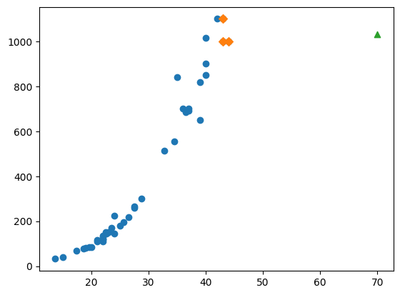

## 선형회귀

## k-최근접 이웃_회귀의 한계

1. **계산 비용**: 모든 훈련 데이터 포인트 간의 거리를 계산해야 하므로, 데이터셋이 커지면 예측 속도가 느려질 수 있다.

2. **이상치에 민감하다**: k-NN 회귀는 `이웃 데이터 포인트의 평균을 사용`하기 때문에, `이상치에 민감`. 예측에 큰 영향을 미치는 이상치가 있을 경우 모델의 성능이 저하할 가능성이 있다.

3. **최적의 k 선택**: `이웃의 수(k)를 어떻게 선택할지에 대한 판단이 필요`하다. 작은 k 값은 노이즈에 민감할 수 있고, 큰 k 값은 모델을 단순화하여 유연성을 잃을 수 있다.

4. **특성의 스케일**: k-최근접 이웃 알고리즘은 `거리 기반`으로 작동하기 때문에, 특성의 스케일이 중요합니다. 다른 스케일을 가진 특성들의 경우 거리 계산에 영향을 주어 정확한 예측을 어렵게 한다.

5. **고차원 데이터**: 특히 데이터셋의 `특성 수가 많은 경우`(k-최근접 이웃의 차원이 증가하는 경우), 예측이 불안정해질 수 있다. = `차원의 저주`

- 코드로 확인하기

```py
import numpy as np
from sklearn.neighbors import KNeighborsRegressor
from sklearn.model_selection import train_test_split

# 길이, 무게 데이터
perch_length = np.array(
    [8.4, 13.7, 15.0, 16.2, 17.4, 18.0, 18.7, 19.0, 19.6, 20.0, 
     21.0, 21.0, 21.0, 21.3, 22.0, 22.0, 22.0, 22.0, 22.0, 22.5, 
     22.5, 22.7, 23.0, 23.5, 24.0, 24.0, 24.6, 25.0, 25.6, 26.5, 
     27.3, 27.5, 27.5, 27.5, 28.0, 28.7, 30.0, 32.8, 34.5, 35.0, 
     36.5, 36.0, 37.0, 37.0, 39.0, 39.0, 39.0, 40.0, 40.0, 40.0, 
     40.0, 42.0, 43.0, 43.0, 43.5, 44.0]
     )
perch_weight = np.array(
    [5.9, 32.0, 40.0, 51.5, 70.0, 100.0, 78.0, 80.0, 85.0, 85.0, 
     110.0, 115.0, 125.0, 130.0, 120.0, 120.0, 130.0, 135.0, 110.0, 
     130.0, 150.0, 145.0, 150.0, 170.0, 225.0, 145.0, 188.0, 180.0, 
     197.0, 218.0, 300.0, 260.0, 265.0, 250.0, 250.0, 300.0, 320.0, 
     514.0, 556.0, 840.0, 685.0, 700.0, 700.0, 690.0, 900.0, 650.0, 
     820.0, 850.0, 900.0, 1015.0, 820.0, 1100.0, 1000.0, 1100.0, 
     1000.0, 1000.0]
     )


# 훈련 세트와 테스트 세트로 나눈다
train_input, test_input, train_target, test_target = train_test_split(perch_length, perch_weight, random_state = 42)

# 훈련 세트와 테스트 세트를 2차원 배열로 바꿔준다.
train_input = train_input.reshape(-1, 1)
test_input = test_input.reshape(-1, 1)


# k-최근접 이웃 회귀 모델을 훈련
knr = KNeighborsRegressor(n_neighbors = 3)
knr.fit(train_input, train_target)

# 길이가 50cm인 농어의 무게를 예측
print(knr.predict([[50]]))

# [1033.33333333] 값이 나온다.
```

- 농어의 길이가 70cm면 선형 관계인 data 인 특성에 의해 무게는 훨씬 많이 나가는 걸로 예측되어야 함.

- 길이가 긴 생선의 길이 데이터가 어떻게(45 이상) 들어가더라도 1033g으로 예측한 이유?

### 산점도를 통해서 knn 의 예측의 원인을 살펴보자

```py
import matplotlib.pyplot as plt

# 70cm 농어의 이웃을 구합니다
distances, indexes = knr.kneighbors([[70]])

# 훈련 세트의 산점도를 그립니다
plt.scatter(train_input, train_target)
# 훈련 세트 중에서 이웃 샘플만 다시 그립니다
plt.scatter(train_input[indexes], train_target[indexes], marker = 'D')
# 70cm 농어 데이터
plt.scatter(70, 1033, marker = '^')

plt.show()

print(np.mean(train_target[indexes]))
# [1033.33333333] 값이 나온다.
```



- 일단 전체적으로 길이가 길면 무게가 많이 나가는 모양의 그래프이다.

- 무게는 모르는 상태로 길이를 기준으로 무게를 찾다보니 저 삼각형 근처의 농어 무게들은 가장 가까운게 45cm근방이다. 그리고 그 이웃들의 무게 평균이 1033g 이기 때문에 예측값으로 1033 이 도출된 것이다.

- 새로운 샘플이 훈련 세트의 범위를 벗어나니 선형적인 관계를 반영하지 못하고 엉뚱한 예측을 한 예제라고 할 수 있다.

### 만약 농어의 길이를 더 늘린다면?

- 농어 100cm 의 무게는?

```py

print(knr.predict([[100]]))

# 100cm 농어의 이웃을 구해야 한다. 이를 위해서 훈련 세트의 산점도를 그립니다
plt.scatter(train_input, train_target)

# 훈련 세트 중에서 이웃 샘플만 다시 그린다.
plt.show()
```


- 하지만 훈련 세트 벗어난 경우 100이나 50이나 모두 1033g으로 예측한다.

- 100cm 농어의 이웃을 표시하면 50cm 농어의 이웃과 동일함

- 위의 70cm 그래프와 동일하게 그리면 된다.

- 그렇기 때문에 머신 러닝 모델은 한번 만들고 끝나지 않는다. 시간이 변하고 환경이 변하면 데이터도 새로 축적되고 새로운 데이터들이 들어오기 때문에 계속해서 최신화를 해줘야 한다.

## 선형회귀

- 널리 사용되는 대표적인 회귀 알고리즘

- 관계식을 만들어놓고 데이터에 적용하는 것

- 비교적 간단하고 성능이 뛰어남

- 특성이 하나인 경우 직선을 학습하는 알고리즘이다. 그렇기 때문에 특성을 잘 나타내는 직선을 찾아야 한다.

- `from sklearn.linear_model import LinearRegression` 위 클래스로 구현할 수 있다.

### 선형회귀 모델 만들기

```py
from sklearn.linear_model import LinearRegression

lr = LinearRegression()
# 선형 회귀 모델 훈련
lr.fit(train_input, train_target)

# 50cm, 70cm, 100cm 농어에 대한 예측
print(lr.predict([[50]]))
[1241.83860323]

print(lr.predict([[70]]))
[2022.1815025]

print(lr.predict([[100]]))
[3192.69585141]
```

- K-최근접 이웃 알고리즘이랑은 다르게 50CM의 농어의 무게를 더 크게 예측한다.
- 어떻게 이 값이 나왔는지 직선을 그려보자 -> 직선을 그리기 위해서는 기울기와 절편이 필요함 -> 선형 회귀알고리즘은 `모델객체의 속성으로 기울기와 절편을 제공`함
- `ax + b 와 같은 직선 방정식을 활용`해 y 값을 구하는 것
- coef_: 기울기(계수, 가중치 등으로 불림)
- intercept_: 절편

```py
print(lr.coef_, lr.intercept_)
# [39.01714496] -709.0186449535474
```

- 즉, 농어의 길이 15에서 50까지의 무게를 예측해서 직선을 그린다고 하면 직선의 두 점은 (15,15X39-709) , (50,50X39-709) 값이 나온다.

### 산점도를 그려 선형회귀를 표현하기

```py

# 훈련 세트의 산점도를 그립니다
plt.scatter(train_input, train_target)

# 15에서 50까지 1차 방정식 그래프를 그립니다
plt.plot([15, 50], [15*lr.coef_+lr.intercept_, 50*lr.coef_+lr.intercept_])

# 50cm 농어 데이터
plt.plot(50, 1241.83860323, marker = '^')
plt.show()
```


- 위 그래프를 보면 무게는 1200 정도로 예측 됨

- knn과 달리 농어의 특성을 반영하는 그래프이다. 즉, 길이가 늘어나면 무게가 늘어나는 특성을 반영하고 있다.

### 정확도를 판단

- 회귀 모델이 종속 변수의 변동성을 얼마나 잘 설명하는지를 측정해보기

```py
# 훈련세트와 테스트세트에 대한 R² (R 제곱) 스코어 스코어 확인
# 선형 회귀 모델(lr)을 사용하여 훈련 데이터셋(train_input, train_target)과 테스트 데이터셋(test_input, test_target)에 대한 R² 스코어를 출력
# 모델이 훈련 데이터와 테스트 데이터 모두에 대해 얼마나 잘 적합되었는지 확인

print(lr.score(train_input, train_target))
# 0.9398463339976041

print(lr.score(test_input, test_target))
# 0.824750312331356
```

- 훈련세트에 과대적합 되어 있는 건지를 판단할 수 있다.

- 훈련세트의 점수도 그리 높지 않다. 오히려 과소적합되어 있음, 데이터에 양이 많지 않다.

- 그래프 왼쪽 아래를 보면 15cm의 농어의 무게는 -로 계산하고 있음, 잘못 계산하고 있다.

- **농어의 길이와 무게의 산점도는 일직선이라기보다 왼쪽 위로 조금 구부러진 곡선에 가까움**

- 선형관계이지만 `곡선의 관계`라고 볼 수 있다.

## 다항 회귀

- 무게와 길이 간의 관계를 나타내는 최적 곡선을 찾기 위해서 특성을 추가해준다.

- 이를 위해서 이차방정식으로 그래프를 그려야 한다.

- 길이를 제곱한 항이 훈련세트에 추가되어야 함 -> column 이 증가하게 된다. 각 특성별로 가중치를 찾아야 한다. -> 2개의 기울기가 생성

- 각 특성을 제곱하여 새로운 특성으로 추가하고, 이를 기반으로 모델을 다시 학습한다.

### 훈련세트에 직접 2차항을 추가해서 훈련을 진행하기

```py
# 훈련세트의 2차항을 데이터에 추가

train_poly = np.column_stack((train_input**2, train_input))
test_poly = np.column_stack((test_input**2, test_input))
```

- 제곱열을 추가했기 때문에 열이 늘어난 상태이다. 그렇기 때문에 다시 학습을 진행시켜줘야 한다.

```py
# 모델을 생성하고
lr = LinearRegression()

# 2차항이 추가된 데이터를 가지고 학습, 훈련을 실시한다.
lr.fit(train_poly, train_target)

# 그 결과를 예측한다.
print(lr.predict([[50**2, 50]]))
# [1573.98423528] 이전과는 다르게 무게, 길이 간의 특성이 반영된 결과가 나온다.
```

### 다른예제, 주어진 그래프를 학습하기

- 무게 = 1.01*길이^2 - 21.6*길이 + 116.05

```py
# 구간별 직선을 그리기 위해 15에서 49까지 정수 배열을 만듭니다
point = np.arange(15, 49)

# 짧은 직선을 이어 그리면 곡선이 됨

plt.scatter(train_input, train_target)
# 훈련 세트의 산점도를 그립니다

# 직접 데이터의 값을 수식으로 대입해준다.
plt.plot(point, 1.01*point**2 - 21.6*point + 116.05)
# 15에서 49까지 2차 방정식 그래프를 그립니다

plt.scatter(50, 1574, marker = '^')
# 50cm 농어 데이터

plt.show()
```


- 단순 선형 회귀모델보다 데이터에 적합한 그래프가 그려짐

- 모델이 훈련 데이터와 테스트 데이터 모두에 대해 얼마나 잘 적합되었는지 확인

```py
print(lr.score(train_poly, train_target))
# 0.9706807451768623

print(lr.score(test_poly, test_target))
# 0.9775935108325122
```

- 훈련세트와 테스트 점수가 높아졌다. 하지만 훈련세트 점수가 높으므로 과소적합이 보임

- 하지만 회귀 모델은 학습데이터의 범위를 벗어나는 범위의 데이터도 예측이 가능

### 다른예, `PolynomialFeatures` 를 활용해서 다항 회귀를 실시하기

```py
from sklearn.preprocessing import PolynomialFeatures
from sklearn.linear_model import LinearRegression

# 2차 다항식을 사용하기 위한 PolynomialFeatures 객체 생성
poly = PolynomialFeatures(degree=2)  

# 훈련 데이터에 대해 새로운 특성(길이의 제곱)을 추가
train_input_poly = poly.fit_transform(train_input)  

# 선형회귀 모데를 생성한다.
lr = LinearRegression()

# 새로운 특성을 추가한 훈련 데이터로 모델 학습
lr.fit(train_input_poly, train_target)  

# 테스트 데이터에도 동일한 변환 적용
test_input_poly = poly.transform(test_input)  

# 테스트 데이터에 대한 R² 스코어 출력
print(lr.score(test_input_poly, test_target))  
```