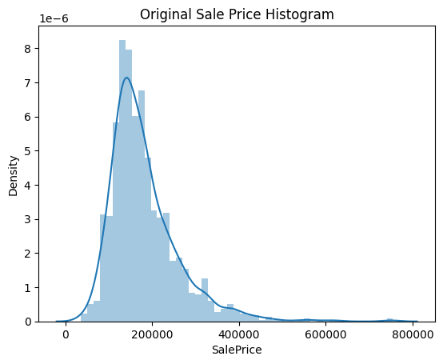

## 회귀 실습 (캐글 주택 가격을 활용한 예측모델 생성)

- 데이터는 kaggle 의 house 에서 받아서 사용한다.

- train.csv -> house_price.csv 로 저장해 사용해준다.

> https://www.kaggle.com/c/house-prices-advanced-regression-techniques/data

### house_price 데이터

- `79개의 변수`로 구성

- 미국 아이오와 주의 에임즈(Ames) 지방의 `주택 가격 정보 데이터`

### 성능 평가는 `RMSLE(Root Mean Squared Log Error)` 기반

- 회귀 문제에서 예측 값과 실제 값의 `오차를 평가`하는 데 사용되는 지표
- 가격이 비싼 주택일수록 예측 결과 오류가 전체 오류에 미치는 비중이 높으므로 이것을 상쇄하기 위해 오류값을 `로그 변환`한 RMSLE 이용
- 오차를 로그 스케일로 변환하여 예측 값과 실제 값의 `비율에 민감하게 반응`하고, 큰 값에 대해서 더 `작은 가중치`를 부여
- RMSE를 하되 예측값과 실제값의 로그 변환값을 기반으로 RMSE 수행 (RMSLE와 동일 방식)

### 전체 회귀 분석 과정

- 데이터 전처리 -> `선형 회귀 모델` 학습/예측/평가

### 데이터 전처리

```py
import warnings
warnings.filterwarnings('ignore') # waring message 안 나타나게 하는 코드
import pandas as pd
import numpy as np
import seaborn as sns
import matplotlib.pyplot as plt
%matplotlib inline

# 원자료를 불러와서 저장해준다.
house_df_org = pd.read_csv('./data/house_price.csv')

# house_df = house_df_org 데이터가 저장된 주소만을 복사하기 때문에 얕은 복사 = 주소 만을 공유한다 
# 때문에 깊은 복사를 통해 원자료를 해치지 않고 학습, 훈련을 실시하기 위해서 깊은 복사를 진행한다.
house_df = house_df_org.copy() 
house_df.head()

# Target 값 : SalePrice (마지막 칼럼) -> 머신러닝을 통해 예측하고자 하는 값이다.
```

### 주요 피처들, 설명

- https://www.kaggle.com/c/house-prices-advanced-regression-techniques/data

- 1stFlrSF: First Floor square feet  # 1층 크기
- 2ndFlrSF: Second floor square feet  # 2층 크기
- GrLivArea: Above grade (ground) living area square feet  # 거실면적
- Bedroom: Bedrooms above grade (does NOT include basement bedrooms)  # 방의 등급
- LotArea: Lot size in square feet # 주택이나 건물이 차지하는 토지의 면적
- GarageArea: Size of garage in square feet   # 차고크기
- YearBuilt: Original construction date # 건축 연도
- OverallQual: Rates the overall material and finish of the house  
       10: Very Excellent  
       9: Excellent  
       8: Very Good  
       7: Good  
       6: Above Average  
       5: Average  
       4: Below Average  
       3: Fair  
       2: Poor  
       1: Very Poor

### 데이터 확인 -> 전처리 시작

```py
# 데이터 확인
house_df.info()
```

```
<class 'pandas.core.frame.DataFrame'>
RangeIndex: 1460 entries, 0 to 1459
Data columns (total 81 columns):
 #   Column         Non-Null Count  Dtype  
---  ------         --------------  -----  
 0   Id             1460 non-null   int64  
 1   MSSubClass     1460 non-null   int64  
 2   MSZoning       1460 non-null   object 
 3   LotFrontage    1201 non-null   float64
 4   LotArea        1460 non-null   int64  
 5   Street         1460 non-null   object 
 6   Alley          91 non-null     object 
 7   LotShape       1460 non-null   object 
 8   LandContour    1460 non-null   object 
 9   Utilities      1460 non-null   object 
 10  LotConfig      1460 non-null   object 
 11  LandSlope      1460 non-null   object 
 12  Neighborhood   1460 non-null   object 
 13  Condition1     1460 non-null   object 
 14  Condition2     1460 non-null   object 
 15  BldgType       1460 non-null   object 
 16  HouseStyle     1460 non-null   object 
 17  OverallQual    1460 non-null   int64  
 18  OverallCond    1460 non-null   int64  
 19  YearBuilt      1460 non-null   int64  
...
 79  SaleCondition  1460 non-null   object 
 80  SalePrice      1460 non-null   int64  
dtypes: float64(3), int64(35), object(43)
-> 여기서 필요한 데이터를 뽑아내서 사용해야 한다.
```

- **데이터 타입과 Null 값 갯수 확인**

```py

# 전체 몇 행 몇 열이냐
print('데이터 세트의 Shape:', house_df.shape) 

# type 을 확인하겠다.
print('\n전체 feature 들의 type \n',house_df.dtypes.value_counts()) 

# Null 컬럼 확인 : 각 열의 누락된 값의 총 수를 나타내는 Series를 생성해준다.
isnull_series = house_df.isnull().sum()

# 그 시리즈를 내림차순으로 정렬하고 출력해준다.
print('\nNull 컬럼과 그 건수:\n ', isnull_series[isnull_series > 0].sort_values(ascending=False))

# 데이터 세트의 Shape: (1460, 81)
# Null 컬럼과 그 건수:
# PoolQC          1453
# MiscFeature     1406
# Alley           1369.... 
# 이런식으로 도출이 된다.
```

- 결측치 확인 결과

- 피처 타입 : 숫자형, 문자형(43개)

- Null값이 1000개 이상인 데이터도 있음(drop) -> 이러한 데이터는 열을 삭제해준다.

### 회귀 모델 적용하기 전에 타겟 값(SalePrice)의 분포도 확인

- SalesPrice의 분포도 확인(히스토그램 활용)

```py
# Saleprice의 분포를 확인해준다.
plt.title('Original Sale Price Histogram')
# 데이터의 분포를 히스토그램과 함께 연속적인 확률 밀도 함수로 시각화
sns.distplot(house_df['SalePrice'])
```



### 그래프의 결과를 통해 확인할 수 있는 것들

- 데이터의 분포가 중심에서 왼쪽으로 치우친 형태 -> 정규 분포에서 벗어나 있음 -> 타겟값을 로그변환 후 학습, 예측을 진행

- `로그변환 데이터로 예측을 진행`하므로 성능평가할 때 RMSE 방식을 이용하면 `RMSLE 를 이용한 결과와 같다`고 할 수 있다.

- RMSE, RMSLE 차이는 학습/예측을 로그변환 했냐 안했냐의 차이가 있기 때문에 할 수 있는 것이다.

### 로그 그래프의 특징 때문에 로그 변환을 활용

- 0 < x <1 범위에서는 y축의 기울기가 매우 가파르다. 즉, 짧은 x의 구간`(0,1)`에 대해 `y의 구간은 매우 큼(-inf~0)`

- x의 값이 0에 가깝게 모이게 되면 y값들은 매우 큰 범위로 벌어지게 됨. 즉, 로그함수를 0에 가까운 값들이 모여있는 입력값을 `넓은 범위로 펼칠 수 있는 특징`이 있다.

- 반면 x의 값이 커지면 로그함수 기울기는 급격히 작아지므로 큰 x값들에 대해서는 y의 값이 크게 차이나지 않게 된다. 넓은 범위의 x를 비교적 작은 구간내에 모이게 하는 특징이 있다.

- 즉,  작은 것은 크게, 큰 것은 작게 만드는 효과가 있다. 결과적으로 데이터의 분포를 밀집되어 있는 부분은 퍼지게 퍼져있는 부분은 모아지게(좁게) 할 수 있다.

- 이 특성 때문에 한쪽으로 몰려 있는 분포에 로그변환을 취하게 되면 분포가 넓어진다고 할 수 있으며, 가운데로 데이터를 모아주는 효과가 있다.

### 로그 변환 시 np.log 변환이 아닌 np.log1p 변환을 사용하는 이유

#### 로그 변환 및 환원

- 정규 분포가 아닌 결과값을 정규 분포 형태로 변환
- `log1p() 이용`해 로그 변환한 결과값을 기반으로 학습한 후
- 예측 시에는 다시 결과값을 `expm1()`으로 환원한다.

```py
compare = np.array([0, 2.354])

# 무한대값이 담긴 배열을 반환, x가 0이면 무한대 값을 갖게됨. 
# 이는 결과로 사용 불가능하기 때문에 이를 해결하기 위해서
print(np.log(compare))

# 모든 데이터에 1을 더한 값을 이용해 log 변환
print(np.log(compare+1))

# log1p 함수는 직접 1을 더하지 않고 함수가 해결함, -1 로 인해서 발생하는 무한대를 방지하기 위함
print(np.log1p(compare))

# 1을 더한것과 1p 함수와 결과는 동일하다.
# [      -inf 0.85611601]
# [0.         1.21015366]
# [0.         1.21015366]
```

### 결과값을 로그 변환하고 다시 분포도 확인

```py
log_SalePrice = np.log1p(house_df['SalePrice'])
sns.displot(log_SalePrice)
```


- 데이터가 어느정도 가운데로 모인 것을 확인할 수 있다.

### **타겟값인 Price를 `로그변환`하고 피처들 중 숫자형 컬럼의 Null값 데이터 처리**


```py
# SalePrice 로그 변환 작업

# 기존값을 따로 저장
original_SalePrince = house_df['SalePrice']

# 로그변환 값으로 타겟값을 대체
house_df['SalePrice'] = np.log1p(house_df['SalePrice'])

# Null이 너무 많은 컬럼들과 불필요한 컬럼 삭제
house_df.drop(['Id','PoolQC','MiscFeature','Alley','Fence'], axis=1, inplace=True)


# drop하지 않은 숫자형 Null 컬럼들은 `평균값`으로 대체
# pandas 버전의 상승으로 mean 함수가 변경되어 문자열에서도 평균을 구하려고 한다.
house_df.fillna(house_df.mean(numeric_only = True), inplace = True)

# Null 값이 있는 피처명과 타입을 추출
null_column_count = house_df.isnull().sum()[house_df.isnull().sum() > 0]
null_column_count

# 수치형 데이터의 결측치 해결을 확인해준다.
print('## Null 피처의 Type :\n', house_df.dtypes[null_column_count.index])


## Null 피처의 Type :
# MasVnrType      object
# BsmtQual        object
# BsmtCond        object
# BsmtExposure    object
# BsmtFinType1    object
# BsmtFinType2    object
# Electrical      object
# FireplaceQu     object
# GarageType      object
# GarageFinish    object
# GarageQual      object
# GarageCond      object
# dtype: object
```

### **현재 문자열 값은 모두 카테고리 값이다. 판다스의 get_dummies( )를 이용하여 원-핫 인코딩 수행**

#### 더미 변수(dummy variable)는 범주형 변수를 처리하기 위해 사용되는 기법

- 사용 이유

  - 범주형 `변수의 개수가 많은 경우`: 범주형 변수의 개수가 많은 경우, 이를 모두 독립변수로 사용하면 모델의 복잡도가 증가하여 학습이 어려워집니다. 더미 변수를 사용하면 이러한 문제를 해결할 수 있습니다.
  - 범주형 변수 간의 `상호작용을 고려`하기 위해: 더미 변수를 사용하면 범주형 변수 간의 상호작용을 고려할 수 있습니다. 예를 들어, 성별과 나이가 서로 영향을 미치는 경우, 이를 각각 더미 변수로 변환하여 모델에 입력하면 상호작용을 고려할 수 있습니다.
  - `결측치 처리`를 위해: 더미 변수를 사용하면 결측치를 처리할 수 있습니다. 예를 들어, 성별이 결측치인 경우, 더미 변수를 사용하여 성별이 남성인지 여성인지를 예측할 수 있습니다.
  - `분석의 편의성`을 위해: 더미 변수를 사용하면 분석의 편의성이 증가합니다. 예를 들어, 회귀분석에서 더미 변수를 사용하면 회귀계수를 쉽게 해석할 수 있습니다.

- 이 데이터에서는 결측치 처리를 위해서 실시한다.

```py
# 수행하기 전 데이터를 확이
print('get_dummies() 수행 전 데이터 Shape:', house_df.shape)

# one-hot encoding 수행
house_df_ohe = pd.get_dummies(house_df) 

# 인코딩 후 데이터 확인
print('get_dummies() 수행 후 데이터 Shape:', house_df_ohe.shape)
```

- tip. 결측치(none)가 있는 컬럼은 더미화 하면 결측도 하나의 값으로 보고 결측을 표시한다.

- 즉, 결측치가 있는 문자열 컴럼은 진행하면 결측치도 사라진다.

```py
# get_dummies( )를 이용하면 따로 null 필드도 생성할 수 있다.
null_column_count = house_df_ohe.isnull().sum()[house_df_ohe.isnull().sum() > 0]
print('## Null 피처의 Type :\n', house_df_ohe.dtypes[null_column_count.index])
```

### 모델링 진행 방법

1. 기본전처리인 결측치 처리

2. 선형회귀모델 이용 학습/예측/평가 : 이 모델이 기준 모델이다.(이 모델 성능보다 좋은 모델을 생성하는 것이 목표)

3. 나머지 전처리들을 단계적으로 진행 후 학습/예측/평가

### 2. 선형 회귀 모델의 학습/예측/평가

- `LinearRegression`, `Ridge`, `Lasso`를 이용해 선형 계열의 회귀 모델 만들기

### **RMSE 평가 함수 생성**

- log 변환된 데이터로 학습/예측/평가를 진행하므로 RMSE를 적용하면 RMSLE와 같아진다.

- rmse 작업을 함수로 정의해준다.

```py
# 단일 모델의 RMSE 값 반환을 해준다.
def get_rmse(model): 

# 학습된 모델을 받아서 예측을 진행
    pred = model.predict(X_test)
    mse = mean_squared_error(y_test, pred)
    # 루트를 씌워서 데이터 간의 격차를 줄여준다.
    rmse = np.sqrt(mse) 
    print('{0} 로그 변환된 RMSE: {1}'.format(model.__class__.__name__,np.round(rmse, 3)))
    return rmse

# 여러 모델의 RMSE 값 반환/ 각각의 모델들에 대해서 rmse 를 리턴하는 함수를 만들겠다.
def get_rmses(models):
    # 반환된 각 모델의 rmse값을 저장한다.
    rmses = [] 
    for model in models:
        rmse = get_rmse(model)
        rmses.append(rmse)    
    return rmses 

# 전달된 모델들의 rmse 값들이 저장된 list 가 반환이 된다.
```

- 본격적인 학습을 위한 데이터 분리

```py
## 데이터 분할
from sklearn.linear_model import LinearRegression, Ridge, Lasso
from sklearn.model_selection import train_test_split
from sklearn.metrics import mean_squared_error

# 타깃과 피처
y_target = house_df_ohe['SalePrice']
X_features = house_df_ohe.drop('SalePrice',axis=1, inplace=False)

X_train, X_test, y_train, y_test = train_test_split(X_features, y_target, test_size=0.2, random_state=156)
```

### **모델 학습/예측/평가**

```py
# 일반 선형 회귀
lr_reg = LinearRegression()
lr_reg.fit(X_train, y_train)

# 릿찌회귀
ridge_reg = Ridge()
ridge_reg.fit(X_train, y_train)

# 라쏘 회귀
lasso_reg = Lasso()
lasso_reg.fit(X_train, y_train)


# 각 방식으로 학습된 모델 전달하고
models = [lr_reg, ridge_reg, lasso_reg]

# rmse값 반환해준다
get_rmses(models)

# LinearRegression 로그 변환된 RMSE: 0.132
# Ridge 로그 변환된 RMSE: 0.128
# Lasso 로그 변환된 RMSE: 0.176
# [0.13209246889873053, 0.12813308035944904, 0.17628250556471403]
```

### 결과

- 라쏘회귀가 타 회귀 방식보다 상대적으로 성능이 떨어진다
- 하이퍼 파라미터 튜닝이 필요(alpha 하이퍼파라미티에 대해서 최적화 수행) -> base model 보다 더 좋은 모델을 만들겠다.
- 선형회귀에 경우에는 alpha 값이 없다.
- ridge, lasso 에 alpha 를 적용하고 모델의 성능을 높이도록 한다.

### **회귀 계수의 시각화**

- 변수가 많으므로 상위10개 하위 10개의 피처명과 회귀계수값을 반환하는 함수를 작성해서 사용해 얼마나 차이가 나는지를 확인

```py

# 각 모델에서 결정한 회귀계수 값 중 상위/하위 10개의 회귀계수 값과 해당 index를 반환하는 함수.
def get_top_bottom_coef(model) :
    
    # series 생성한다. 각 독립변수의 회귀계수가 저장됨
    coef = pd.Series(model.coef_, index=X_features.columns)

    # 내림차순 상위 10개
    coef_high = coef.sort_values(ascending=False).head(10)
    
    # 내림차순 하위 10개
    coef_low = coef.sort_values(ascending=False).tail(10)
    
    return coef_high, coef_low
```

```py
# 모델별 회귀 계수 시각화 함수
# list 객체로 모델을 입력 받아서
# 모델별로 회귀 계수 상위 10개, 하위 10개 추출 -> 가로 막대 그래프 형태로 출력
def visualize_coefficient(models):
    
    # 3개 회귀 모델의 시각화를 위해 3개의 컬럼을 가지는 subplot 생성, 한번에 3개의 그래프를 그릴 수 있도록 한다.
    fig, axs = plt.subplots(figsize=(24,10),nrows=1, ncols=3)
    fig.tight_layout() 

    palette = sns.color_palette("husl", n_colors=len(models))
    
    # 입력인자로 받은 list객체인 models에서 차례로 model을 추출하여 회귀 계수 시각화. 
    # zip을 활용해서 models 리스트와 palette 리스트를 결합
    # enumerate() 함수를 사용하여 models 리스트와 palette 리스트의 인덱스와 값을 추출
    for i_num, (model, color) in enumerate(zip(models, palette)):
        
        # 상위 10개, 하위 10개 회귀 계수를 구하고, 이를 판다스 concat(여러 개의 데이터프레임을 결합 하나의 데이터프레임으로 반환)으로 결합. 
        coef_high, coef_low = get_top_bottom_coef(model)
        coef_concat = pd.concat( [coef_high , coef_low] )
        
        # 순차적으로 ax subplot에 barchar로 표현. 한 화면에 표현하기 위해 tick label 위치와 font 크기 조정. 

        axs[i_num].set_title(model.__class__.__name__ +' Coeffiecents', size=25)
        axs[i_num].tick_params(axis="y",direction="in", pad=-120) 
        
        # 안쪽, 패딩값, 안쪽을 좁게
        for label in (axs[i_num].get_xticklabels() + axs[i_num].get_yticklabels()):
            label.set_fontsize(22) # 글씨 크기 설정
        sns.barplot(x=coef_concat.values, y=coef_concat.index , ax=axs[i_num])

# 그래프 그리기
models = [lr_reg, ridge_reg, lasso_reg]
visualize_coefficient(models)
```


### 결과

- OLS 기반의 `LinearRegression`과 `Ridge` : 회귀 계수가 유사한 형태로 분포

- 라쏘 : 전체적으로 회귀 계수 값이 매우 작음. 값이 거의 없다.
  - Year Built가 가장 크고, 다른 피처의 회기 계수는 너무 작음