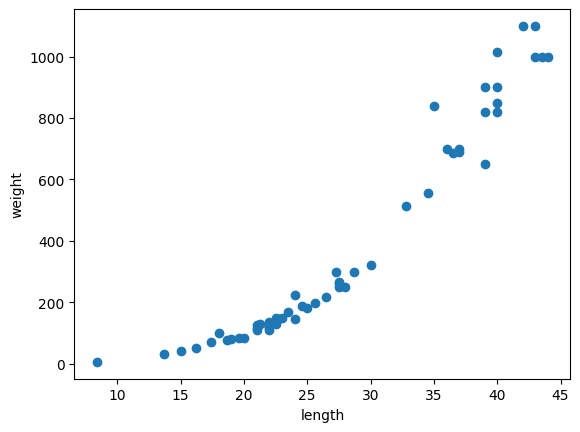

# k-최근접 이웃 회귀 사용

## 농어의 무게 예측

### 지도 학습 VS 비지도 학습

- 학습을 위한 `데이터에 결정값이 있는지의 여부(정답이 있느냐 없느냐)에 따라 분류`

### 지도학습

- 회귀와 분류
  - 분류 : 샘플을 몇개의 클래스(범주)로 분류하는 문제
  - 회귀 : 임의의 어떤 연속적인 수치를 예측하는 문제, 정답과 얼마나 오차가 적은지에 따라 성능을 평가한다.
        - 통계적인 의미의 회귀 : 두 변수 사이의 상관관계를 분석하는 방법

### 데이터 준비

```py
import numpy as np

# 길이와 무게 data
perch_length = np.array(
    [8.4, 13.7, 15.0, 16.2, 17.4, 18.0, 18.7, 19.0, 19.6, 20.0, 
     21.0, 21.0, 21.0, 21.3, 22.0, 22.0, 22.0, 22.0, 22.0, 22.5, 
     22.5, 22.7, 23.0, 23.5, 24.0, 24.0, 24.6, 25.0, 25.6, 26.5, 
     27.3, 27.5, 27.5, 27.5, 28.0, 28.7, 30.0, 32.8, 34.5, 35.0, 
     36.5, 36.0, 37.0, 37.0, 39.0, 39.0, 39.0, 40.0, 40.0, 40.0, 
     40.0, 42.0, 43.0, 43.0, 43.5, 44.0]
     )

perch_weight = np.array(
    [5.9, 32.0, 40.0, 51.5, 70.0, 100.0, 78.0, 80.0, 85.0, 85.0, 
     110.0, 115.0, 125.0, 130.0, 120.0, 120.0, 130.0, 135.0, 110.0, 
     130.0, 150.0, 145.0, 150.0, 170.0, 225.0, 145.0, 188.0, 180.0, 
     197.0, 218.0, 300.0, 260.0, 265.0, 250.0, 250.0, 300.0, 320.0, 
     514.0, 556.0, 840.0, 685.0, 700.0, 700.0, 690.0, 900.0, 650.0, 
     820.0, 850.0, 900.0, 1015.0, 820.0, 1100.0, 1000.0, 1100.0, 
     1000.0, 1000.0]
     )
```

- 산점도를 그려 데이터 형태 및 특성 확인하기

```py
import matplotlib.pyplot as plt
plt.scatter(perch_length, perch_weight)
plt.xlabel('length')
plt.ylabel('weight')
plt.show()
```



- 농어의 길이가 길어짐 -> 무게도 증가

- 길이가 무게를 결정한다.

- 농어 길이 특성을 이용해 무게 예측을 실시

### 데이터 분할

```py
# 훈련 세트와 테스트 세트로 나누기
from sklearn.model_selection import train_test_split
train_input, test_input, train_target, test_target = train_test_split(perch_length, perch_weight, random_state = 42)
```

- 학습 데이터가 1차원
  - 사이킷런은 2차원 입력을 요구하므로 차원을 변경해야 함
  - 넘파이 배열.`reshape(행,열[,깊이])` 함수 사용

- input 데이터 차원 변경 : 행에 -1을 사용하면 행은 알아서 계산
  - 행은 알아서 계산, 1열 의 2차원 데이터로 변환

```py
# shape 속성
test_array = np.array([1, 2, 3, 4])
test_array.shape

# reshape() :  데이터의 차원을 변경하는 함수
# 행렬로 변경했을 때 나타나는 원소수가 원본과 일치해야 함
# 배열의 구조를 2행 2열로 변경
test_arr = test_array.reshape(2, 2)

train_input = train_input.reshape(-1, 1)
test_input = test_input.reshape(-1, 1)
```

### 결정 계수 ($ R^2$)

- 회귀 모델의 예측 결과에 대한 평가지표, 성능을 평가하는 지표
- 비교에 크게 적합하지 않은 지표이다.
- 회귀에서 `정확한 숫자(정확한 무게)를 맞춘다는 것은 불가능`하다. 예측값이나 타깃값 모두 임의의 숫자임
- 결국 회귀의 평가는 모든 타겟에 대해서 타깃값에서 예측값을 뺀 크기가 얼마나 되는지를 확인해서 계산하게 된다.
- `상쇄를 방지를 위해서 전부 제곱`을 해준다.
- 분자가 클수록 남는 값이 적다 -> 오차가 크다 -> 즉, R 값이 클수록 오차가 적다.


### k-최근접 이웃 회귀 모델을 훈련

```py
from sklearn.neighbors import KNeighborsRegressor
knr = KNeighborsRegressor()
knr.fit(train_input, train_target)

# 1 에 가까운 값
knr.score(test_input, test_target)
```

- $ R^2$ 지표로 0.99가 나옴 -> 100점 중 99점이라는 의미

- 상당히 좋은 값 이지만 직관적이지 못하기 때문에 직관적인 다른 지표를 사용해야 한다.
- MAE 사용: 타깃값과 예측값의 절대값 오차의 평균 (mean_absolute_error)

```py
from sklearn.metrics import mean_absolute_error

# 테스트 세트에 대한 예측을 만듭니다
test_pred = knr.predict(test_input)

# 테스트 세트에 대한 평균 절댓값 오차를 계산 -> 평균적으로 어느정도의 오차가 있다는 것을 알려준다.
mae = mean_absolute_error(test_target, test_pred)

print(mae)
# 19.157142857142862
```

- 결과적으로 평균 19g정도 타깃값과 다르다는 것을 의미한다.
- 결과가 좋다, 나쁘다를 명확하게 판단할 수 없다.

### 과대적합 vs 과소적합

- 과대적합은 학습 데이터에만 너무 정확하게 패턴을 찾아 훈련한 결과
  - 학습데이터로는 100%의 예측을 진행하지만 다른 데이터에는 낮은 성능을 나타내는 모델인 경우

- `과소적합`은 적은 학습 횟수, 적은 데이터 등으로 인해 성능이 `학습/평가 데이터 모두에서 낮게 나오는 현상`

```py
print(knr.score(test_input, test_target))
# 0.992809406101064

print(knr.score(train_input, train_target))
# 0.9698823289099254
```

- 훈련 세트의 score보다 테스트 세트의 score가 더 높다 -> 과소 적합
- 데이터 수를 늘리거나, 파라미터 조정을 통해 해결할 수 있다.

### 이웃의 갯수를 3으로 설정하고 다시 훈련을 진행

```py
knr.n_neighbors =3

# 모델을 다시 훈련합니다.
knr.fit(train_input, train_target)

print(knr.score(test_input, test_target))
# 0.9746459963987609

print(knr.score(train_input, train_target))
# 0.9804899950518966
```

- 훈련 세트의 score가 테스트 세트의 score보다 더 높다 -> `과대 적합`
- 차이가 `미비한건 상관이 없음`(실제 작은 차이는 과대/과소 적합이라고도 하지 않음)

- 차이가 너무 많이 나는 경우
  - 훈련을 너무 많이 시켜 훈련데이터에만 맞는 모델이 되었거나(과대적합)
  - 과대적합은 훈련스코어는 높으나, 테스트 스코어는 현저하게 낮은 경우

  - 훈련을 너무 적게 해서 제대로 된 결과를 내지 못하고 있는 것(과소적합)
  - 과소 적합은 성능이 굉장히 떨어진 결과로 나타남

### 과대/과소 적합 확인 예제

- n_neighbors 값을 변경시켜가면서 그래프를 통해 과대,과소 적합 확인

```py
# k-최근접 이웃 회귀 객체를 만들어준다.
knr = KNeighborsRegressor()

# 5에서 45까지 x 좌표를 만들어준다
x = np.arange(5, 45).reshape(-1, 1)

# n = 1, 5, 10일 때 예측 결과를 그래프로 그리기
for n in [1, 5, 10]:
    knr.n_neighbors = n
    knr.fit(train_input, train_target)
    # 지정한 범위 x에 대한 예측 구하기
    pred = knr.predict(x)
    plt.scatter(train_input, train_target)
    plt.plot(x, pred)
    plt.title('n_neighbors = {}'.format(n))    
    plt.xlabel('length')
    plt.ylabel('weight')
    plt.show()
```


- n_neighbors 가 `작을수록` 학습 데이터에 `매몰`

- n_neighbors 가 `클수록 과소적합`이 일어날 수 있다.
