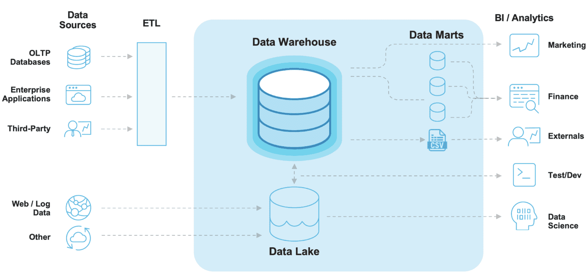

# 데이터 웨어하우스의 아키텍처

출처 : https://bomwo.cc/posts/Datawarehouse/

## SPARK RDD 프로그래밍 기술

- 개념

- 기본 문법

- hadoop, mysql 과의 연결에 대한 문법

- 공공데이터의 코로나 data 를 수집 -> 처리 -> datamart 로 저장 (corona 프로젝트 진행)

- fred project
  1. fred data 를 hdfs 에 저장하는 프로그램을 만들어본다.
  2. fred data 를 kafka 활용 hdfs에 저장한다.
  3. fred data 를 kafka 활용 수집 -> spark 로 처리 -> mysql 로 이동
  4. airflow 를 활용해서 자동화처리
  5. 웹서버와 연동
