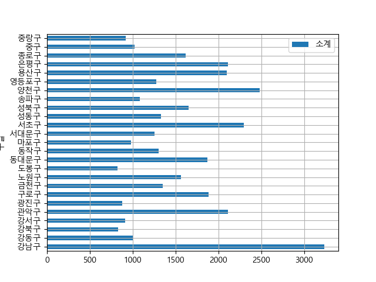
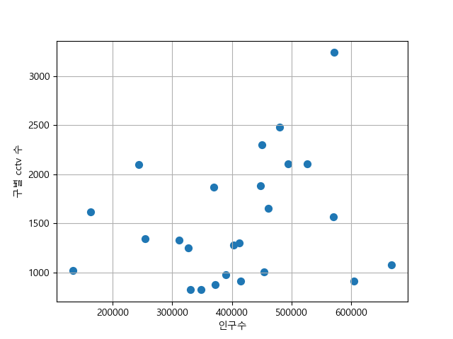
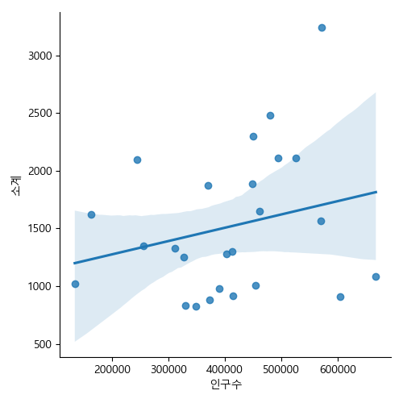

## 파이썬으로 데이터 주무르기 by 민형기의도서 예제

```
# 그래프로 시각화
import matplotlib.pyplot as plt
```

### 분석 내용

- 서울시 각 구별 cctv 수를 확인하고 인구대비 cctv 구별을 구해 순위 비교

- 인구 대치 ccst 평균치를 확인, cctv가 과하게 부족한 구를 확인

  - cctv 설치가 영향을 미치는 연구 데이터를 찾기
  - 전체 인구, 외국인, 고령화 인구 그룹이 cctv 설치 영향을 미친 그룹이 있는지 통계검증을 활용해서 확인

- data 폴더에 있는 `CCTV_in_Seoul.csv` 불러오기

> cctv_seoul = pd.read_csv('./data/01. CCTV_in_Seoul.csv')

- 문제에서 제시한대로 자치구별로 구분하기 위해 기관명 column을 자치구로 `rename` 해준다. 

```
# rename 함수사용 - 기관명의 index 를 활용해 rename 하고 저장해준다.
cctv_seoul.rename(columns = {cctv_seoul.columns[0]:'구별'},
                 inplace = True)
```

- 이제 비교를 위한 파일인 `서울시 인구 excel 파일을 가져온다`

```
# 인구파일을 가져온다
pop_seoul = pd.read_excel('./data/01.population_in_Seoul.xls')


# 필요한 data 만 추출하기 위해서 구성을 확인
pop_seoul.head()
기간	자치구	세대	인구	인구.1	인구.2	인구.3	인구.4	인구.5	인구.6	인구.7	인구.8	세대당인구	65세이상고령자

# 열들 중에서 자치구, 총인구, 외국인 인구, 65세 이상 고령자 를 뽑아서 따로 저장한다.

pop_seoul = pd.read_excel('./data/01.population_in_Seoul.xls',
                         header = 2, # column 명을 지정해줌
                         usecols = 'B, D, G, J, N')

# 자치구가 여기서 도출되었기 때문에 위에서 column 명을 바꿔준 것
```

- 인구, cctv 데이터 간 행 차이가 존재 -> 위에서 확인해보니 인구파일의 0번째 행은 합계이므로 삭제해준다.

```
cctv_seoul.info() 
dtypes: int64(5), object(1)

pop_seoul.info()
dtypes: float64(4), object(1)

# 인구 data 에서 불필요한 행을 삭제해준다.

pop_seoul.drop([0], inplace = True)
```

- 중복값, null 값을 확인해준다.

```
# 중복값확인
pop_seoul.구별.unique()
set(cctv_seoul.구별)


# null 값을 확인
pop_seoul[pop_seoul.구별.isnull()]

# 26번째 행에 null 값 존재, 제거
pop_seoul.drop(26, inplace = True)

```

### 이제 몇 가지 내용을 `시각화`

- cctv 설치 대수가 적은 5개 구를 확인
    
    `내림차순 정렬`을 통해서 확인

>cctv_seoul.`sort_values`(by = '소계').head(5)

- cctv 설치 대수가 많은 5개 구를 확인
  
   ` 오름차순 정렬`을 통해서 확인

> cctv_seoul.`sort_values`(by = '소계', `ascending = False`).head(5)


- 증가율 Field 를 생성

```
# 벡터화 연산을 실시한다
# 각각의 원소들 중 행번호가 같은 원소들끼리 짝을 맞춰서 연산을 진행한다.
# 최근 3년 간의 증가율을 확인한다.
cctv_seoul['최근증가율'] = (cctv_seoul['2014년'] + 
                       cctv_seoul['2015년'] + 
                       cctv_seoul['2016년']) / cctv_seoul['2013년도 이전'] * 100
```

- 최근 3개년동안 cctv 설치 증가율이 높은 3개의 구

    위와 같은 방식으로 확인한다.

> cctv_seoul.sort_values(by = '최근증가율', ascending = False).head(3)


- 인구, 외국인 인구, 고령자 인구가 가장 많은 자치구 확인하기

```
# 인구 제일 많은 곳 : 송파, 강서, 강남
pop_seoul.sort_values(by = '인구수', ascending = False).head(5)


# 고령자 제일 많은 곳 : 강서, 송파, 은평
pop_seoul.sort_values(by = '고령자', ascending = False).head(5)


# 외국인 제일 많은 곳 : 영등포구, 구로구, 금천구
pop_seoul.sort_values(by = '외국인', ascending = False).head(5)
```

- 이들의 비율을 계산하기

```
pop_seoul['외국인비율'] = pop_seoul['외국인']/pop_seoul['인구수']*100
pop_seoul['고령자비율'] = pop_seoul['고령자']/pop_seoul['인구수']*100
```

- 이렇게 만든 비율을 통해서 자료를 정렬할 수 있다.

```
# 인구수 대비 외국인 비율이 높은 자치구
pop_seoul.sort_values(by = '외국인비율', ascending = False).head()
```

- ### 비율 계산, 정렬은 엑셀에서의 필터, Table 만들기와 유사한 측면이 있다.


### 인구수 대비 cctv 적정성을 확인

-  `구별` 컬럼명을 기준으로 병합

```
# 앞에서 설정한 rename 해 설정해둔 것을 활용한다.
data_result = pd.merge(cctv_seoul, pop_seoul, on = '구별')
data_result.head()
```

```
# 불필요한 컬럼 삭제 -> 기준년도에 따라서 계산하기 위함
# del 명령어 사용 : 원본에 무조건 반영
del data_result['2013년도 이전']
del data_result['2014년']
del data_result['2015년']
del data_result['2016년']
```


### 인구와 관련된 data 와 cctv 관련한 data 들 간의 선형적인 상관성이 있는지 확인(문제에서 설정한 기준을 통해서 확인한다.)

- 상관계수
  
  - 계수값이 절대값으로 0.3을 넘어가면 상관관계가 있다.
  
  - 0.1 이하면 무시
  
  - 0.7 이상이면 아주 강한 상관관계(자기 상관 의심)
  
  - 0.1 < 계수 <= 0.3 약한 상관관계
  
  - 값이 - 면 음의 상관 : 두 변수의 값 중 하나의 변수값이 증가하면 나머지   변수의 값은 감소한다.
  
  - 값이 + 면 양의 상관 : 두 변수의 값 중 하나의 변수값이 증가하면 나머지 
  변수의 값도 증가한다.


- df.corr() 상관계수를 구해주는 함수
    
    `np.corrcoef(데이터값1, 데이터값2)`

```
# 인구수, cctv 대수와의 상관 관계
np.corrcoef(data_result['소계'], data_result['인구수'])

array([[1.       , 0.2432198],
       [0.2432198, 1.       ]])

# 약한 양의 상관
```

- cctv vs 인구현황 기본 시각화(막대 그래프)

```
# 전체 자치구별 cctv 절대 대수의 차이 확인 그래프 

# 그래프의 크기
plt.figure(figsize = (10, 10)) 

# 그래프의 종류, 소계 data 를 활용하겠다. 
data_result[['소계']].plot(kind = 'barh', grid = True)

# 그래프 반환
plt.show()
```




- 약한 양의 상관관계를 보이는 구별 cctv 수와 구별 인구수와의 관게(점 분포도)

```
plt.scatter(data_result.인구수, data_result.소계, s=50)
plt.xlabel('인구수')
plt.ylabel('구별 cctv 수')
plt.grid()
```



- 여기에 implot 를 통해 data 를 대표하는 직선을 추가해줄 수 있다.

```
import seaborn as sns

sns.lmplot(x = '인구수', y = '소계', data =  data_result)
```

