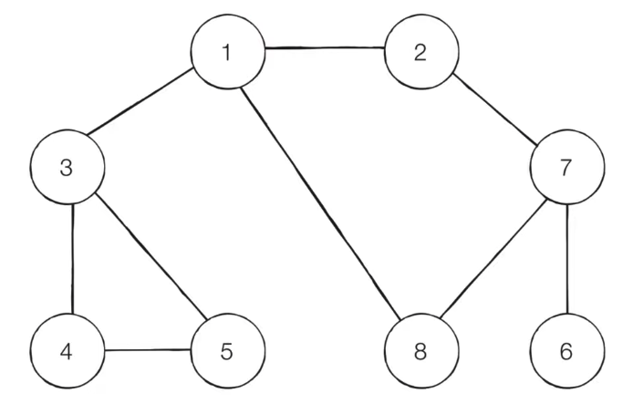

## DFS(Depth-First search)

DFS는 깊이 우선 탐색이라고도 부르며 그래프에서 깊은 부분을 우선적으로 탐색하는 알고리즘

DFS는 `스택 자료구조(혹은 재귀 함수`)를 이용한다.

- 동작 과정

1. 탐색 시작 노드를 스택에 삽입하고 방문 처리.

2. 스택의 최상단 노드에 방문하지 않은 인접한 노드가 하나라도 있으면 그 노드를 스택에 넣고 방문 처리.
   
3. 기준에 따라 인접 노드를 방문, 인접-> 인접의 방향으로 방문한다.

4. 방문하지 않은 인접 노드가 없으면 스택에서 최상단 노드를 꺼낸다.

5. 더 이상 2번의 과정을 수행할 수 없을 때까지 반복.

### 사진을 통해서 DFS 쉽게 확인



방문기준: 시작 노드인 1에서부터 번호가 낮은 인접 노드 부터

1 -> 2

2 -> 7 -> 6

8

다시 1

3 -> 4 -> 5

> 1 -> 2 -> 7 -> 6 -> 8 -> 3 -> 4 -> 5


### DFS 소스코드 예제 (Python)

```
# DFS 함수 정의
def dfs(graph, v, visited):
    # 현재 노드를 방문 처리
    visited[v] = True
    print(v, end=' ')
    
    # 현재 노드와 연결된 다른 노드를 재귀적으로 방문 
    # 밑에서부터 시작점을 찾는다고 보면 편하다.
    for i in graph[v]:
        if not visited[i]:
            dfs(graph, i, visited)

# 각 노드가 연결된 정보를 리스트 자료형으로 표현(2차원)
graph = [
  [],
  [2, 3, 8],
  [1, 7],
  [1, 4, 5],
  [3, 5],
  [3, 4],
  [7],
  [2, 6, 8],
  [1, 7]
]

# 각 노드가 방문된 정보를 리스트 자료형으로 표현(1차원)
# index 로 순서를 나타낸다.
visited = [False] * 9

# 정의된 DFS 함수 호출
dfs(graph, 1, visited)
```

> 1 2 7 6 8 3 4 5

### BFS (Breadth-First Search)

BFS는 너비 우선 탐색이라고도 부르며, 그래프에서 가까운 노드부터 우선적으로 탐색하는 알고리즘이다

BFS는 `큐 자료구조`를 이용한다.

- 동작 과정

1. 탐색 시작 노드를 큐에 삽입하고 방문 처리.

2. 큐에서 노드를 꺼낸 뒤에 해당 노드의 인접 노드 중에서 방문하지 않은 노드를 모두 큐에 삽입하고 방문 처리. 

3. 기준에 따라 시작 노드에서 인접노드를 선정하고 다시 인접 노드를 기준에 따라서 탐색한다.

4. 더 이상 2번의 과정을 수행할 수 없을 때까지 반복.


### 사진을 통한 BFS 확인


방문기준: 시작 노드인 1에서부터 번호가 낮은 인접 노드부터

1 -> (2 -> 3 -> 8) 방문 처리

그 다음으로 작은 수인, 2 를 기준 으로 작은 수인 7 처리

그 다음으로 작은 수인, 3 을 기준으로 4 -> 5 처리

그 다음으로 작은 수인, 8 을 기준으로 6 을 처리

> 1 -> 2 -> 3 -> 8 -> 7 -> 4 -> 5 -> 6


### BFS 소스코드 예제 (Python)

```
from collections import deque

# BFS 함수 정의
def bfs(graph, start, visited):
    # 큐(Queue) 구현을 위해 deque 라이브러리 사용
    queue = deque([start])
    # 현재 노드를 방문 처리
    visited[start] = True
    
    # 큐가 빌 때까지 반복
    while queue:

        # 큐에서 하나의 원소를 뽑아 출력
        # 하나씩 뽑아준다.
        v = queue.popleft()
        print(v, end=' ')
        # 해당 원소와 연결된, 아직 방문하지 않은 원소들을 큐에 삽입
        for i in graph[v]:
            if not visited[i]:
                queue.append(i)
                visited[i] = True

# 각 노드가 연결된 정보를 리스트 자료형으로 표현(2차원)
graph = [
  [],
  [2, 3, 8],
  [1, 7],
  [1, 4, 5],
  [3, 5],
  [3, 4],
  [7],
  [2, 6, 8],
  [1, 7]
]

# 각 노드가 방문된 정보를 리스트 자료형으로 표현(1차원)
# index 로 순서를 나타낸다.
visited = [False] * 9

# 정의된 BFS 함수 호출
bfs(graph, 1, visited)

```

> 1 2 3 8 7 4 5 6