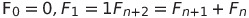
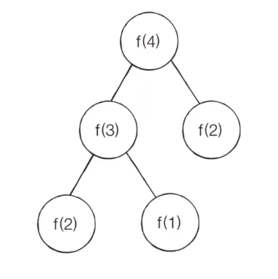
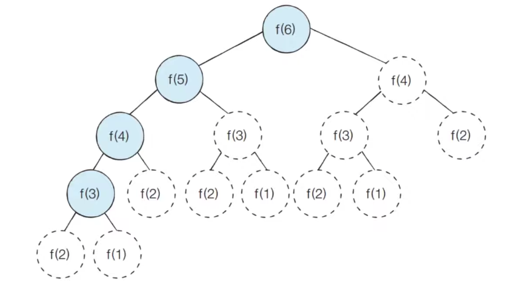

## 다이나믹 프로그래밍

- 메모리를 적절히 사용하여 수행 시간 `효율성을 비약적으로 향상`시키는 방법

- 이미 계산된 결과는 `별도의 메모리 영역에 저장하여 다시 계산하지 않도록 합니다`.

- 탑다운, 보텀업으로 구성된다.

- 다이나믹 프로그래밍은 `동적 계획법`이라고도 부른다

일반적인 프로그래밍 분야에서의 `동적(Dynamic)`이란 어떤 의미를 가질까?

    자료구조에서 `동적 할당(Dynamic Allocation)`은 '프로그램이 실행되는 도중에 `실행에 필요한 메모리를 할당하는 기법`'을 의미한다

    메모리 공간이 필요할 때마다 실행하는 도중에 할당하는 것.

    반면에 다이나믹 프로그래밍에서 '다이나믹'은 별다른 의미 없이 사용된 단어이다

- 다이나믹 프로그래밍은 다음의 조건을 만족할 때 사용할 수 있다

  - `최적 부분` 구조 (Optimal Substructure)

        큰 문제를 작은 문제로 나눌 수 있으며 작은 문제로 나눌 수 있으며 작은  문제의 답을 모아서 큰 문제를 해결할 수 있다

  - `중복`되는 부분 문제 (Overlapping Subproblem)

        동일한 작은 문제를 반복적으로 해결해야 한다, 부분 문제가 서로 중첩되어 반복적으로 나타나고 해결해야하는 것


### 피보나치 수열

- 피보나치 수열 다음과 같은 형태의 수열이며, 다이나믹 프로그래밍으로 효과적으로 계산할 수 있다

    1, 1, 2, 3, 5, 8, 13, 21, 34, 55, 89, ...

- 점화식이란 `인접한 항들 사이의 관계식`을 의미

- 피보나치 수열을 점화식으로 표현하면 다음과 같음
​


- 피보나치 수열이 계산되는 과정은 다음과 같이 표현할 수 있다
    
    프로그래밍에서는 이러한 수열을 `배열`이나 `리스트`(선형적 자료)를 이용해 표현한다 -> table에 할당한다고도 함.




### 피보나치 수열: 단순 재귀 소스코드 (Python)

```
# 피보나치 함수(Fibonacci Function)을 재귀함수로 구현
def fibo(x):
    # 무한 루프를 방지하기 위한 종료 조건을 명시
    if x == 1 or x == 2:
        return 1
    return fibo(x-1) + fibo(x-2) # 재귀적인 호출

print(fibo(4))
```

### 피보나치 수열의 시간 복잡도 분석

- 단순 재귀 함수로 피보나치 수열을 해결하면 `지수 시간 복잡도`를 가지게 된다. 비효율적이다.

- 다음과 같이 𝒇(2) 가 여러 번 호출되는 것을 확인할 수 있다 (`중복되는 부분 문제`) -> 이를 방지하면 시간을 단축할 수 있다.

- 피보나치 수열의 시간 복잡도는 다음과 같다
    
    - 세타 표기법: 𝜽(1.618・・・ᴺ)
    
    - 빅오 표기법: O(2ᴺ)

- 빅오 표기법을 기준으로 𝒇(30)을 계산하기 위해 약 10억가량의 연산을 수행해야 한다

- 그렇다면 𝒇(100)을 계산하기 위해 얼마나 많은 연산을 수행해야 할까?

### 피보나치 수열의 효율적인 해법: 다이나믹 프로그래밍

- 다이나믹 프로그래밍의 사용 조건을 만족하는지 확인한다

  - 최적 부분 구조: 큰 문제를 작은 문제로 나눌 수 있다
    
    n = n-1 + n-2

  - `중복`되는 부분 문제: 동일한 작은 문제를 반복적으로 해결한다


피보나치 수열은 다이나믹 프로그래밍의 사용 조건을 만족한다

### 메모이제이션 (Memoization)

- `탑다운, 하향식 방식`이다.

- 메모이제이션은 다이나믹 프로그래밍을 구현하는 방법 중 하나이다

- 한 번 계산한 `결과를 메모리 공간에 메모`하는 기법이다
    
    같은 문제를 다시 호출하면 메모했던 결과를 그대로 가져온다
    
    값을 기록해 놓는다는 점에서 `캐싱(Caching)` 이라고도 한다

    별도에 테이블에 값을 기록해 놓는다.

### 탑다운 VS 보텀업

- 탑다운(메모이제이션) 방식은 `하향식`이라고도 하며, 보텀업 방식은 `상향식`이라고도 한다

- 다이나믹 프로그래밍의 `전형적인 형태는 보텀업 방식`이다

  - 결과 저장용 리스트, 배열을 `DP 테이블`이라고 부른다

- 엄밀히 말하면 메모이제이션은 이전에 계산된 결과를 `일시적으로 기록`해 놓는 `넓은 개념`을 의미한다

  - 따라서 메모이제이션은 다이나믹 프로그래밍에 국한된 개념은 아니다.
    - 서로 다른 개념에 가깝다.

  - 한 번 계산된 결과를 담아 놓기만 하고 다이나믹 프로그래밍을 위해 활용하지 않을 수도 있다 -> 캐쉬를 사용했다.


### 피보나치 수열: 탑다운 다이나믹 프로그래밍 소스코드 (Python)

```
# 한 번 계산된 결과를 메모이제이션(Memoization)하기 위한 리스트 초기화
d = [0] * 100 # 원소가 100개 list 0 ~ 100

# 피보나치 함수(Fibonacci Function)를 재귀함수로 구현 (탑다운 다이나믹 프로그래밍)
def fibo(x):
    # 종료 조건(1 혹은 2일 때 1을 반환)
    if x == 1 or x == 2:
        return 1

    # 이미 계산한 적 있는 문제라면 그대로 반환
    # 이를 판단하고 저장해놓은 값을 가져온다.
    if d[x] != 0:
        return d[x]
    
    # 아직 계산하지 않은 문제라면 점화식에 따라서 피보나치 결과 반환
    # 새로운 문제를 해결해야 한다면
    d[x] = fibo(x-1) + fibo(x-2)
    return d[x]

print(fibo(99))

```


### 피보나치 수열: 보텀업 다이나믹 프로그래밍 소스코드 (Python)

```
# 앞서 계산된 결과를 저장하기 위한 DP 테이블 초기화, 반복문이 사용되기 때문
d = [0] * 100

# 첫 번째 피보나치 수와 두 번째 피보나치 수는 1
d[1] = 1
d[2] = 1
n = 99

# 피보나치 함수(Fibonacci Function) 반복문으로 구현(보텀업 다이나믹 프로그래밍) -> 모든 수열을 계산, 차례대로 각각의 항에 대입
for i in range(3, n + 1):
    d[i] = d[i - 1] + d[i - 2]

print(d[n])

```

### 피보나치 수열: 메모이제이션 동작 분석

- 이미 계산된 결과를 메모리에 저장하면 다음과 같이 색`칠된 노드만 처리할 것을 기대`할 수 있다, 실질적으로는 색칠된 부분만 처리가 된다.

- 메모이제이션을 이용하는 경우 피보나치 수열 함수의 시간 복잡도는 `O(N)` 이다
 



### 다이나믹 프로그래밍 VS 분할 정복

- 다이나믹 프로그래밍과 분할 정복은 `모두 최적 부분 구조를 가질 때 사용`할 수 있다

    - 큰 문제를 작은 문제로 나눌 수 있으며 `작은 문제의 답을 모아서 큰 문제를 해결`할 수 있는 상황

- 다이나믹 프로그래밍과 분할 정복의 차이점은 `부분 문제의 중복`이다

  - 다이나믹 프로그래밍 문제에서는 각 부분 문제들이 서로 영향을 미치며 부분 문제가 중복된다

  - 분할 정복 문제에서는 동일한 부분 문제가 반복적으로 계산되지 않는다

- 분할 정복의 대표적인 예시인 `퀵 정렬`을 살펴보자

    - 한 번 기준 원소(Pivot)가 자리를 변경해서 자리를 잡으면 그 기준 원소의 위치는 바뀌지 않는다

    - 분할 이후에 해당 `피벗을 다시 처리하는 부분 문제는 호출하지 않는다`

### 다이나믹 프로그래밍 문제에 접근하는 방법

- 주어진 문제가 다이나믹 프로그래밍 유형임을 파악하는 것이 중요하다

- 가장 먼저 `그리디, 구현, 완전 탐색 등의 아이디어로 문제를 해결할 수 있는지 검토`할 수 있다

    다른 알고리즘으로 풀이 방법이 떠오르지 않으면 다이나믹 프로그래밍을 고려해 보자

- 일단 `재귀 함수로 비효율적인 완전 탐색 프로그램을 작성`한 뒤에 `(탑다운) 작은 문제에서 구한 답이 큰 문제에서 그대로 사용될 수 있으면, 코드를 개선하는 방법을 사용`할 수 있다

- 일반적인 코딩 테스트 수준에서는 기본 유형의 다이나믹 프로그래밍 문제가 출제되는 경우가 많다